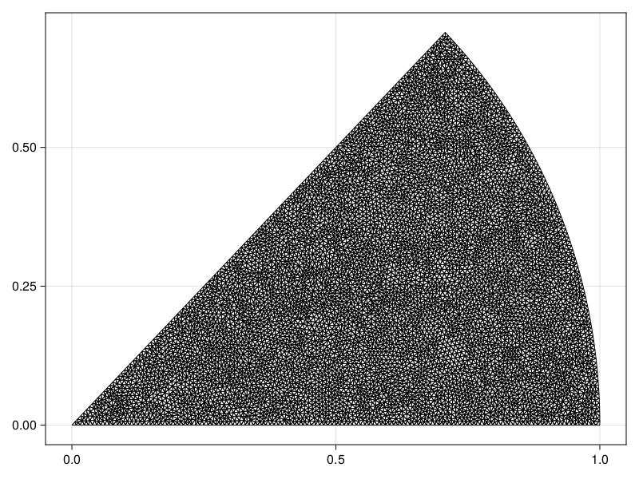
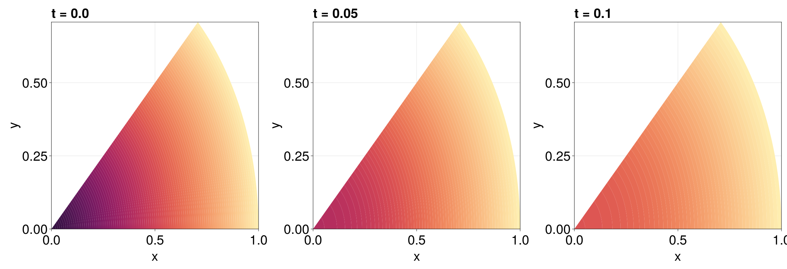

```@meta
EditURL = "https://github.com/SciML/FiniteVolumeMethod.jl/tree/main/docs/src/literate_tutorials/diffusion_equation_in_a_wedge_with_mixed_boundary_conditions.jl"
```


# Diffusion Equation in a Wedge with Mixed Boundary Conditions
In this example, we consider a diffusion equation on a wedge
with angle $\alpha$ and mixed boundary conditions:
```math
\begin{equation*}
\begin{aligned}
\pdv{u(r, \theta, t)}{t} &= \grad^2u(r,\theta,t), & 0<r<1,\,0<\theta<\alpha,\,t>0,\\[6pt]
\pdv{u(r, 0, t)}{\theta} & = 0 & 0<r<1,\,t>0,\\[6pt]
u(1, \theta, t) &= 0 & 0<\theta<\alpha,\,t>0,\\[6pt]
\pdv{u(r,\alpha,t)}{\theta} & = 0 & 0<\theta<\alpha,\,t>0,\\[6pt]
u(r, \theta, 0) &= f(r,\theta) & 0<r<1,\,0<\theta<\alpha,
\end{aligned}
\end{equation*}
```
where we take $f(r,\theta) = 1-r$ and $\alpha=\pi/4$.

Note that the PDE is provided in polar form, but Cartesian coordinates
are assumed for the operators in our code. The conversion is easy, noting
that the two Neumann conditions are just equations of the form $\grad u \vdot \vu n = 0$.
Moreover, although the right-hand side of the PDE is given as a Laplacian,
recall that $\grad^2 = \div\grad$, so we can write the PDE as $\partial u/\partial t + \div \vb q = 0$,
where $\vb q = -\grad u$.

Let us now setup the problem. To define the geometry,
we need to be careful that the `Triangulation` recognises
that we need to split the boundary into three parts,
one part for each boundary condition. This is accomplished
by providing a single vector for each part of the boundary as follows
(and as described in DelaunayTriangulation.jl's documentation),
where we also `refine!` the mesh to get a better mesh.

````julia
using DelaunayTriangulation, FiniteVolumeMethod, ElasticArrays
n = 50
α = π / 4
# The bottom edge
x₁ = [0.0, 1.0]
y₁ = [0.0, 0.0]
# The arc
r₂ = fill(1, n)
θ₂ = LinRange(0, α, n)
x₂ = @. r₂ * cos(θ₂)
y₂ = @. r₂ * sin(θ₂)
# The upper edge
x₃ = [cos(α), 0.0]
y₃ = [sin(α), 0.0]
# Now combine and create the mesh
x = [x₁, x₂, x₃]
y = [y₁, y₂, y₃]
boundary_nodes, points = convert_boundary_points_to_indices(x, y; existing_points=ElasticMatrix{Float64}(undef, 2, 0))
tri = triangulate(points; boundary_nodes)
A = get_total_area(tri)
refine!(tri; max_area=1e-4A)
mesh = FVMGeometry(tri)
````

````
FVMGeometry with 8090 control volumes, 15824 triangles, and 23913 edges
````

This is the mesh we've constructed.

````julia
using CairoMakie
fig, ax, sc = triplot(tri)
fig
````


To confirm that the boundary is now in three parts, see:

````julia
get_boundary_nodes(tri)
````

````
3-element Vector{Vector{Int64}}:
 [1, 6533, 3376, 3403, 1972, 3402, 1973, 4478, 726, 3763, 3306, 3317, 1938, 3367, 1966, 3366, 356, 3365, 3266, 6062, 1934, 6064, 3834, 5565, 723, 5581, 1995, 5584, 906, 7304, 1991, 6205, 147, 6204, 1903, 2077, 907, 2070, 2000, 2064, 360, 3718, 1892, 5936, 750, 5534, 1888, 5174, 148, 1905, 1882, 4831, 951, 4118, 1019, 4111, 379, 4108, 980, 4125, 754, 4189, 979, 4171, 52, 4164, 1002, 4161, 760, 4155, 1006, 6190, 296, 5653, 1828, 3449, 993, 5024, 1829, 3825, 166, 5318, 1838, 4671, 1295, 4659, 1359, 4662, 271, 6214, 1354, 3636, 1181, 3640, 1357, 5249, 56, 6179, 1376, 6183, 434, 5091, 1373, 5088, 279, 4967, 1378, 4973, 1342, 4962, 2700, 6301, 61, 5192, 2697, 5188, 290, 5187, 2665, 5763, 69, 5566, 2674, 4816, 92, 6838, 122, 6451, 2]
 [2, 6450, 3, 5302, 4, 5168, 5, 5288, 6, 2753, 7, 5343, 8, 4321, 9, 4214, 10, 3774, 11, 3777, 12, 3780, 13, 5967, 14, 3797, 15, 3803, 16, 5064, 17, 5267, 18, 5269, 19, 4786, 20, 4758, 21, 4767, 22, 4737, 23, 4741, 24, 4744, 25, 6305, 26, 4560, 27, 5357, 28, 3167, 29, 3154, 30, 3152, 31, 5283, 32, 3142, 33, 3122, 34, 3120, 35, 6051, 36, 2424, 37, 2422, 38, 2418, 39, 5966, 40, 2437, 41, 2443, 42, 2445, 43, 5425, 44, 5149, 45, 5652, 46, 5139, 47, 5657, 48, 5146, 49, 6099, 50, 4798, 51]
 [51, 4799, 123, 5720, 93, 3513, 2522, 2579, 70, 2582, 2499, 6821, 419, 5538, 2497, 5029, 60, 3477, 428, 3482, 249, 3485, 532, 4959, 199, 4954, 527, 4948, 329, 4491, 826, 4590, 55, 4579, 830, 7363, 298, 6068, 2933, 2934, 252, 2929, 790, 2938, 645, 2923, 2922, 2943, 156, 4939, 2894, 2954, 637, 4305, 2314, 4298, 304, 4293, 2299, 4297, 639, 4205, 857, 4208, 53, 5575, 923, 5572, 701, 2260, 879, 2256, 348, 2262, 2181, 4368, 704, 6460, 2183, 5371, 203, 5231, 2188, 5227, 708, 5223, 2187, 5219, 354, 3745, 2012, 3755, 1945, 3749, 3748, 4346, 146, 4343, 2006, 4352, 720, 3392, 3388, 5208, 719, 3386, 3339, 5239, 1922, 3357, 1976, 3329, 357, 3350, 1979, 4010, 1920, 3312, 2005, 6021, 727, 3371, 2218, 3973, 1971, 3377, 3375, 6532, 1]
````

We now need to define the boundary conditions. For this,
we need to provide `Tuple`s, where the `i`th element of the
`Tuple`s refers to the `i`th part of the boundary. The boundary
conditions are thus:

````julia
lower_bc = arc_bc = upper_bc = (x, y, t, u, p) -> zero(u)
types = (Neumann, Dirichlet, Neumann)
BCs = BoundaryConditions(mesh, (lower_bc, arc_bc, upper_bc), types)
````

````
BoundaryConditions with 3 boundary conditions with types (Neumann, Dirichlet, Neumann)
````

Now we can define the PDE. We use the reaction-diffusion formulation,
specifying the diffusion function as a constant.

````julia
f = (x, y) -> 1 - sqrt(x^2 + y^2)
D = (x, y, t, u, p) -> one(u)
initial_condition = [f(x, y) for (x, y) in each_point(tri)]
final_time = 0.1
prob = FVMProblem(mesh, BCs; diffusion_function=D, initial_condition, final_time)
````

````
FVMProblem with 8090 nodes and time span (0.0, 0.1)
````

If you did want to use the flux formulation, you would need to provide

````julia
flux = (x, y, t, α, β, γ, p) -> (-α, -β)
````

````
#9 (generic function with 1 method)
````

which replaces `u` with `αx + βy + γ` so that we approximate $\grad u$ by $(\alpha,\beta)^{\mkern-1.5mu\mathsf{T}}$,
and the negative is needed since $\vb q = -\grad u$.

We now solve the problem. We provide the solver for this problem.
In my experience, I've found that `TRBDF2(linsolve=KLUFactorization())` typically
has the best performance for these problems.

````julia
using OrdinaryDiffEq, LinearSolve
sol = solve(prob, TRBDF2(linsolve=KLUFactorization()), saveat=0.01, parallel=Val(false))
````

````
retcode: Success
Interpolation: 1st order linear
t: 11-element Vector{Float64}:
 0.0
 0.01
 0.02
 0.03
 0.04
 0.05
 0.06
 0.07
 0.08
 0.09
 0.1
u: 11-element Vector{Vector{Float64}}:
 [1.0, 0.0, 0.0, 0.0, 0.0, 0.0, 0.0, 0.0, 0.0, 0.0  …  0.6813482272130559, 0.6108206334567428, 0.36758559740810826, 0.12417703023769322, 0.04924753463363363, 0.18986370432449273, 0.7077372179289926, 0.37102157442089, 0.03774456636616852, 0.2235482690800653]
 [0.821817583328804, 0.0, 0.0, 0.0, 0.0, 0.0, 0.0, 0.0, 0.0, 0.0  …  0.6478074919057649, 0.5839984222183421, 0.35158231809336843, 0.11474954200521874, 0.044345402425944196, 0.17816007812637139, 0.6707401372097953, 0.35492933662953896, 0.03381969312601742, 0.21097280782250202]
 [0.7471746392437034, 0.0, 0.0, 0.0, 0.0, 0.0, 0.0, 0.0, 0.0, 0.0  …  0.6114477889947355, 0.5549068514376952, 0.3354600173498207, 0.10805930968886497, 0.041638266897797316, 0.1684081102547906, 0.6310290126154924, 0.3386878991238289, 0.0317463570574086, 0.19985219332291249]
 [0.6920513243721184, 0.0, 0.0, 0.0, 0.0, 0.0, 0.0, 0.0, 0.0, 0.0  …  0.5752890612755472, 0.5248180552529385, 0.31945083129156965, 0.10251770299303356, 0.03947700325527504, 0.15994998306984948, 0.5924678639194082, 0.3225306657775144, 0.03009910349287324, 0.18992626257428605]
 [0.644535994689619, 0.0, 0.0, 0.0, 0.0, 0.0, 0.0, 0.0, 0.0, 0.0  …  0.5412824408839593, 0.4955175700588264, 0.3036908865081168, 0.09742674657693885, 0.03750672039796963, 0.15205383214044518, 0.5567030387484868, 0.30660984984218237, 0.028596081975729652, 0.18057739891681276]
 [0.6029373203268474, 0.0, 0.0, 0.0, 0.0, 0.0, 0.0, 0.0, 0.0, 0.0  …  0.5095164852320212, 0.46743245865261734, 0.28823953135523694, 0.0926376766841678, 0.035664677802127065, 0.14455446027303676, 0.5236219094614839, 0.2909933688232998, 0.0271914287715621, 0.171646492535847]
 [0.5651702863997045, 0.0, 0.0, 0.0, 0.0, 0.0, 0.0, 0.0, 0.0, 0.0  …  0.47972680098217085, 0.4408134078963046, 0.27325378314036236, 0.08802485130227147, 0.03389472445354318, 0.13731203881814685, 0.4927218631799493, 0.27584852020446227, 0.025842250986434778, 0.1630080728164548]
 [0.5303874825170253, 0.0, 0.0, 0.0, 0.0, 0.0, 0.0, 0.0, 0.0, 0.0  …  0.45176858168890305, 0.4156751845444958, 0.258801919385998, 0.08355718162751433, 0.032181283586178944, 0.13029629961481257, 0.46378666661831486, 0.26124619484554823, 0.024536266755036108, 0.15464069532212615]
 [0.49837101795829003, 0.0, 0.0, 0.0, 0.0, 0.0, 0.0, 0.0, 0.0, 0.0  …  0.4255703135381048, 0.3919762801579924, 0.24490334955244397, 0.07923705913403588, 0.030524628464561086, 0.12351385690211797, 0.4367322847955337, 0.24720572895259288, 0.023273618163128108, 0.1465541729693597]
 [0.4689030020029789, 0.0, 0.0, 0.0, 0.0, 0.0, 0.0, 0.0, 0.0, 0.0  …  0.40106048271566325, 0.3696751862975957, 0.23157748310000018, 0.07506687529597564, 0.02892503235321636, 0.11697132491914713, 0.41147468273055865, 0.23374645873163122, 0.022054447296472792, 0.13875831867465416]
 [0.4417654642148272, 0.0, 0.0, 0.0, 0.0, 0.0, 0.0, 0.0, 0.0, 0.0  …  0.37816754898130406, 0.3487303792148016, 0.21884373658469988, 0.07104902249231813, 0.027382768634674915, 0.11067532037178646, 0.38792979436786373, 0.22088772745630025, 0.020878896309103317, 0.13126294898623006]
````

````julia
using CairoMakie
fig = Figure(fontsize=38)
for (i, j) in zip(1:3, (1, 6, 11))
    ax = Axis(fig[1, i], width=600, height=600,
        xlabel="x", ylabel="y",
        title="t = $(sol.t[j])",
        titlealign=:left)
    tricontourf!(ax, tri, sol.u[j], levels=0:0.01:1, colormap=:matter)
    tightlimits!(ax)
end
resize_to_layout!(fig)
fig
````


## Just the code
An uncommented version of this example is given below.
You can view the source code for this file [here](https://github.com/SciML/FiniteVolumeMethod.jl/tree/main/docs/src/literate_tutorials/diffusion_equation_in_a_wedge_with_mixed_boundary_conditions.jl).

```julia
using DelaunayTriangulation, FiniteVolumeMethod, ElasticArrays
n = 50
α = π / 4
# The bottom edge
x₁ = [0.0, 1.0]
y₁ = [0.0, 0.0]
# The arc
r₂ = fill(1, n)
θ₂ = LinRange(0, α, n)
x₂ = @. r₂ * cos(θ₂)
y₂ = @. r₂ * sin(θ₂)
# The upper edge
x₃ = [cos(α), 0.0]
y₃ = [sin(α), 0.0]
# Now combine and create the mesh
x = [x₁, x₂, x₃]
y = [y₁, y₂, y₃]
boundary_nodes, points = convert_boundary_points_to_indices(x, y; existing_points=ElasticMatrix{Float64}(undef, 2, 0))
tri = triangulate(points; boundary_nodes)
A = get_total_area(tri)
refine!(tri; max_area=1e-4A)
mesh = FVMGeometry(tri)

using CairoMakie
fig, ax, sc = triplot(tri)
fig

get_boundary_nodes(tri)

lower_bc = arc_bc = upper_bc = (x, y, t, u, p) -> zero(u)
types = (Neumann, Dirichlet, Neumann)
BCs = BoundaryConditions(mesh, (lower_bc, arc_bc, upper_bc), types)

f = (x, y) -> 1 - sqrt(x^2 + y^2)
D = (x, y, t, u, p) -> one(u)
initial_condition = [f(x, y) for (x, y) in each_point(tri)]
final_time = 0.1
prob = FVMProblem(mesh, BCs; diffusion_function=D, initial_condition, final_time)

flux = (x, y, t, α, β, γ, p) -> (-α, -β)

using OrdinaryDiffEq, LinearSolve
sol = solve(prob, TRBDF2(linsolve=KLUFactorization()), saveat=0.01, parallel=Val(false))

using CairoMakie
fig = Figure(fontsize=38)
for (i, j) in zip(1:3, (1, 6, 11))
    ax = Axis(fig[1, i], width=600, height=600,
        xlabel="x", ylabel="y",
        title="t = $(sol.t[j])",
        titlealign=:left)
    tricontourf!(ax, tri, sol.u[j], levels=0:0.01:1, colormap=:matter)
    tightlimits!(ax)
end
resize_to_layout!(fig)
fig
```

---

*This page was generated using [Literate.jl](https://github.com/fredrikekre/Literate.jl).*

