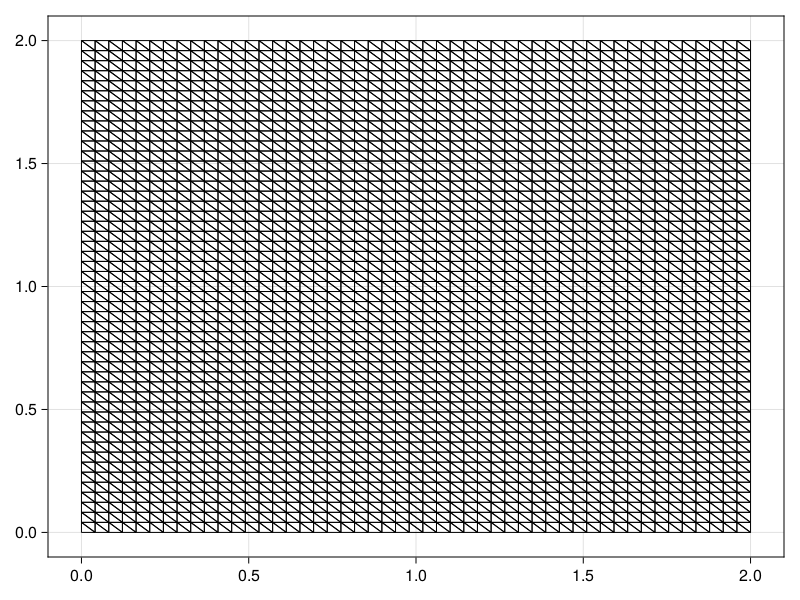
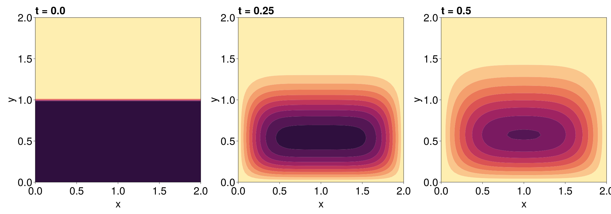

```@meta
EditURL = "https://github.com/SciML/FiniteVolumeMethod.jl/tree/main/docs/src/literate_tutorials/diffusion_equation_on_a_square_plate.jl"
```


# Diffusion Equation on a Square Plate
This tutorial considers a diffusion equation on a square plate:
```math
\begin{equation*}
\begin{aligned}
\pdv{u(\vb x, t)}{t} &= \frac{1}{9}\grad^2 u(\vb x, t)  & \vb x \in \Omega,\,t>0, \\[6pt]
u(\vb x, t) & =  0  &\vb x \in \partial\Omega,\,t>0,\\[6pt]
u(\vb x, 0) &= f(\vb x) & \vb x \in \Omega,
\end{aligned}
\end{equation*}
```
where $\Omega = [0, 2]^2$ and
```math
f(x, y) = \begin{cases} 50 & y \leq 1, \\ 0 & y > 1. \end{cases}
```
To solve this problem, the first step is to define the mesh.

````julia
using FiniteVolumeMethod, DelaunayTriangulation
a, b, c, d = 0.0, 2.0, 0.0, 2.0
nx, ny = 50, 50
tri = triangulate_rectangle(a, b, c, d, nx, ny, single_boundary=true)
mesh = FVMGeometry(tri)
````

````
FVMGeometry with 2500 control volumes, 4802 triangles, and 7301 edges
````

This mesh is shown below.

````julia
using CairoMakie
fig, ax, sc = triplot(tri)
fig
````


We now need to define the boundary conditions. We have a homogeneous Dirichlet condition:

````julia
bc = (x, y, t, u, p) -> zero(u)
BCs = BoundaryConditions(mesh, bc, Dirichlet)
````

````
BoundaryConditions with 1 boundary condition with type Dirichlet
````

We can now define the actual PDE. We start by defining the initial condition and the diffusion function.

````julia
f = (x, y) -> y ≤ 1.0 ? 50.0 : 0.0
initial_condition = [f(x, y) for (x, y) in each_point(tri)]
D = (x, y, t, u, p) -> 1 / 9
````

````
#7 (generic function with 1 method)
````

We can now define the problem:

````julia
final_time = 0.5
prob = FVMProblem(mesh, BCs; diffusion_function=D, initial_condition, final_time)
````

````
FVMProblem with 2500 nodes and time span (0.0, 0.5)
````

Note that in `prob`, it is not a diffusion function that is used but instead it is a flux function:

````julia
prob.flux_function
````

````
#65 (generic function with 1 method)
````

When providing `diffusion_function`, the flux is given by $\vb q(\vb x, t, \alpha,\beta,\gamma) = (-\alpha/9, -\beta/9)^{\mkern-1.5mu\mathsf{T}}$,
where $(\alpha, \beta, \gamma)$ defines the approximation to $u$ via $u(x, y) = \alpha x + \beta y + \gamma$ so that
$\grad u(\vb x, t) = (\alpha,\beta)^{\mkern-1.5mu\mathsf{T}}$.

To now solve the problem, we simply use `solve`. When no algorithm
is provided, as long as DifferentialEquations is loaded (instead of e.g.
OrdinaryDiffEq), the algorithm is chosen automatically. Moreover, note that,
in the `solve` call below, multithreading is enabled by default.

````julia
using DifferentialEquations
sol = solve(prob, saveat=0.05)
````

````
retcode: Success
Interpolation: 1st order linear
t: 11-element Vector{Float64}:
 0.0
 0.05
 0.1
 0.15
 0.2
 0.25
 0.3
 0.35
 0.4
 0.45
 0.5
u: 11-element Vector{Vector{Float64}}:
 [50.0, 50.0, 50.0, 50.0, 50.0, 50.0, 50.0, 50.0, 50.0, 50.0  …  0.0, 0.0, 0.0, 0.0, 0.0, 0.0, 0.0, 0.0, 0.0, 0.0]
 [0.0, 0.0, 0.0, 0.0, 0.0, 0.0, 0.0, 0.0, 0.0, 0.0  …  0.0, 0.0, 0.0, 0.0, 0.0, 0.0, 0.0, 0.0, 0.0, 0.0]
 [0.0, 0.0, 0.0, 0.0, 0.0, 0.0, 0.0, 0.0, 0.0, 0.0  …  0.0, 0.0, 0.0, 0.0, 0.0, 0.0, 0.0, 0.0, 0.0, 0.0]
 [0.0, 0.0, 0.0, 0.0, 0.0, 0.0, 0.0, 0.0, 0.0, 0.0  …  0.0, 0.0, 0.0, 0.0, 0.0, 0.0, 0.0, 0.0, 0.0, 0.0]
 [0.0, 0.0, 0.0, 0.0, 0.0, 0.0, 0.0, 0.0, 0.0, 0.0  …  0.0, 0.0, 0.0, 0.0, 0.0, 0.0, 0.0, 0.0, 0.0, 0.0]
 [0.0, 0.0, 0.0, 0.0, 0.0, 0.0, 0.0, 0.0, 0.0, 0.0  …  0.0, 0.0, 0.0, 0.0, 0.0, 0.0, 0.0, 0.0, 0.0, 0.0]
 [0.0, 0.0, 0.0, 0.0, 0.0, 0.0, 0.0, 0.0, 0.0, 0.0  …  0.0, 0.0, 0.0, 0.0, 0.0, 0.0, 0.0, 0.0, 0.0, 0.0]
 [0.0, 0.0, 0.0, 0.0, 0.0, 0.0, 0.0, 0.0, 0.0, 0.0  …  0.0, 0.0, 0.0, 0.0, 0.0, 0.0, 0.0, 0.0, 0.0, 0.0]
 [0.0, 0.0, 0.0, 0.0, 0.0, 0.0, 0.0, 0.0, 0.0, 0.0  …  0.0, 0.0, 0.0, 0.0, 0.0, 0.0, 0.0, 0.0, 0.0, 0.0]
 [0.0, 0.0, 0.0, 0.0, 0.0, 0.0, 0.0, 0.0, 0.0, 0.0  …  0.0, 0.0, 0.0, 0.0, 0.0, 0.0, 0.0, 0.0, 0.0, 0.0]
 [0.0, 0.0, 0.0, 0.0, 0.0, 0.0, 0.0, 0.0, 0.0, 0.0  …  0.0, 0.0, 0.0, 0.0, 0.0, 0.0, 0.0, 0.0, 0.0, 0.0]
````

To visualise the solution, we can use `tricontourf!` from Makie.jl.

````julia
fig = Figure(fontsize=38)
for (i, j) in zip(1:3, (1, 6, 11))
    ax = Axis(fig[1, i], width=600, height=600,
        xlabel="x", ylabel="y",
        title="t = $(sol.t[j])",
        titlealign=:left)
    tricontourf!(ax, tri, sol.u[j], levels=0:5:50, colormap=:matter)
    tightlimits!(ax)
end
resize_to_layout!(fig)
fig
````


## Just the code
An uncommented version of this example is given below.
You can view the source code for this file [here](https://github.com/SciML/FiniteVolumeMethod.jl/tree/main/docs/src/literate_tutorials/diffusion_equation_on_a_square_plate.jl).

```julia
using FiniteVolumeMethod, DelaunayTriangulation
a, b, c, d = 0.0, 2.0, 0.0, 2.0
nx, ny = 50, 50
tri = triangulate_rectangle(a, b, c, d, nx, ny, single_boundary=true)
mesh = FVMGeometry(tri)

using CairoMakie
fig, ax, sc = triplot(tri)
fig

bc = (x, y, t, u, p) -> zero(u)
BCs = BoundaryConditions(mesh, bc, Dirichlet)

f = (x, y) -> y ≤ 1.0 ? 50.0 : 0.0
initial_condition = [f(x, y) for (x, y) in each_point(tri)]
D = (x, y, t, u, p) -> 1 / 9

final_time = 0.5
prob = FVMProblem(mesh, BCs; diffusion_function=D, initial_condition, final_time)

prob.flux_function

using DifferentialEquations
sol = solve(prob, saveat=0.05)

fig = Figure(fontsize=38)
for (i, j) in zip(1:3, (1, 6, 11))
    ax = Axis(fig[1, i], width=600, height=600,
        xlabel="x", ylabel="y",
        title="t = $(sol.t[j])",
        titlealign=:left)
    tricontourf!(ax, tri, sol.u[j], levels=0:5:50, colormap=:matter)
    tightlimits!(ax)
end
resize_to_layout!(fig)
fig
```

---

*This page was generated using [Literate.jl](https://github.com/fredrikekre/Literate.jl).*

