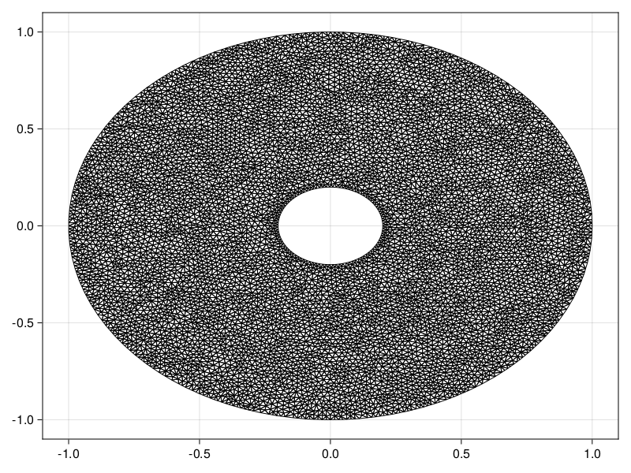

```@meta
EditURL = "https://github.com/SciML/FiniteVolumeMethod.jl/tree/main/docs/src/literate_tutorials/diffusion_equation_on_an_annulus.jl"
```


# Diffusion Equation on an Annulus
In this tutorial, we consider a
diffusion equation on an annulus:
```math
\begin{equation}
\begin{aligned}
\pdv{u(\vb x, t)}{t} &= \grad^2 u(\vb x, t) & \vb x \in \Omega, \\
\grad u(\vb x, t) \vdot \vu n(\vb x) &= 0 & \vb x \in \mathcal D(0, 1), \\
u(\vb x, t) &= c(t) & \vb x \in \mathcal D(0,0.2), \\
u(\vb x, t) &= u_0(\vb x),
\end{aligned}
\end{equation}
```
demonstrating how we can solve PDEs over multiply-connected domains.
Here, $\mathcal D(0, r)$ is a circle of radius $r$ centered at the origin,
$\Omega$ is the annulus between $\mathcal D(0,0.2)$ and
$\mathcal D(0, 1)$, $c(t) = 50[1-\mathrm{e}^{-t/2}]$, and
```math
u_0(x) = 10\mathrm{e}^{-25\left[\left(x+\frac12\right)^2+\left(y+\frac12\right)^2\right]} - 10\mathrm{e}^{-45\left[\left(x-\frac12\right)^2+\left(y-\frac12\right)^2\right]} - 5\mathrm{e}^{-50\left[\left(x+\frac{3}{10}\right)^2+\left(y+\frac12\right)^2\right]}.
```
The complicated task for this problem is the definition
of the mesh of the annulus. We need to follow the boundary
specification from DelaunayTriangulation.jl, discussed
[here](https://SciML.github.io/DelaunayTriangulation.jl/dev/boundary_handling/).
In particular, the outer boundary must be counter-clockwise,
the inner boundary be clockwise, and we need to provide
the nodes as a `Vector{Vector{Vector{Int}}}`.
We define this mesh below.

````julia
using DelaunayTriangulation, FiniteVolumeMethod, CairoMakie
R₁ = 0.2
R₂ = 1.0
θ = collect(LinRange(0, 2π, 100))
θ[end] = 0.0 # get the endpoints to match
x = [
    [R₂ .* cos.(θ)], # outer first
    [reverse(R₁ .* cos.(θ))] # then inner - reverse to get clockwise orientation
]
y = [
    [R₂ .* sin.(θ)], #
    [reverse(R₁ .* sin.(θ))]
]
boundary_nodes, points = convert_boundary_points_to_indices(x, y)
tri = triangulate(points; boundary_nodes)
A = get_area(tri)
refine!(tri; max_area=1e-4A)
triplot(tri)
````


````julia
mesh = FVMGeometry(tri)
````

````
FVMGeometry with 8226 control volumes, 16007 triangles, and 24233 edges
````

Now let us define the boundary conditions. Remember,
the order of the boundary conditions follows the order
of the boundaries in the mesh. The outer boundary
came first, and then came the inner boundary. We can verify
that this is the order of the boundary indices as
follows:

````julia
fig = Figure()
ax = Axis(fig[1, 1])
outer = [get_point(tri, i) for i in get_neighbours(tri, -1)]
inner = [get_point(tri, i) for i in get_neighbours(tri, -2)]
triplot!(ax, tri)
scatter!(ax, outer, color=:red)
scatter!(ax, inner, color=:blue)
fig
````


So, the boundary conditions are:

````julia
outer_bc = (x, y, t, u, p) -> zero(u)
inner_bc = (x, y, t, u, p) -> oftype(u, 50(1 - exp(-t / 2)))
types = (Neumann, Dirichlet)
BCs = BoundaryConditions(mesh, (outer_bc, inner_bc), types)
````

````
BoundaryConditions with 2 boundary conditions with types (Neumann, Dirichlet)
````

Finally, let's define the problem and solve it.

````julia
initial_condition_f = (x, y) -> begin
    10 * exp(-25 * ((x + 0.5) * (x + 0.5) + (y + 0.5) * (y + 0.5))) - 5 * exp(-50 * ((x + 0.3) * (x + 0.3) + (y + 0.5) * (y + 0.5))) - 10 * exp(-45 * ((x - 0.5) * (x - 0.5) + (y - 0.5) * (y - 0.5)))
end
diffusion_function = (x, y, t, u, p) -> one(u)
initial_condition = [initial_condition_f(x, y) for (x, y) in DelaunayTriangulation.each_point(tri)]
final_time = 2.0
prob = FVMProblem(mesh, BCs;
    diffusion_function,
    final_time,
    initial_condition)
````

````
FVMProblem with 8226 nodes and time span (0.0, 2.0)
````

````julia
using OrdinaryDiffEq, LinearSolve
sol = solve(prob, TRBDF2(linsolve=KLUFactorization()), saveat=0.2)
````

````
retcode: Success
Interpolation: 1st order linear
t: 11-element Vector{Float64}:
 0.0
 0.2
 0.4
 0.6
 0.8
 1.0
 1.2
 1.4
 1.6
 1.8
 2.0
u: 11-element Vector{Vector{Float64}}:
 [-1.6918979226151304e-9, -2.6824824758316947e-8, -3.508918015123032e-7, -3.7478900338780008e-6, -3.2376946343892575e-5, -0.0002242588591250139, -0.0012357868125636464, -0.005380630921148495, -0.01840119235904892, -0.04918487388571497  …  2.0918713433458237e-14, 3.458890574190645, -0.005558506394611075, 2.8396329156286174e-11, -5.049929362733235e-9, -1.913445529149473e-10, 5.667754383376993e-12, 5.945251247871394e-15, -3.6470661441248834e-9, -4.3485569041014065e-5]
 [0.044776239431783424, 0.016726907958835927, -0.0098190205049255, -0.03492537473095343, -0.0589525739059889, -0.0811913566499606, -0.10109478437577493, -0.11900339123181591, -0.13396061458347966, -0.1461851369688485  …  0.4604244890762291, 1.3158333385225314, 0.03518599997718615, 0.5534220548094115, 0.1796198426114264, 0.4147202809074338, 0.5840259694640018, 0.40954910091969754, 0.04562251319893571, 0.9448599818948571]
 [1.8560465047556662, 1.8442231107917193, 1.8341189228750276, 1.8251569018804588, 1.816408153091307, 1.8085637692014882, 1.8020486458198512, 1.7959648309553493, 1.791372066121246, 1.7875907024842426  …  2.196699182934059, 2.8835895560671783, 1.9837736621895719, 2.1237680104471393, 2.0188237615834073, 2.336190392410584, 2.1341487006708393, 2.1752212900606858, 1.8575547389410483, 3.3565016059477526]
 [4.3844956626170575, 4.378545995804241, 4.374092325972138, 4.370387141064735, 4.3662874071770155, 4.362603895840999, 4.359819933554336, 4.356828842769086, 4.35488647000348, 4.353144723776922  …  4.683981092075278, 5.335520809924663, 4.574811590140766, 4.5093274584343686, 4.561387785181804, 4.928043263091946, 4.513379397177754, 4.682838874718729, 4.386373146810551, 6.220764297797526]
 [7.289327439041294, 7.28610944721683, 7.284274530281505, 7.282993724561839, 7.281021171345756, 7.2792279122974035, 7.27812763415356, 7.276514233941954, 7.275741413179119, 7.2748812088794015  …  7.56978289683622, 8.210574460320776, 7.509439242066505, 7.347218975767628, 7.472416305980833, 7.8631216439680465, 7.34892232564419, 7.57840988719536, 7.291384124443954, 9.281115142352236]
 [10.349864716591316, 10.347912278241836, 10.347271966947286, 10.347090447534972, 10.346094140489061, 10.345168069281993, 10.344831718149985, 10.343852416686643, 10.343607493414781, 10.343147040875175  …  10.617624243370118, 11.243632500674538, 10.579916645649323, 10.377257248218204, 10.532839929231029, 10.927997080853823, 10.377979056274048, 10.630463513128609, 10.351971017975025, 12.371462230126909]
 [13.419167926910074, 13.41781113227301, 13.41770333448452, 13.418001717997312, 13.417452175610725, 13.416923875934378, 13.416925900666152, 13.41624460883248, 13.416233433836018, 13.415956482628237  …  13.674755314320933, 14.278332981604084, 13.647771159994207, 13.432726776104372, 13.59751623843466, 13.984541055121042, 13.433018976571283, 13.689089544317357, 13.421243539051773, 15.399209554116393]
 [16.40294230710082, 16.40188299839002, 16.40200429392593, 16.402495938860138, 16.402153898874715, 16.401811637664757, 16.40195682477512, 16.401424387472126, 16.401512470372563, 16.40132234395567  …  16.644810996179245, 17.218389394051336, 16.62327237704967, 16.41019551417071, 16.573358562372473, 16.943861406638472, 16.410297683581025, 16.659295197514986, 16.404935650365353, 18.29702290179812]
 [19.24550938695191, 19.244614269912603, 19.244827126650037, 19.24538151788817, 19.245139224838063, 19.244887712131817, 19.245087524240414, 19.244637314733378, 19.244763727309568, 19.2446170682584  …  19.47263752298845, 20.012541835470465, 19.454182010436305, 19.249848757295258, 19.406263119436968, 19.756137462874126, 19.24986755719106, 19.486647895613643, 19.247394042446498, 21.035917198515495]
 [21.91732633217701, 21.916535089163556, 21.916777735472504, 21.917336394554113, 21.917145265619478, 21.916941502462457, 21.91715622359347, 21.916758068269093, 21.916895476678704, 21.91677273681172  …  22.129486281255307, 22.635814101696177, 22.113024295751757, 21.920279408360912, 22.067778541636255, 22.395955057938913, 21.92026264374806, 22.1427658888403, 21.9190913367679, 23.608729555731376]
 [24.399479988903376, 24.398770157110683, 24.39901295282689, 24.399545747360502, 24.399384865274424, 24.399210544172945, 24.399420750245497, 24.39906340742901, 24.399198503471773, 24.39909155511398  …  24.59530361538348, 25.065981088430707, 24.58043249620733, 24.401722824192777, 24.538428062491725, 24.842757086613155, 24.401692408661553, 24.607662262491655, 24.40110929509522, 25.99198334271778]
````

````julia
fig = Figure(fontsize=38)
for (i, j) in zip(1:3, (1, 6, 11))
    ax = Axis(fig[1, i], width=600, height=600,
        xlabel="x", ylabel="y",
        title="t = $(sol.t[j])",
        titlealign=:left)
    tricontourf!(ax, tri, sol.u[j], levels=-10:2:40, colormap=:matter)
    tightlimits!(ax)
end
resize_to_layout!(fig)
fig
````


To finish this example, let us consider how
natural neighbour interpolation can be applied here. The
application is more complicated for this problem since
the mesh has holes. Before we do that, though, let us
show how we could use `pl_interpolate`, which could
be useful if we did not need a higher quality interpolant.
Let us interpolate the solution at $t = 1$, which
is `sol.t[6]`. For this, we need to put the ghost
triangles back into `tri` so that we can safely
apply `jump_and_march`. This is done with `add_ghost_triangles!`.

````julia
add_ghost_triangles!(tri)
````

Now let's interpolate.

````julia
x = LinRange(-R₂, R₂, 400)
y = LinRange(-R₂, R₂, 400)
interp_vals = zeros(length(x), length(y))
u = sol.u[6]
last_triangle = Ref((1, 1, 1))
for (j, _y) in enumerate(y)
    for (i, _x) in enumerate(x)
        T = jump_and_march(tri, (_x, _y), try_points=last_triangle[])
        last_triangle[] = triangle_vertices(T) # used to accelerate jump_and_march, since the points we're looking for are close to each other
        if DelaunayTriangulation.is_ghost_triangle(T) # don't extrapolate
            interp_vals[i, j] = NaN
        else
            interp_vals[i, j] = pl_interpolate(prob, T, sol.u[6], _x, _y)
        end
    end
end
fig, ax, sc = contourf(x, y, interp_vals, levels=-10:2:40, colormap=:matter)
fig
````


Let's now consider applying NaturalNeighbours.jl. We apply it naively first to
highlight some complications.

````julia
using NaturalNeighbours
_x = vec([x for x in x, y in y]) # NaturalNeighbours.jl needs vector data
_y = vec([y for x in x, y in y])
itp = interpolate(tri, u, derivatives=true)
````

````
Natural Neighbour Interpolant
    z: [10.349864716591316, 10.347912278241836, 10.347271966947286, 10.347090447534972, 10.346094140489061, 10.345168069281993, 10.344831718149985, 10.343852416686643, 10.343607493414781, 10.343147040875175  …  10.617624243370118, 11.243632500674538, 10.579916645649323, 10.377257248218204, 10.532839929231029, 10.927997080853823, 10.377979056274048, 10.630463513128609, 10.351971017975025, 12.371462230126909]
    ∇: [(0.0167759898313112, -0.01878578243151147), (-0.032908955775623944, -0.00262729515068905), (-0.0499857484041637, -0.028310041468257337), (-0.0036232656312899718, -0.012179801096744552), (0.001988309479592199, -0.002205287158034077), (-0.0033426705601698322, -0.018184635905077507), (0.023677745363512127, -0.004738085134243245), (-0.016326170141901342, -0.013441410165932562), (0.013140605190489733, -0.0073889162622241935), (-0.003534308098465609, 0.0032229658783444644)  …  (1.7559371616569213, -2.4109153545203887), (5.176488791237448, 2.751464523042365), (-2.7584085170587995, -0.7684092321135257), (-0.1448942568797414, 0.2181202955857769), (0.2627845167491605, -2.47053927005044), (1.3111000316616632, -4.4848132772296125), (0.2106258934891403, -0.15947438204654413), (-2.5845247658419055, 1.6660687236508438), (-0.2671645494903941, -0.01917277216052589), (0.3936531616440942, -9.97875863146146)]
    H: [(16.288141655107403, -0.6394535341044831, 0.6854575492474814), (14.335584652134871, 0.6955755751292197, 0.8702733271567972), (10.831669262884455, 0.35107866273802235, 1.2388893791228002), (13.562816107328018, -0.4753557730912129, 2.6914162879265797), (13.299434352775776, 0.7098705301318029, 3.978005563335226), (12.961763952972248, 1.3081852166380359, 3.967516058279129), (13.378086826768516, 1.9628398235215962, 5.599097606392703), (11.023722943553466, 2.781116547355478, 5.312298304241565), (12.168900954138454, 2.947587603587016, 6.256466484912792), (9.922031664521095, 4.55885688686574, 7.003956074571443)  …  (4.528619693662909, 11.03739306944645, -10.724310463496717), (16.313060788112068, -1.6223355249800782, 13.425380303917457), (17.220186845167305, -1.8028616548100926, 5.806155464599244), (2.913297168551773, 10.80774838792608, -6.136927800991009), (-2.7193537362874736, 17.909425855572504, -2.402873271088078), (-4.038603125437703, 19.22114948500803, -7.597607167701472), (10.222014842704965, 3.353644951280155, -6.480285894682976), (11.740698189055745, 2.785718339489214, -10.337729524010104), (15.465098540749937, -0.49936621092941696, 0.12810171693728375), (-18.826376615132325, 32.1891065646984, -2.03364083283624)]
````

````julia
itp_vals = itp(_x, _y; method=Farin())
````

````
160000-element Vector{Float64}:
 10.397841454574205
 10.397881486052796
 10.391546417236441
 10.391529995958052
 10.391513574679607
  ⋮
 10.334195891351527
 10.334057991849193
 10.333920092346858
 10.333782192844467
 10.33364429334216
````

````julia
fig, ax, sc = contourf(x, y, reshape(itp_vals, length(x), length(y)), colormap=:matter, levels=-10:2:40)
fig
````


The issue here is that the interpolant is trying to extrapolate inside the hole and
outside of the annulus. To avoid this, you need to pass `project=false`.

````julia
itp_vals = itp(_x, _y; method=Farin(), project=false)
````

````
160000-element Vector{Float64}:
 Inf
 Inf
 Inf
 Inf
 Inf
  ⋮
 Inf
 Inf
 Inf
 Inf
 Inf
````

````julia
fig, ax, sc = contourf(x, y, reshape(itp_vals, length(x), length(y)), colormap=:matter, levels=-10:2:40)
fig
````


## Just the code
An uncommented version of this example is given below.
You can view the source code for this file [here](https://github.com/SciML/FiniteVolumeMethod.jl/tree/main/docs/src/literate_tutorials/diffusion_equation_on_an_annulus.jl).

```julia
using DelaunayTriangulation, FiniteVolumeMethod, CairoMakie
R₁ = 0.2
R₂ = 1.0
θ = collect(LinRange(0, 2π, 100))
θ[end] = 0.0 # get the endpoints to match
x = [
    [R₂ .* cos.(θ)], # outer first
    [reverse(R₁ .* cos.(θ))] # then inner - reverse to get clockwise orientation
]
y = [
    [R₂ .* sin.(θ)], #
    [reverse(R₁ .* sin.(θ))]
]
boundary_nodes, points = convert_boundary_points_to_indices(x, y)
tri = triangulate(points; boundary_nodes)
A = get_area(tri)
refine!(tri; max_area=1e-4A)
triplot(tri)

mesh = FVMGeometry(tri)

fig = Figure()
ax = Axis(fig[1, 1])
outer = [get_point(tri, i) for i in get_neighbours(tri, -1)]
inner = [get_point(tri, i) for i in get_neighbours(tri, -2)]
triplot!(ax, tri)
scatter!(ax, outer, color=:red)
scatter!(ax, inner, color=:blue)
fig

outer_bc = (x, y, t, u, p) -> zero(u)
inner_bc = (x, y, t, u, p) -> oftype(u, 50(1 - exp(-t / 2)))
types = (Neumann, Dirichlet)
BCs = BoundaryConditions(mesh, (outer_bc, inner_bc), types)

initial_condition_f = (x, y) -> begin
    10 * exp(-25 * ((x + 0.5) * (x + 0.5) + (y + 0.5) * (y + 0.5))) - 5 * exp(-50 * ((x + 0.3) * (x + 0.3) + (y + 0.5) * (y + 0.5))) - 10 * exp(-45 * ((x - 0.5) * (x - 0.5) + (y - 0.5) * (y - 0.5)))
end
diffusion_function = (x, y, t, u, p) -> one(u)
initial_condition = [initial_condition_f(x, y) for (x, y) in DelaunayTriangulation.each_point(tri)]
final_time = 2.0
prob = FVMProblem(mesh, BCs;
    diffusion_function,
    final_time,
    initial_condition)

using OrdinaryDiffEq, LinearSolve
sol = solve(prob, TRBDF2(linsolve=KLUFactorization()), saveat=0.2)

fig = Figure(fontsize=38)
for (i, j) in zip(1:3, (1, 6, 11))
    ax = Axis(fig[1, i], width=600, height=600,
        xlabel="x", ylabel="y",
        title="t = $(sol.t[j])",
        titlealign=:left)
    tricontourf!(ax, tri, sol.u[j], levels=-10:2:40, colormap=:matter)
    tightlimits!(ax)
end
resize_to_layout!(fig)
fig

add_ghost_triangles!(tri)

x = LinRange(-R₂, R₂, 400)
y = LinRange(-R₂, R₂, 400)
interp_vals = zeros(length(x), length(y))
u = sol.u[6]
last_triangle = Ref((1, 1, 1))
for (j, _y) in enumerate(y)
    for (i, _x) in enumerate(x)
        T = jump_and_march(tri, (_x, _y), try_points=last_triangle[])
        last_triangle[] = triangle_vertices(T) # used to accelerate jump_and_march, since the points we're looking for are close to each other
        if DelaunayTriangulation.is_ghost_triangle(T) # don't extrapolate
            interp_vals[i, j] = NaN
        else
            interp_vals[i, j] = pl_interpolate(prob, T, sol.u[6], _x, _y)
        end
    end
end
fig, ax, sc = contourf(x, y, interp_vals, levels=-10:2:40, colormap=:matter)
fig

using NaturalNeighbours
_x = vec([x for x in x, y in y]) # NaturalNeighbours.jl needs vector data
_y = vec([y for x in x, y in y])
itp = interpolate(tri, u, derivatives=true)

itp_vals = itp(_x, _y; method=Farin())

fig, ax, sc = contourf(x, y, reshape(itp_vals, length(x), length(y)), colormap=:matter, levels=-10:2:40)
fig

itp_vals = itp(_x, _y; method=Farin(), project=false)

fig, ax, sc = contourf(x, y, reshape(itp_vals, length(x), length(y)), colormap=:matter, levels=-10:2:40)
fig
```

---

*This page was generated using [Literate.jl](https://github.com/fredrikekre/Literate.jl).*

