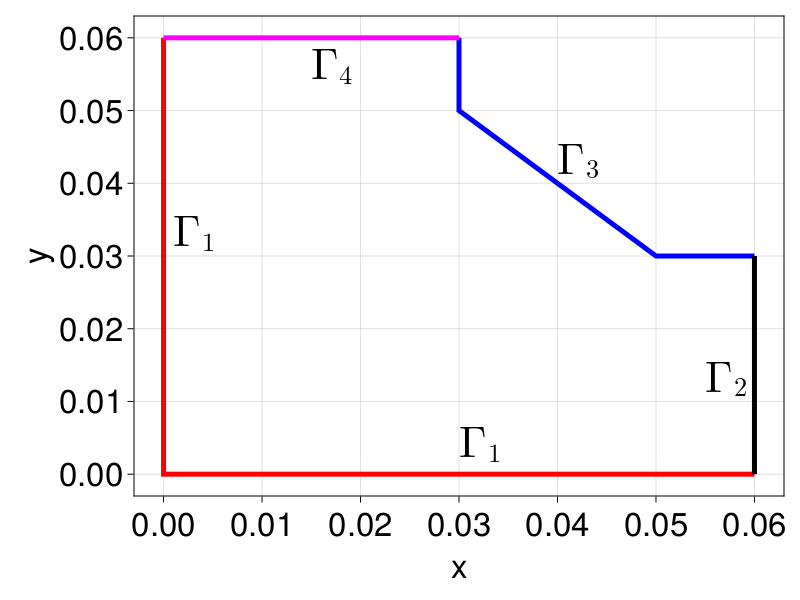
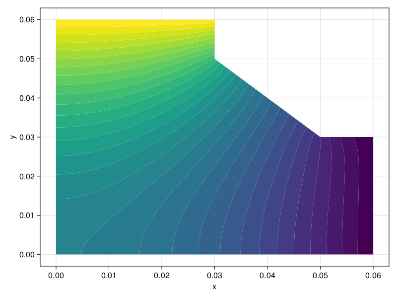

```@meta
EditURL = "https://github.com/DanielVandH/FiniteVolumeMethod.jl/tree/main/docs/src/literate_tutorials/equilibrium_temperature_distribution_with_mixed_boundary_conditions_and_using_ensembleproblems.jl"
```


# Equilibrium Temperature Distribution with Mixed Boundary Conditions and using EnsembleProblems
For this tutorial, we consider the following problem:
```math
\begin{equation}
\begin{aligned}
\grad^2 T &= 0 & \vb x \in \Omega, \\
\grad T \vdot \vu n &= 0 & \vb x \in \Gamma_1, \\
T &= 40 & \vb x \in \Gamma_2, \\
k\grad T \vdot \vu n &= h(T_{\infty} - T) & \vb x \in \Gamma_3, \\
T &= 70 & \vb x \in \Gamma_4. \\
\end{aligned}
\end{equation}
```
This domain $\Omega$ with boundary $\partial\Omega=\Gamma_1\cup\Gamma_2\cup\Gamma_3\cup\Gamma_4$ is shown below.



Let us start by defining the mesh.

````julia
using DelaunayTriangulation, FiniteVolumeMethod, CairoMakie
A, B, C, D, E, F, G = (0.0, 0.0),
(0.06, 0.0),
(0.06, 0.03),
(0.05, 0.03),
(0.03, 0.05),
(0.03, 0.06),
(0.0, 0.06)
bn1 = [G, A, B]
bn2 = [B, C]
bn3 = [C, D, E, F]
bn4 = [F, G]
bn = [bn1, bn2, bn3, bn4]
boundary_nodes, points = convert_boundary_points_to_indices(bn)
tri = triangulate(points; boundary_nodes)
refine!(tri; max_area=1e-4get_total_area(tri))
triplot(tri)
````


````julia
mesh = FVMGeometry(tri)
````

````
FVMGeometry with 8238 control volumes, 16082 triangles, and 24319 edges
````

For the boundary conditions, the parameters that we use are
$k = 3$, $h = 20$, and $T_{\infty} = 20$ for thermal conductivity,
heat transfer coefficient, and ambient temperature, respectively.

````julia
k = 3.0
h = 20.0
T∞ = 20.0
bc1 = (x, y, t, T, p) -> zero(T) # ∇T⋅n=0
bc2 = (x, y, t, T, p) -> oftype(T, 40.0) # T=40
bc3 = (x, y, t, T, p) -> -p.h * (p.T∞- T) / p.k # k∇T⋅n=h(T∞-T). The minus is since q = -∇T
bc4 = (x, y, t, T, p) -> oftype(T, 70.0) # T=70
parameters = (nothing, nothing, (h=h, T∞=T∞, k=k), nothing)
BCs = BoundaryConditions(mesh, (bc1, bc2, bc3, bc4),
    (Neumann, Dirichlet, Neumann, Dirichlet);
    parameters)
````

````
BoundaryConditions with 4 boundary conditions with types (Neumann, Dirichlet, Neumann, Dirichlet)
````

Now we can define the actual problem. For the initial condition,
which recall is used as an initial guess for steady state problems,
let us use an initial condition which ranges from $T=70$ at $y=0.06$
down to $T=40$ at $y=0$.

````julia
diffusion_function = (x, y, t, T, p) -> one(T)
f = (x, y) -> 500y + 40
initial_condition = [f(x, y) for (x, y) in each_point(tri)]
final_time = Inf
prob = FVMProblem(mesh, BCs;
    diffusion_function,
    initial_condition,
    final_time)
````

````
FVMProblem with 8238 nodes and time span (0.0, Inf)
````

````julia
steady_prob = SteadyFVMProblem(prob)
````

````
SteadyFVMProblem with 8238 nodes
````

Now we can solve.

````julia
using OrdinaryDiffEq, SteadyStateDiffEq
sol = solve(steady_prob, DynamicSS(Rosenbrock23()))
````

````
u: 8238-element Vector{Float64}:
 70.0
 53.10259920333329
 40.0
 40.0
 44.13578834120672
  ⋮
 54.07293382935639
 48.246919643865496
 48.119992679511604
 52.16124801403591
 49.61724214403759
````

````julia
fig, ax, sc = tricontourf(tri, sol.u, levels=40:70, axis=(xlabel="x", ylabel="y"))
fig
````


Let us now suppose we are interested in how the ambient temperature, $T_{\infty}$,
affects the temperature distribution. In particular, let us ask the following question:
> What range of $T_{\infty}$ will allow the temperature at $(0.03, 0.03)$ to be between $50$ and $55$?
To answer this question, we use an `EnsembleProblem` so that we can solve the problem over many
values of $T_{\infty}$ efficiently. For these new problems, it would be
a good idea to use a new initial condition given by the solution of the previous problem.

````julia
copyto!(prob.initial_condition, sol.u)
using Accessors
T∞_range = LinRange(-100, 100, 101)
ens_prob = EnsembleProblem(steady_prob,
    prob_func=(prob, i, repeat) -> let T∞_range = T∞_range, h = h, k = k
        _prob =
            @set prob.problem.conditions.functions[3].parameters =
                (h=h, T∞=T∞_range[i], k=k)
        return _prob
    end)
esol = solve(ens_prob, DynamicSS(Rosenbrock23()), EnsembleSerial(); trajectories=length(T∞_range))
````

````
EnsembleSolution Solution of length 101 with uType:
SciMLBase.NonlinearSolution{Float64, 1, Vector{Float64}, Vector{Float64}, SciMLBase.SteadyStateProblem{Vector{Float64}, true, @NamedTuple{duplicated_du::PreallocationTools.DiffCache{Matrix{Float64}, Vector{Float64}}, dirichlet_nodes::Vector{Int64}, solid_triangles::Vector{Tuple{Int64, Int64, Int64}}, solid_vertices::Vector{Int64}, chunked_solid_triangles::ChunkSplitters.Chunk{Vector{Tuple{Int64, Int64, Int64}}}, boundary_edges::Vector{Tuple{Int64, Int64}}, chunked_boundary_edges::ChunkSplitters.Chunk{Vector{Tuple{Int64, Int64}}}, parallel::Val{true}, prob::FVMProblem{FVMGeometry{DelaunayTriangulation.Triangulation{Vector{Tuple{Float64, Float64}}, Set{Tuple{Int64, Int64, Int64}}, Int64, Tuple{Int64, Int64}, Set{Tuple{Int64, Int64}}, Vector{Vector{Int64}}, Dict{Tuple{Int64, Int64}, Tuple{Int64, Int64}}, OrderedCollections.OrderedDict{Int64, Int64}, OrderedCollections.OrderedDict{Int64, UnitRange{Int64}}, Dict{Int64, DelaunayTriangulation.RepresentativeCoordinates{Int64, Float64}}}, DelaunayTriangulation.TriangulationStatistics{Tuple{Int64, Int64, Int64}, Float64, Int64}}, Conditions{Tuple{FiniteVolumeMethod.ParametrisedFunction{Main.var"##1027".var"#1#2", Nothing}, FiniteVolumeMethod.ParametrisedFunction{Main.var"##1027".var"#3#4", Nothing}, FiniteVolumeMethod.ParametrisedFunction{Main.var"##1027".var"#5#6", @NamedTuple{h::Float64, T∞::Float64, k::Float64}}, FiniteVolumeMethod.ParametrisedFunction{Main.var"##1027".var"#7#8", Nothing}}}, FiniteVolumeMethod.var"#65#66"{Main.var"##1027".var"#9#10", Nothing}, Nothing, FiniteVolumeMethod.var"#19#21", Nothing, Vector{Float64}, Float64}}, SciMLBase.ODEFunction{true, SciMLBase.AutoSpecialize, SciMLBase.ODEFunction{true, SciMLBase.AutoSpecialize, typeof(FiniteVolumeMethod.fvm_eqs!), LinearAlgebra.UniformScaling{Bool}, Nothing, Nothing, Nothing, Nothing, Nothing, SparseArrays.SparseMatrixCSC{Float64, Int64}, SparseArrays.SparseMatrixCSC{Float64, Int64}, Nothing, Nothing, Nothing, Nothing, Nothing, Nothing, Nothing, typeof(SciMLBase.DEFAULT_OBSERVED), Nothing, Nothing}, LinearAlgebra.UniformScaling{Bool}, Nothing, Nothing, Nothing, Nothing, Nothing, SparseArrays.SparseMatrixCSC{Float64, Int64}, SparseArrays.SparseMatrixCSC{Float64, Int64}, Nothing, Nothing, Nothing, Nothing, Nothing, Nothing, Nothing, typeof(SciMLBase.DEFAULT_OBSERVED), Nothing, Nothing}, Base.Pairs{Symbol, SciMLBase.CallbackSet{Tuple{}, Tuple{SciMLBase.DiscreteCallback{FiniteVolumeMethod.var"#100#101", typeof(FiniteVolumeMethod.update_dirichlet_nodes!), typeof(SciMLBase.INITIALIZE_DEFAULT), typeof(SciMLBase.FINALIZE_DEFAULT)}}}, Tuple{Symbol}, @NamedTuple{callback::SciMLBase.CallbackSet{Tuple{}, Tuple{SciMLBase.DiscreteCallback{FiniteVolumeMethod.var"#100#101", typeof(FiniteVolumeMethod.update_dirichlet_nodes!), typeof(SciMLBase.INITIALIZE_DEFAULT), typeof(SciMLBase.FINALIZE_DEFAULT)}}}}}}, SteadyStateDiffEq.DynamicSS{OrdinaryDiffEq.Rosenbrock23{0, true, Nothing, typeof(OrdinaryDiffEq.DEFAULT_PRECS), Val{:forward}, true, nothing}, Float64, Float64, Float64, DiffEqBase.NLSolveTerminationCondition{DiffEqBase.NLSolveTerminationMode.SteadyStateDefault, Float64, Nothing}}, Nothing, Nothing, DiffEqBase.Stats}
````

From these results, let us now extract the temperature at $(0.03, 0.03)$. We will use
NaturalNeighbours.jl for this.

````julia
using NaturalNeighbours
itps = [interpolate(tri, esol[i].u) for i in eachindex(esol)];
itp_vals = [itp(0.03, 0.03; method=Sibson()) for itp in itps]
# If you want piecewise linear interpolation, use either method=Triangle()
# or itp_vals = [pl_interpolate(prob, T, sol.u, 0.03, 0.03) for sol in esol], where
# T = jump_and_march(tri, (0.03, 0.03)).
fig = Figure(fontsize=33)
ax = Axis(fig[1, 1], xlabel=L"T_{\infty}", ylabel=L"T(0.03, 0.03)")
lines!(ax, T∞_range, itp_vals, linewidth=4)
fig
````


We see that the temperature at this point seems to increase linearly
with $T_{\infty}$. Let us find precisely where this curve
meets $T=50$ and $T=55$.

````julia
using NonlinearSolve, DataInterpolations
itp = LinearInterpolation(itp_vals, T∞_range)
rootf = (u, p) -> p.itp(u) - p.τ[]
Tthresh = Ref(50.0)
prob = IntervalNonlinearProblem(rootf, (-100.0, 100.0), (itp=itp, τ=Tthresh))
sol50 = solve(prob, ITP())
````

````
u: -11.80210839583255
````

````julia
Tthresh[] = 55.0
sol55 = solve(prob, ITP())
````

````
u: 55.00515873347367
````

So, it seems like the answer to our question is $-11.8 \leq T_{\infty} \leq 55$.
Here is an an animation of the temperature distribution as $T_{\infty}$ varies.

````julia
fig = Figure(fontsize=33)
i = Observable(1)
tt = map(i -> L"T_{\infty} = %$(rpad(round(T∞_range[i], digits=3),5,'0'))", i)
u = map(i -> esol.u[i], i)
ax = Axis(fig[1, 1], xlabel=L"x", ylabel=L"y",
    title=tt, titlealign=:left)
tricontourf!(ax, tri, u, levels=40:70, extendlow=:auto, extendhigh=:auto)
tightlimits!(ax)
record(fig, joinpath(@__DIR__, "../figures", "temperature_animation.mp4"), eachindex(esol);
    framerate=12) do _i
    i[] = _i
end;
````


## Just the code
An uncommented version of this example is given below.
You can view the source code for this file [here](https://github.com/DanielVandH/FiniteVolumeMethod.jl/tree/main/docs/src/literate_tutorials/equilibrium_temperature_distribution_with_mixed_boundary_conditions_and_using_ensembleproblems.jl).

```julia
using DelaunayTriangulation, FiniteVolumeMethod, CairoMakie
A, B, C, D, E, F, G = (0.0, 0.0),
(0.06, 0.0),
(0.06, 0.03),
(0.05, 0.03),
(0.03, 0.05),
(0.03, 0.06),
(0.0, 0.06)
bn1 = [G, A, B]
bn2 = [B, C]
bn3 = [C, D, E, F]
bn4 = [F, G]
bn = [bn1, bn2, bn3, bn4]
boundary_nodes, points = convert_boundary_points_to_indices(bn)
tri = triangulate(points; boundary_nodes)
refine!(tri; max_area=1e-4get_total_area(tri))
triplot(tri)

mesh = FVMGeometry(tri)

k = 3.0
h = 20.0
T∞ = 20.0
bc1 = (x, y, t, T, p) -> zero(T) # ∇T⋅n=0
bc2 = (x, y, t, T, p) -> oftype(T, 40.0) # T=40
bc3 = (x, y, t, T, p) -> -p.h * (p.T∞- T) / p.k # k∇T⋅n=h(T∞-T). The minus is since q = -∇T
bc4 = (x, y, t, T, p) -> oftype(T, 70.0) # T=70
parameters = (nothing, nothing, (h=h, T∞=T∞, k=k), nothing)
BCs = BoundaryConditions(mesh, (bc1, bc2, bc3, bc4),
    (Neumann, Dirichlet, Neumann, Dirichlet);
    parameters)

diffusion_function = (x, y, t, T, p) -> one(T)
f = (x, y) -> 500y + 40
initial_condition = [f(x, y) for (x, y) in each_point(tri)]
final_time = Inf
prob = FVMProblem(mesh, BCs;
    diffusion_function,
    initial_condition,
    final_time)

steady_prob = SteadyFVMProblem(prob)

using OrdinaryDiffEq, SteadyStateDiffEq
sol = solve(steady_prob, DynamicSS(Rosenbrock23()))

fig, ax, sc = tricontourf(tri, sol.u, levels=40:70, axis=(xlabel="x", ylabel="y"))
fig

copyto!(prob.initial_condition, sol.u)
using Accessors
T∞_range = LinRange(-100, 100, 101)
ens_prob = EnsembleProblem(steady_prob,
    prob_func=(prob, i, repeat) -> let T∞_range = T∞_range, h = h, k = k
        _prob =
            @set prob.problem.conditions.functions[3].parameters =
                (h=h, T∞=T∞_range[i], k=k)
        return _prob
    end)
esol = solve(ens_prob, DynamicSS(Rosenbrock23()), EnsembleSerial(); trajectories=length(T∞_range))

using NaturalNeighbours
itps = [interpolate(tri, esol[i].u) for i in eachindex(esol)];
itp_vals = [itp(0.03, 0.03; method=Sibson()) for itp in itps]
# If you want piecewise linear interpolation, use either method=Triangle()
# or itp_vals = [pl_interpolate(prob, T, sol.u, 0.03, 0.03) for sol in esol], where
# T = jump_and_march(tri, (0.03, 0.03)).
fig = Figure(fontsize=33)
ax = Axis(fig[1, 1], xlabel=L"T_{\infty}", ylabel=L"T(0.03, 0.03)")
lines!(ax, T∞_range, itp_vals, linewidth=4)
fig

using NonlinearSolve, DataInterpolations
itp = LinearInterpolation(itp_vals, T∞_range)
rootf = (u, p) -> p.itp(u) - p.τ[]
Tthresh = Ref(50.0)
prob = IntervalNonlinearProblem(rootf, (-100.0, 100.0), (itp=itp, τ=Tthresh))
sol50 = solve(prob, ITP())

Tthresh[] = 55.0
sol55 = solve(prob, ITP())

fig = Figure(fontsize=33)
i = Observable(1)
tt = map(i -> L"T_{\infty} = %$(rpad(round(T∞_range[i], digits=3),5,'0'))", i)
u = map(i -> esol.u[i], i)
ax = Axis(fig[1, 1], xlabel=L"x", ylabel=L"y",
    title=tt, titlealign=:left)
tricontourf!(ax, tri, u, levels=40:70, extendlow=:auto, extendhigh=:auto)
tightlimits!(ax)
record(fig, joinpath(@__DIR__, "../figures", "temperature_animation.mp4"), eachindex(esol);
    framerate=12) do _i
    i[] = _i
end;
```

---

*This page was generated using [Literate.jl](https://github.com/fredrikekre/Literate.jl).*

