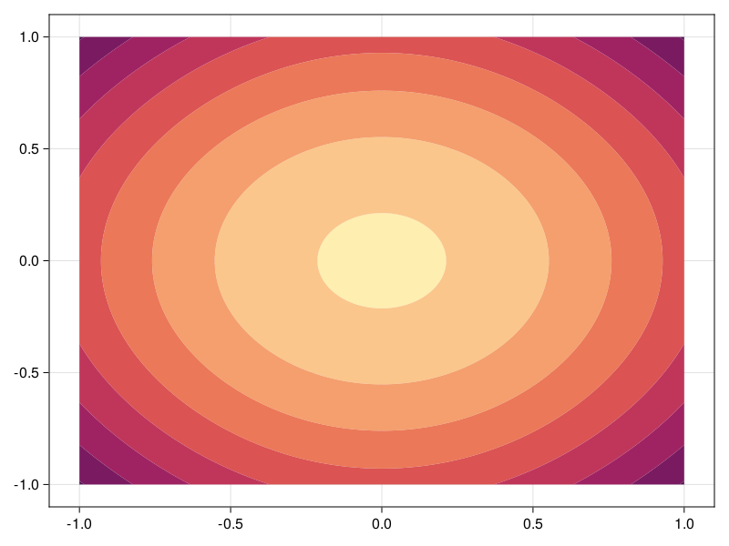

```@meta
EditURL = "https://github.com/DanielVandH/FiniteVolumeMethod.jl/tree/main/docs/src/literate_tutorials/helmholtz_equation_with_inhomogeneous_boundary_conditions.jl"
```


# Helmholtz Equation with Inhomogeneous Boundary Conditions
In this tutorial, we consider the following steady state problem:
```math
\begin{equation}
\begin{aligned}
\grad^2 u(\vb x) + u(\vb x) &= 0 & \vb x \in [-1, 1]^2 \\
\pdv{u}{\vb n} &= 1 & \vb x \in\partial[-1,1]^2.
\end{aligned}
\end{equation}
```
We can define this problem in the same way we have defined previous problems,
except that the final `FVMProblem` must be wrapped in a `SteadyFVMProblem`.
Let us start by defining the mesh and the boundary conditions.

````julia
using DelaunayTriangulation, FiniteVolumeMethod
tri = triangulate_rectangle(-1, 1, -1, 1, 125, 125, single_boundary=true)
mesh = FVMGeometry(tri)
````

````
FVMGeometry with 15625 control volumes, 30752 triangles, and 46376 edges
````

For the boundary condition,
```math
\pdv{u}{\vb n} = 1,
```
which is the same as $\grad u \vdot \vu n = 1$, this needs to be expressed in terms of $\vb q$.
Since $\vb q = -\grad u$ for this problem, the boundary condition is $\vb q \vdot \vu n = -1$.

````julia
BCs = BoundaryConditions(mesh, (x, y, t, u, p) -> -one(u), Neumann)
````

````
BoundaryConditions with 1 boundary condition with type Neumann
````

To now define the problem, we note that the `initial_condition` and `final_time`
fields have different interpretations for steady state problems. The
`initial_condition` now serves as an initial estimate for the steady state solution,
which is needed for the nonlinear solver, and `final_time` should now
be `Inf`. For the initial condition, let us simply let
the initial estimate be all zeros. For the diffusion and source terms,
note that previously we have been considered equations of the form
```math
\pdv{u}{t} + \div\vb q = S \quad \textnormal{or} \quad \pdv{u}{t} = \div[D\grad u] + S,
```
while steady state problems take the form
```math
\div\vb q = S \quad \textnormal{or} \quad \div[D\grad u] + S = 0.
```
So, for this problem, $D = 1$ and $S = u$.

````julia
diffusion_function = (x, y, t, u, p) -> one(u)
source_function = (x, y, t, u, p) -> u
initial_condition = zeros(DelaunayTriangulation.num_solid_vertices(tri))
final_time = Inf
prob = FVMProblem(mesh, BCs;
    diffusion_function,
    source_function,
    initial_condition,
    final_time)
````

````
FVMProblem with 15625 nodes and time span (0.0, Inf)
````

````julia
steady_prob = SteadyFVMProblem(prob)
````

````
SteadyFVMProblem with 15625 nodes
````

To now solve this problem, we use a Newton-Raphson solver. Alternative solvers,
such as `DynamicSS(TRBDF2(linsolve=KLUFactorization()), reltol=1e-4)` from
SteadyStateDiffEq can also be used. A good method could be to use
a simple solver, like `NewtonRaphson()`, and then use that solution
as the initial guess in a finer algorithm like the `DynamicSS`
algorithm above.

````julia
using NonlinearSolve
sol = solve(steady_prob, NewtonRaphson())
copyto!(prob.initial_condition, sol.u) # this also changes steady_prob's initial condition
using SteadyStateDiffEq, LinearSolve, OrdinaryDiffEq
sol = solve(steady_prob, DynamicSS(TRBDF2(linsolve=KLUFactorization())))
````

````
u: 15625-element Vector{Float64}:
 -1.2840868826185348
 -1.3001602399337269
 -1.316047180716894
 -1.3317536108619148
 -1.3472783728730695
  ⋮
 -1.3472783728732491
 -1.331753610862094
 -1.3160471807170733
 -1.300160239933906
 -1.284086882618714
````

For this problem, this correction by `DynamicSS` doesn't seem to actually be needed.
Now let's visualise.

````julia
using CairoMakie
fig, ax, sc = tricontourf(tri, sol.u, levels=-2.5:0.15:-1.0, colormap=:matter)
fig
````


## Just the code
An uncommented version of this example is given below.
You can view the source code for this file [here](https://github.com/DanielVandH/FiniteVolumeMethod.jl/tree/main/docs/src/literate_tutorials/helmholtz_equation_with_inhomogeneous_boundary_conditions.jl).

```julia
using DelaunayTriangulation, FiniteVolumeMethod
tri = triangulate_rectangle(-1, 1, -1, 1, 125, 125, single_boundary=true)
mesh = FVMGeometry(tri)

BCs = BoundaryConditions(mesh, (x, y, t, u, p) -> -one(u), Neumann)

diffusion_function = (x, y, t, u, p) -> one(u)
source_function = (x, y, t, u, p) -> u
initial_condition = zeros(DelaunayTriangulation.num_solid_vertices(tri))
final_time = Inf
prob = FVMProblem(mesh, BCs;
    diffusion_function,
    source_function,
    initial_condition,
    final_time)

steady_prob = SteadyFVMProblem(prob)

using NonlinearSolve
sol = solve(steady_prob, NewtonRaphson())
copyto!(prob.initial_condition, sol.u) # this also changes steady_prob's initial condition
using SteadyStateDiffEq, LinearSolve, OrdinaryDiffEq
sol = solve(steady_prob, DynamicSS(TRBDF2(linsolve=KLUFactorization())))

using CairoMakie
fig, ax, sc = tricontourf(tri, sol.u, levels=-2.5:0.15:-1.0, colormap=:matter)
fig
```

---

*This page was generated using [Literate.jl](https://github.com/fredrikekre/Literate.jl).*

