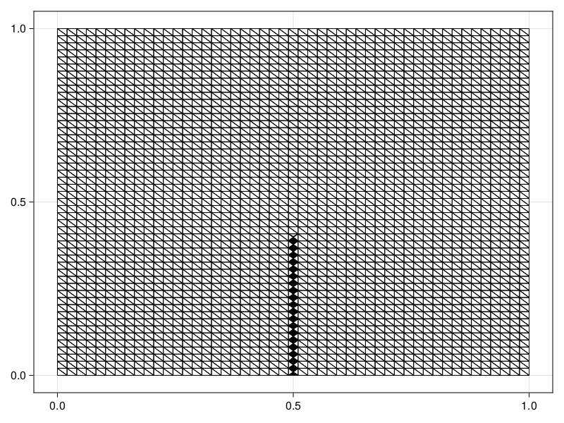
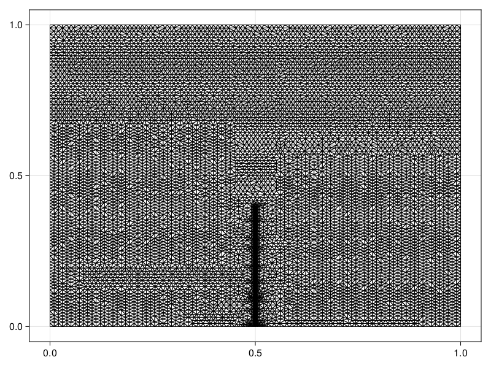
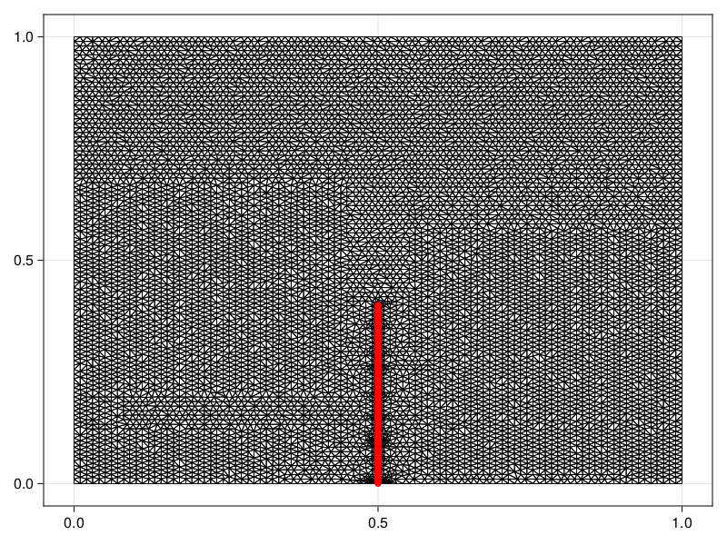
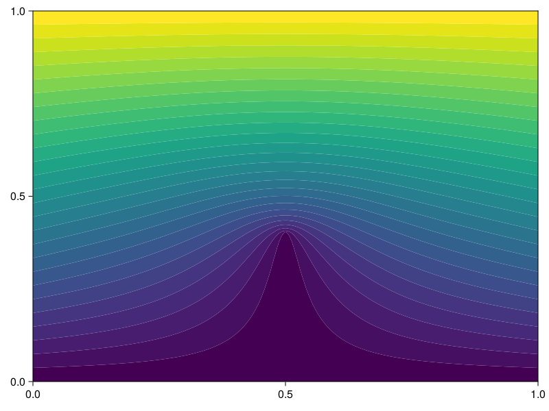

```@meta
EditURL = "https://github.com/SciML/FiniteVolumeMethod.jl/tree/main/docs/src/literate_tutorials/laplaces_equation_with_internal_dirichlet_conditions.jl"
```


# Laplace's Equation with Internal Dirichlet Conditions
In this tutorial, we consider Laplace's equation with some additional complexity
put into the problem via internal Dirichlet conditions:
```math
\begin{equation}
\begin{aligned}
\grad^2 u &= 0 & \vb x \in [0, 1]^2, \\
u(0, y) &= 100y & 0 \leq y \leq 1, \\
u(1, y) &= 100y & 0 \leq y \leq 1, \\
u(x, 0) &= 0 & 0 \leq x \leq 1, \\
u(x, 1) &= 100 & 0 \leq x \leq 1, \\
u(1/2, y) &= 0 & 0 \leq y \leq 2/5.
\end{aligned}
\end{equation}
```
To start with solving this problem, let us define an initial mesh.

````julia
using DelaunayTriangulation, FiniteVolumeMethod
tri = triangulate_rectangle(0, 1, 0, 1, 50, 50, single_boundary=false)
````

````
Delaunay Triangulation.
    Constrained: true
    Has ghost triangles: true
    Number of points: 2500
    Number of triangles: 4998
    Number of edges: 7501
````

In this mesh, we don't have any points that lie exactly on the
line $\{x = 1/2, 0 \leq y \leq 2/5\}$, so we cannot enforce this
constraint exactly.[^1] Instead, we need to add these points into `tri`.
We do not need to add any constrained edges in this case, since these internal
conditions are enforced only at points.

[^1]: Of course, by defining the grid spacing appropriately we could have such points, but we just want to show here how we can add these points in if needed.

Let us now add in the points.

````julia
using CairoMakie
new_points = LinRange(0, 2 / 5, 250)
for y in new_points
    add_point!(tri, 1 / 2, y)
end
fig, ax, sc = triplot(tri)
fig
````


It may also help to refine the mesh slightly.

````julia
refine!(tri, max_area=1e-4)
fig, ax, sc = triplot(tri)
fig
````


````julia
mesh = FVMGeometry(tri)
````

````
FVMGeometry with 10223 control volumes, 20042 triangles, and 30264 edges
````

Now that we have the mesh, we can define the boundary conditions.
Remember that the order of the boundary indices is the bottom wall,
right wall, top wall, and then the left wall.

````julia
bc_bot = (x, y, t, u, p) -> zero(u)
bc_right = (x, y, t, u, p) -> oftype(u, 100y) # helpful to have each bc return the same type
bc_top = (x, y, t, u, p) -> oftype(u, 100)
bc_left = (x, y, t, u, p) -> oftype(u, 100y)
bcs = (bc_bot, bc_right, bc_top, bc_left)
types = (Dirichlet, Dirichlet, Dirichlet, Dirichlet)
BCs = BoundaryConditions(mesh, bcs, types)
````

````
BoundaryConditions with 4 boundary conditions with types (Dirichlet, Dirichlet, Dirichlet, Dirichlet)
````

We now need to define the internal conditions.
This is done using `InternalConditions`. First,
we need to find all the vertices that lie on
the line $\{x = 1/2, 0 \leq y \leq 2/5\}$. We could
compute these manually, but let's find them programmatically
instead for the sake of demonstration.

````julia
function find_all_points_on_line(tri)
    vertices = Int[]
    for i in each_solid_vertex(tri)
        x, y = get_point(tri, i)
        if x == 1 / 2 && 0 ≤ y ≤ 2 / 5
            push!(vertices, i)
        end
    end
    return vertices
end
vertices = find_all_points_on_line(tri)
fig, ax, sc = triplot(tri)
points = [get_point(tri, i) for i in vertices]
scatter!(ax, points, color=:red, markersize=10)
fig
````


Now that we have the vertices, we can define the internal conditions.
We need to provide `InternalConditions` with a `Dict` that maps
each vertex in `vertices` to a function index that corresponds to the
condition for that vertex. In this case, that function index
is `1` as we only have a single function.

````julia
ICs = InternalConditions((x, y, t, u, p) -> zero(u),
    dirichlet_nodes=Dict(vertices .=> 1))
````

````
InternalConditions with 250 Dirichlet nodes and 0 Dudt nodes
````

Now we can define the problem. As discussed in
the [Helmholtz tutorial](helmholtz_equation_with_inhomogeneous_boundary_conditions.md),
we are looking to define a steady state problem, and so
the initial condition needs to be a suitable initial guess of
what the solution could be. Looking to the boundary and internal conditions,
one suitable guess is $u(x, y) = 100y$ with $u(1/2, y) = 0$ for $0 \leq y \leq 2/5$;
in fact, $u(x, y) = 100y$ is the solution of the problem without the internal condition.
Let us now use this to define our initial condition.

````julia
initial_condition = zeros(DelaunayTriangulation.num_solid_vertices(tri))
for i in each_solid_vertex(tri)
    x, y = get_point(tri, i)
    initial_condition[i] = ifelse(x == 1 / 2 && 0 ≤ y ≤ 2 / 5, 0, 100y)
end
````

Now let's define the problem. The internal conditions are
provided as the third argument of `FVMProblem`.

````julia
diffusion_function = (x, y, t, u, p) -> one(u) # ∇²u = ∇⋅[D∇u], D = 1
final_time = Inf
prob = FVMProblem(mesh, BCs, ICs;
    diffusion_function,
    initial_condition,
    final_time)
````

````
FVMProblem with 10223 nodes and time span (0.0, Inf)
````

````julia
steady_prob = SteadyFVMProblem(prob)
````

````
SteadyFVMProblem with 10223 nodes
````

Now let's solve the problem.

````julia
using SteadyStateDiffEq, LinearSolve, OrdinaryDiffEq
sol = solve(steady_prob, DynamicSS(TRBDF2(linsolve=KLUFactorization())))
````

````
u: 10223-element Vector{Float64}:
  0.0
  0.0
  0.0
  0.0
  0.0
  ⋮
 52.99056010002759
 60.20408163265305
 82.65306122448979
  0.0
 64.28571428571428
````

````julia
fig, ax, sc = tricontourf(tri, sol.u, levels=LinRange(0, 100, 28))
tightlimits!(ax)
fig
````


## Just the code
An uncommented version of this example is given below.
You can view the source code for this file [here](https://github.com/SciML/FiniteVolumeMethod.jl/tree/main/docs/src/literate_tutorials/laplaces_equation_with_internal_dirichlet_conditions.jl).

```julia
using DelaunayTriangulation, FiniteVolumeMethod
tri = triangulate_rectangle(0, 1, 0, 1, 50, 50, single_boundary=false)

using CairoMakie
new_points = LinRange(0, 2 / 5, 250)
for y in new_points
    add_point!(tri, 1 / 2, y)
end
fig, ax, sc = triplot(tri)
fig

refine!(tri, max_area=1e-4)
fig, ax, sc = triplot(tri)
fig

mesh = FVMGeometry(tri)

bc_bot = (x, y, t, u, p) -> zero(u)
bc_right = (x, y, t, u, p) -> oftype(u, 100y) # helpful to have each bc return the same type
bc_top = (x, y, t, u, p) -> oftype(u, 100)
bc_left = (x, y, t, u, p) -> oftype(u, 100y)
bcs = (bc_bot, bc_right, bc_top, bc_left)
types = (Dirichlet, Dirichlet, Dirichlet, Dirichlet)
BCs = BoundaryConditions(mesh, bcs, types)

function find_all_points_on_line(tri)
    vertices = Int[]
    for i in each_solid_vertex(tri)
        x, y = get_point(tri, i)
        if x == 1 / 2 && 0 ≤ y ≤ 2 / 5
            push!(vertices, i)
        end
    end
    return vertices
end
vertices = find_all_points_on_line(tri)
fig, ax, sc = triplot(tri)
points = [get_point(tri, i) for i in vertices]
scatter!(ax, points, color=:red, markersize=10)
fig

ICs = InternalConditions((x, y, t, u, p) -> zero(u),
    dirichlet_nodes=Dict(vertices .=> 1))

initial_condition = zeros(DelaunayTriangulation.num_solid_vertices(tri))
for i in each_solid_vertex(tri)
    x, y = get_point(tri, i)
    initial_condition[i] = ifelse(x == 1 / 2 && 0 ≤ y ≤ 2 / 5, 0, 100y)
end

diffusion_function = (x, y, t, u, p) -> one(u) # ∇²u = ∇⋅[D∇u], D = 1
final_time = Inf
prob = FVMProblem(mesh, BCs, ICs;
    diffusion_function,
    initial_condition,
    final_time)

steady_prob = SteadyFVMProblem(prob)

using SteadyStateDiffEq, LinearSolve, OrdinaryDiffEq
sol = solve(steady_prob, DynamicSS(TRBDF2(linsolve=KLUFactorization())))

fig, ax, sc = tricontourf(tri, sol.u, levels=LinRange(0, 100, 28))
tightlimits!(ax)
fig
```

---

*This page was generated using [Literate.jl](https://github.com/fredrikekre/Literate.jl).*

