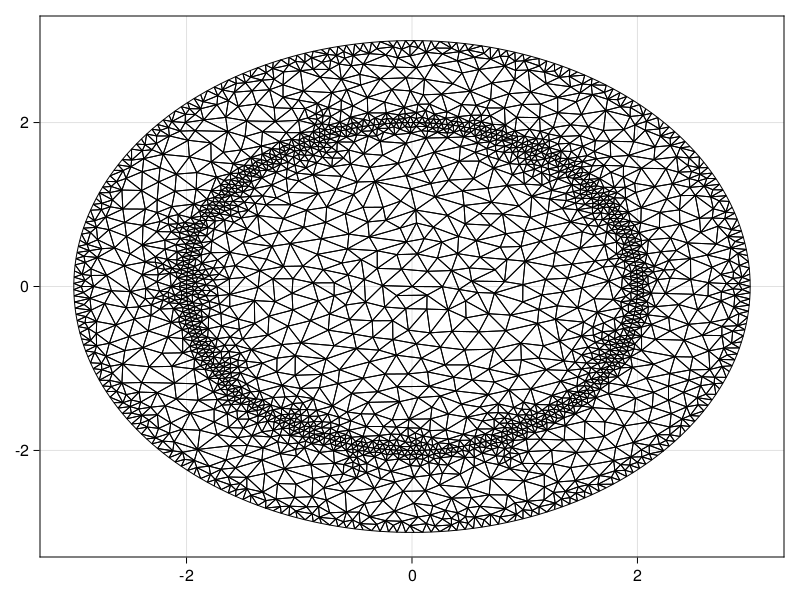
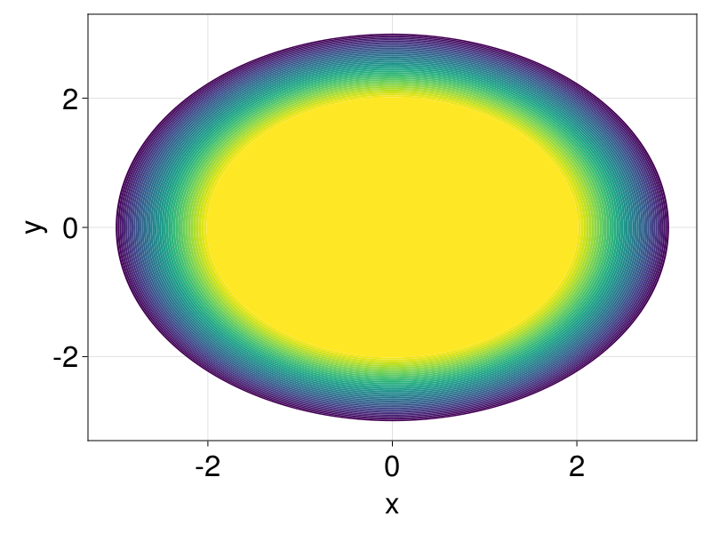
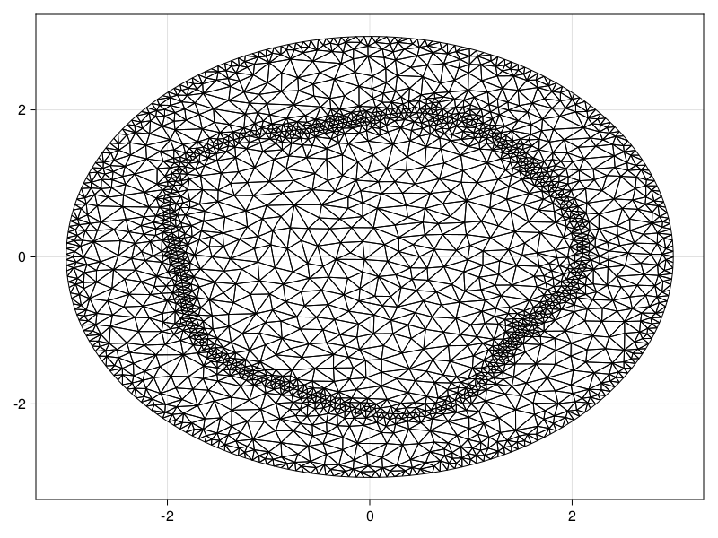
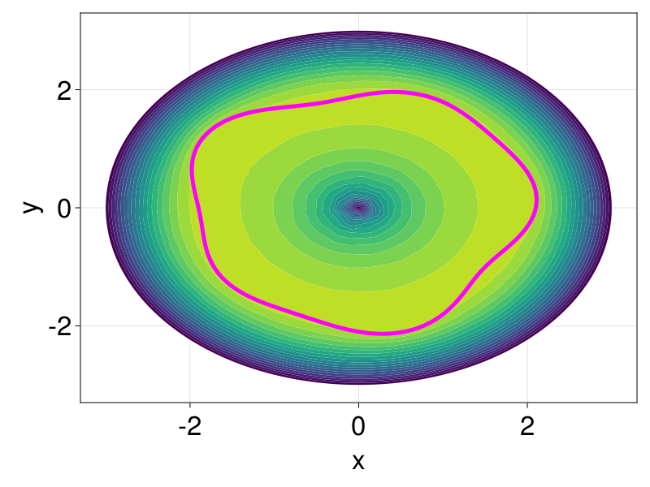
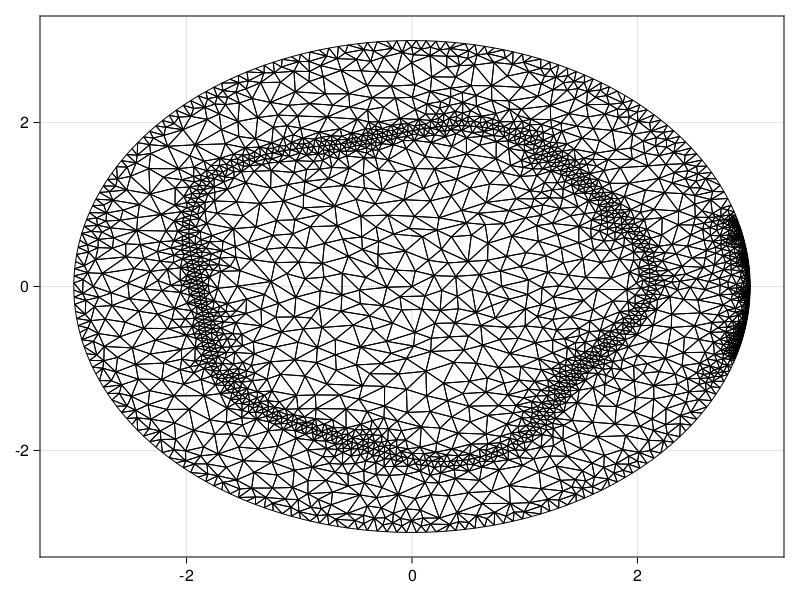
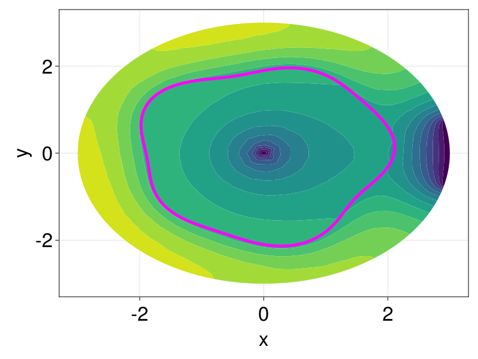
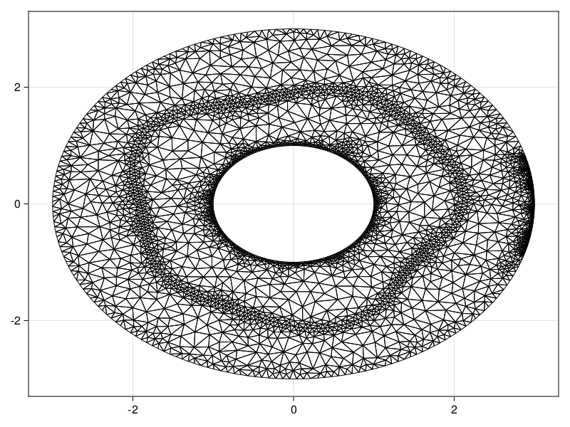
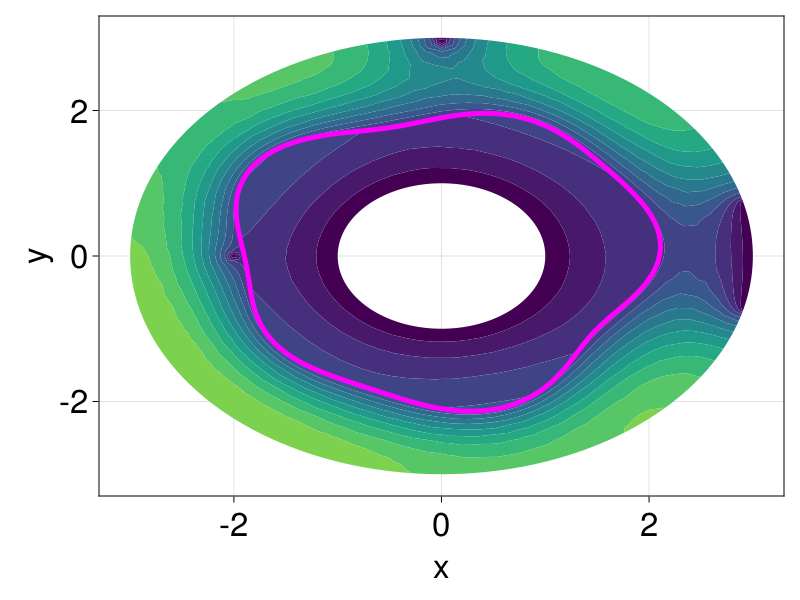

```@meta
EditURL = "https://github.com/SciML/FiniteVolumeMethod.jl/tree/main/docs/src/literate_tutorials/mean_exit_time.jl"
```


# Mean Exit Time
```@contents
Pages = ["mean_exit_time.md"]
```
## Definition of the problem
In this tutorial, we consider the problem of mean exit time, based
on some of my previous work.[^1] Typically,
mean exit time problems with linear diffusion take the form
```math
\begin{equation}\label{eq:met}
\begin{aligned}
D\grad^2T(\vb x) &= -1 & \vb x \in \Omega, \\
T(\vb x) &= 0 & \vb x \in \partial \Omega,
\end{aligned}
\end{equation}
```
for some diffusivity $D$. $T(\vb x)$ is the mean exit time at $\vb x$,
meaning the average time it would take a particle starting at $\vb x$ to exit the domain
through $\partial\Omega$. For this interpretation of $T$, we are letting $D = \mathcal P\delta^2/(4\tau)$,
where $\delta > 0$ is the step length of the particle, $\tau>0$ is the duration between steps, and $\mathcal P \in [0, 1]$
is the probability that the particle actually moves at a given time step.

[^1]: See [Simpson et al. (2021)](https://iopscience.iop.org/article/10.1088/1367-2630/abe60d) and [Carr et al. (2022)](https://iopscience.iop.org/article/10.1088/1751-8121/ac4a1d).
 In this previous work, we also use the finite volume method, but the problems are instead formulated
 as linear problems, which makes the solution significantly simpler to implement. The approach we give here
 is more generally applicable for other nonlinear problems, though.

A more complicated extension of \eqref{eq:met} is to allow the particle to be moving through
a _heterogenous_ media, so that the diffusivity depends on $\vb x$. In particular,
let us consider a compound disk $\Omega = \{0 < r < R_1\} \cup \{R_1 < r < R_2\}$,
and let $\mathcal P$ (the probability of movement) be piecewise constant across $\Omega$
(and thus also $D$):
```math
P = \begin{cases} P_1 & 0<r<R_1,\\P_2&R_1<r<R_2,\end{cases}\quad D=\begin{cases}D_1&0<r<R_1,\\D_2&R_1<r<R_2,\end{cases}
```
where $D_1 = P_1\delta^2/(4\tau)$ and $D_2=P_2\delta^2/(4\tau)$. The inner region, where
$0 < r < R_1$, and the outer region, where $R_1<r<R_2$, are separated by an interface
at $r=R_1$ and we apply an _absorbing boundary condition_ at $r=R_2$, meaning particles
that reach $r=R_2$ exit the domain. For this problem, \eqref{eq:met} is instead given by
```math
\begin{equation}\label{eq:met2}
\begin{aligned}
\frac{D_1}{r}\dv{r}\left(r\dv{T^{(1)}}{r}\right) &= -1 & 0 <r<R_1, \\[6pt]
\frac{D_2}{r}\dv{r}\left(r\dv{T^{(2)}}{r}\right) &= -1 & R_1<r<R_2,\\[6pt]
T^{(1)}(R_1) &= T^{(2)}(R_1), \\
D_1\dv{T^{(1)}}{r}(R_1) &= D_2\dv{T^{(2)}}{r}(R_1), \\[6pt]
\dv{T^{(1)}}{r}(0) &= 0, \\[6pt]
T^{(2)}(R_2) &= 0,
\end{aligned}
\end{equation}
```
which we describe using polar coordinates, and we let $T^{(1)}(r)$
be the mean exit time for $0 < r < R_1$, and $T^{(2)}(r)$ be the mean exit time
for $R_1 < r < R_2$. The boundary conditions at the interface
are to enforce continuity of $T$ and continuity of the flux of $T$ across
the interface, and the condition $\mathrm dT^{(1)}/\mathrm dr = 0$ at $r=0$
is to ensure that $T^{(1)}$ is finite at $r=0$. This problem actually
has an exact solution,
```math
\begin{equation}\label{eq:met2exact}
\begin{aligned}
T^{(1)}(r) &= \frac{R_1^2-r^2}{4D_1}+\frac{R_2^2-R_1^2}{4D_2}, \\
T^{(2)}(r) &= \frac{R_2^2-r^2}{4D_2},
\end{aligned}
\end{equation}
```
which will be useful later.

One other extension we can make is to allow the interface to be more
complicated than just a circle. We take a _perturbed_ interface,
$\mathcal R_1(\theta)$, so that the inner region
is now $0 < r < \mathcal R_1(\theta)$ and the outer region is $\mathcal R_1(\theta) < r < R_2$.
The function $\mathcal R_1(\theta)$ is written in the form
$\mathcal R_1(\theta) = R_1(1+\varepsilon g(\theta))$, where $\varepsilon \ll 1$
is a perturbation parameter, $R_1$ is the radius of the unperturbed interface,
and $g(\theta)$ is a smooth $\mathcal O(1)$ periodic function with period $2\pi$;
we let $g(\theta) = \sin(3\theta) + \cos(5\theta)$ and $\varepsilon=0.05$
for this tutorial. With this setup, \eqref{eq:met2} now becomes
```math
\begin{equation}\label{eq:met3}
\begin{aligned}
D_1\grad^2 T^{(1)}(\vb x) &= -1 & 0 < r < \mathcal R_1(\theta), \\
D_2\grad^2 T^{(2)}(\vb x) &= -1 & \mathcal R_1(\theta) < r < R_2, \\
T^{(1)}(\mathcal R_1(\theta),\theta) &= T^{(2)}(\mathcal R_1(\theta),\theta), \\
D_1\grad T^{(1)}(\mathcal R_1(\theta), \theta) \vdot \vu n(\theta) &= D_2\grad T^{(2)}(\mathcal R_1(\theta), \theta) \vdot \vu n(\theta), \\
T^{(2)}(R_2, \theta) &= 0. \\
\end{aligned}
\end{equation}
```
This problem has no exact solution (it has a perturbation solution, though,
derived in [Carr et al. (2022)](https://iopscience.iop.org/article/10.1088/1751-8121/ac4a1d)).

At the end of this tutorial, we also consider modifying \eqref{eq:met3} even further so that there are holes
in the domain, and an internal Dirichlet condition at the origin.

## Unperturbed interface
Let us start by solving the problem on an unperturbed interface. We note that, while \eqref{eq:met2} is defined
so that there are two variables $T^{(1)}$ and $T^{(2)}$, which therefore requires continuity equations across
the interface, numerically we can solve this in terms of a single variable $T$ with a space-varying diffusivity. Moreover,
the finiteness condition at the origin is not needed. Thus, we can solve
```math
\begin{equation}
\begin{aligned}
D(\vb x)\grad^2 T(\vb x) &= -1 & \vb x \in \mathcal D(0, R_2), \\
T(\vb x) &= 0 & \vb x \in \partial \mathcal D(0, R_2).
\end{aligned}
\end{equation}
```
Here, $\mathcal D(0,R_2)$ is the circle of radius $R_2$ centered at the origin, and
```math
D(\vb x) = \begin{cases} D_1 & \|\vb x\| < R_1, \\ D_2 & R_1 \leq \|\vb x\| \leq R_2. \end{cases}
```
The mesh is defined as follows. To help the accuracy of the solution,
we add more triangles around the boundary by putting some constrained
edges there.

````julia
using DelaunayTriangulation, FiniteVolumeMethod, CairoMakie
θ = LinRange(0, 2π, 250)
R₁, R₂ = 2.0, 3.0
x = @. R₂ * cos(θ)
y = @. R₂ * sin(θ)
x[end] = x[begin]
y[end] = y[begin]
boundary_nodes, points = convert_boundary_points_to_indices(x, y)
tri = triangulate(points; boundary_nodes, delete_ghosts=false)
xin = @views @. R₁ * cos(θ)[begin:end-1]
yin = @views @. R₁ * sin(θ)[begin:end-1]
add_point!(tri, xin[1], yin[1])
for i in 2:length(xin)
    add_point!(tri, xin[i], yin[i])
    n = DelaunayTriangulation.num_solid_vertices(tri)
    add_segment!(tri, n - 1, n)
end
n = DelaunayTriangulation.num_solid_vertices(tri)
add_segment!(tri, n - 1, n)
refine!(tri; max_area=1e-3get_area(tri))
triplot(tri)
````


````julia
mesh = FVMGeometry(tri)
````

````
FVMGeometry with 2395 control volumes, 4539 triangles, and 6933 edges
````

The boundary conditions are simple absorbing conditions.

````julia
BCs = BoundaryConditions(mesh, ((x, y, t, u, p) -> zero(u),), (Dirichlet,))
````

````
BoundaryConditions with 1 boundary condition with type Dirichlet
````

For the problem, let us first define the diffusivity.

````julia
D₁, D₂ = 6.25e-4, 6.25e-5
diffusion_function = (x, y, t, u, p) -> let r = sqrt(x^2 + y^2)
    return ifelse(r < p.R₁, p.D₁, p.D₂)
end
diffusion_parameters = (R₁=R₁, D₁=D₁, D₂=D₂)
````

````
(R₁ = 2.0, D₁ = 0.000625, D₂ = 6.25e-5)
````

For the initial condition, which recall is the
initial guess for the steady problem, let us use the
exact solution for the mean exit time problem on a
disk with a uniform diffusivity, which is given by
$(R_2^2 - r^2)/(4D_2)$.

````julia
f = (x, y) -> let r = sqrt(x^2 + y^2)
    return (R₂^2 - r^2) / (4D₂)
end
initial_condition = [f(x, y) for (x, y) in DelaunayTriangulation.each_point(tri)]
````

````
2395-element Vector{Float64}:
     0.0
     7.105427357601002e-12
    -1.4210854715202004e-11
     7.105427357601002e-12
     7.105427357601002e-12
     ⋮
 28863.753017474664
 32730.346629636977
 27004.7281726618
 27004.728172661857
 27004.728172661886
````

We now define the problem.

````julia
source_function = (x, y, t, u, p) -> one(u)
prob = FVMProblem(mesh, BCs;
    diffusion_function, diffusion_parameters,
    source_function, initial_condition,
    final_time=Inf)
````

````
FVMProblem with 2395 nodes and time span (0.0, Inf)
````

````julia
steady_prob = SteadyFVMProblem(prob)
````

````
SteadyFVMProblem with 2395 nodes
````

We now solve this problem as we've done for any previous problem.

````julia
using SteadyStateDiffEq, LinearSolve, OrdinaryDiffEq
sol = solve(steady_prob, DynamicSS(Rosenbrock23()))
````

````
u: 2395-element Vector{Float64}:
     0.0
     0.0
     0.0
     0.0
     0.0
     ⋮
 21131.223444250667
 21521.64597816076
 20940.58089547931
 20940.04016685199
 20940.651793961155
````

````julia
fig = Figure(fontsize=33)
ax = Axis(fig[1, 1], xlabel="x", ylabel="y")
tricontourf!(ax, tri, sol.u, levels=0:500:20000, extendhigh=:auto)
fig
````


## Perturbed interface
Let us now solve the problem with a perturbed interface.
The mesh is defined as follows.

````julia
g = θ -> sin(3θ) + cos(5θ)
ε = 0.05
R1_f = θ -> R₁ * (1 + ε * g(θ))
x = @. R₂ * cos(θ)
y = @. R₂ * sin(θ)
x[end] = x[begin]
y[end] = y[begin]
boundary_nodes, points = convert_boundary_points_to_indices(x, y)
tri = triangulate(points; boundary_nodes, delete_ghosts=false)
xin = @views (@. R1_f(θ) * cos(θ))[begin:end-1]
yin = @views (@. R1_f(θ) * sin(θ))[begin:end-1]
add_point!(tri, xin[1], yin[1])
for i in 2:length(xin)
    add_point!(tri, xin[i], yin[i])
    n = DelaunayTriangulation.num_solid_vertices(tri)
    add_segment!(tri, n - 1, n)
end
n = DelaunayTriangulation.num_solid_vertices(tri)
add_segment!(tri, n - 1, n)
refine!(tri; max_area=1e-3get_area(tri))
triplot(tri)
````


````julia
mesh = FVMGeometry(tri)
````

````
FVMGeometry with 2247 control volumes, 4243 triangles, and 6489 edges
````

The boundary conditions are simple absorbing conditions.

````julia
BCs = BoundaryConditions(mesh, (x, y, t, u, p) -> zero(u), Dirichlet)
````

````
BoundaryConditions with 1 boundary condition with type Dirichlet
````

Now we define the problem. For the initial condition that we use,
we will use the exact solution for the problem with an unperturbed
interface.

````julia
function T_exact(x, y)
    r = sqrt(x^2 + y^2)
    if r < R₁
        return (R₁^2 - r^2) / (4D₁) + (R₂^2 - R₁^2) / (4D₂)
    else
        return (R₂^2 - r^2) / (4D₂)
    end
end
diffusion_function = (x, y, t, u, p) -> let r = sqrt(x^2 + y^2), θ = atan(y, x)
    interface_val = p.R1_f(θ)
    return ifelse(r < interface_val, p.D₁, p.D₂)
end
diffusion_parameters = (D₁=D₁, D₂=D₂, R1_f=R1_f)
initial_condition = [T_exact(x, y) for (x, y) in DelaunayTriangulation.each_point(tri)]
source_function = (x, y, t, u, p) -> one(u)
prob = FVMProblem(mesh, BCs;
    diffusion_function, diffusion_parameters,
    source_function, initial_condition,
    final_time=Inf)
steady_prob = SteadyFVMProblem(prob)
````

````
SteadyFVMProblem with 2247 nodes
````

````julia
sol = solve(steady_prob, DynamicSS(Rosenbrock23()))
````

````
u: 2247-element Vector{Float64}:
     0.0
     0.0
     0.0
     0.0
     0.0
     ⋮
 20365.266543725145
 21261.70075768702
 12518.592153951857
 21279.951123146006
 20737.025749964443
````

````julia
fig = Figure(fontsize=33)
ax = Axis(fig[1, 1], xlabel="x", ylabel="y")
tricontourf!(ax, tri, sol.u, levels=0:500:20000, extendhigh=:auto)
lines!(ax, [xin; xin[1]], [yin; yin[1]], color=:magenta, linewidth=5)
fig
````


## Adding obstacles
Let us now add some obstacles into the problem. We add in components
one at a time, exploring the impact of each component individually. When
we update the triangulation, we do need to update the `mesh` since it is
constructed from the initial `tri`.

The first obstacle we consider adding is a single hole at the origin,
which we accomplish by adding a point at the origin and then
using `InternalConditions`. This point will be used to absorb
any nearby particles, i.e. $T(0,0)=0$.

````julia
add_point!(tri, 0.0, 0.0)
mesh = FVMGeometry(tri)
ICs = InternalConditions((x, y, t, u, p) -> zero(u), dirichlet_nodes=Dict(DelaunayTriangulation.num_solid_vertices(tri) => 1))
BCs = BoundaryConditions(mesh, (x, y, t, u, p) -> zero(u), Dirichlet)
initial_condition = [T_exact(x, y) for (x, y) in DelaunayTriangulation.each_point(tri)]
prob = FVMProblem(mesh, BCs, ICs;
    diffusion_function, diffusion_parameters,
    source_function, initial_condition,
    final_time=Inf)
steady_prob = SteadyFVMProblem(prob)
sol = solve(steady_prob, DynamicSS(Rosenbrock23()))
fig = Figure(fontsize=33)
ax = Axis(fig[1, 1], xlabel="x", ylabel="y")
tricontourf!(ax, tri, sol.u, levels=0:500:10000, extendhigh=:auto)
lines!(ax, [xin; xin[1]], [yin; yin[1]], color=:magenta, linewidth=5)
fig
````


We see that the hole has changed the interior significantly. For the
next constraint, let us change the boundary so that
we only allow particles to exit through a small part of the boundary,
reflecting off all other parts. For the reflecting boundary condition,
this is enforced by using Neumann boundary conditions.

````julia
εr = 0.25
θref = LinRange(εr, 2π - εr, 200)
θabs = LinRange(2π - εr, 2π + εr, 200)
xref = @. R₂ * cos(θref)
yref = @. R₂ * sin(θref)
xabs = @. R₂ * cos(θabs)
yabs = @. R₂ * sin(θabs)
xref[end] = xabs[begin]
yref[end] = yabs[begin]
x = [xref, xabs]
y = [yref, yabs]
boundary_nodes, points = convert_boundary_points_to_indices(x, y)
tri = triangulate(points; boundary_nodes, delete_ghosts=false)
xin = @views (@. R1_f(θ) * cos(θ))[begin:end-1]
yin = @views (@. R1_f(θ) * sin(θ))[begin:end-1]
add_point!(tri, xin[1], yin[1])
for i in 2:length(xin)
    add_point!(tri, xin[i], yin[i])
    n = DelaunayTriangulation.num_solid_vertices(tri)
    add_segment!(tri, n - 1, n)
end
n = DelaunayTriangulation.num_solid_vertices(tri)
add_segment!(tri, n - 1, n)
add_point!(tri, 0.0, 0.0)
origin_idx = DelaunayTriangulation.num_solid_vertices(tri)
refine!(tri; max_area=1e-3get_area(tri))
triplot(tri)
````


````julia
mesh = FVMGeometry(tri)
zero_f = (x, y, t, u, p) -> zero(u)
BCs = BoundaryConditions(mesh, (zero_f, zero_f), (Neumann, Dirichlet))
ICs = InternalConditions((x, y, t, u, p) -> zero(u), dirichlet_nodes=Dict(origin_idx => 1))
initial_condition = [T_exact(x, y) for (x, y) in DelaunayTriangulation.each_point(tri)]
prob = FVMProblem(mesh, BCs, ICs;
    diffusion_function, diffusion_parameters,
    source_function, initial_condition,
    final_time=Inf)
steady_prob = SteadyFVMProblem(prob)
sol = solve(steady_prob, DynamicSS(Rosenbrock23()))
fig = Figure(fontsize=33)
ax = Axis(fig[1, 1], xlabel="x", ylabel="y")
tricontourf!(ax, tri, sol.u, levels=0:2500:35000, extendhigh=:auto)
lines!(ax, [xin; xin[1]], [yin; yin[1]], color=:magenta, linewidth=5)
fig
````


Now, as a last constraint, let's add a hole. We'll put hole at the origin,  and we'll
move the point hole to $(-2, 0)$ rather than at the origin, and we'll also put a hole at
$(0, 2.95)$.

````julia
xhole = @. cos(θ)
yhole = @. sin(θ)
reverse!(xhole) # clockwise
reverse!(yhole)
xhole[begin] = xhole[end]
yhole[begin] = yhole[end]
x = [[xref, xabs], [xhole]]
y = [[yref, yabs], [yhole]]
boundary_nodes, points = convert_boundary_points_to_indices(x, y)
tri = triangulate(points; boundary_nodes, delete_ghosts=false)
xin = @views (@. R1_f(θ) * cos(θ))[begin:end-1]
yin = @views (@. R1_f(θ) * sin(θ))[begin:end-1]
add_point!(tri, xin[1], yin[1])
for i in 2:length(xin)
    add_point!(tri, xin[i], yin[i])
    n = DelaunayTriangulation.num_solid_vertices(tri)
    add_segment!(tri, n - 1, n)
end
n = DelaunayTriangulation.num_solid_vertices(tri)
add_segment!(tri, n - 1, n)
add_point!(tri, -2.0, 0.0)
add_point!(tri, 0.0, 2.95)
pointhole_idxs = [DelaunayTriangulation.num_solid_vertices(tri), DelaunayTriangulation.num_solid_vertices(tri)-1]
refine!(tri; max_area=1e-3get_area(tri))
triplot(tri)
````


The boundary condition we'll use at the new interior hole
will be an absorbing boundary condition.

````julia
mesh = FVMGeometry(tri)
ICs = InternalConditions((x, y, t, u, p) -> zero(u), dirichlet_nodes=Dict(origin_idx => 1))
zero_f = (x, y, t, u, p) -> zero(u)
BCs = BoundaryConditions(mesh, (zero_f, zero_f, zero_f), (Neumann, Dirichlet, Dirichlet))
ICs = InternalConditions((x, y, t, u, p) -> zero(u), dirichlet_nodes=Dict(pointhole_idxs .=> 1))
initial_condition = [T_exact(x, y) for (x, y) in DelaunayTriangulation.each_point(tri)]
prob = FVMProblem(mesh, BCs, ICs;
    diffusion_function, diffusion_parameters,
    source_function, initial_condition,
    final_time=Inf)
steady_prob = SteadyFVMProblem(prob)
sol = solve(steady_prob, DynamicSS(Rosenbrock23()))
fig = Figure(fontsize=33)
ax = Axis(fig[1, 1], xlabel="x", ylabel="y")
tricontourf!(ax, tri, sol.u, levels=0:1000:15000, extendhigh=:auto)
lines!(ax, [xin; xin[1]], [yin; yin[1]], color=:magenta, linewidth=5)
fig
````


## Just the code
An uncommented version of this example is given below.
You can view the source code for this file [here](https://github.com/SciML/FiniteVolumeMethod.jl/tree/main/docs/src/literate_tutorials/mean_exit_time.jl).

```julia
using DelaunayTriangulation, FiniteVolumeMethod, CairoMakie
θ = LinRange(0, 2π, 250)
R₁, R₂ = 2.0, 3.0
x = @. R₂ * cos(θ)
y = @. R₂ * sin(θ)
x[end] = x[begin]
y[end] = y[begin]
boundary_nodes, points = convert_boundary_points_to_indices(x, y)
tri = triangulate(points; boundary_nodes, delete_ghosts=false)
xin = @views @. R₁ * cos(θ)[begin:end-1]
yin = @views @. R₁ * sin(θ)[begin:end-1]
add_point!(tri, xin[1], yin[1])
for i in 2:length(xin)
    add_point!(tri, xin[i], yin[i])
    n = DelaunayTriangulation.num_solid_vertices(tri)
    add_segment!(tri, n - 1, n)
end
n = DelaunayTriangulation.num_solid_vertices(tri)
add_segment!(tri, n - 1, n)
refine!(tri; max_area=1e-3get_area(tri))
triplot(tri)

mesh = FVMGeometry(tri)

BCs = BoundaryConditions(mesh, ((x, y, t, u, p) -> zero(u),), (Dirichlet,))

D₁, D₂ = 6.25e-4, 6.25e-5
diffusion_function = (x, y, t, u, p) -> let r = sqrt(x^2 + y^2)
    return ifelse(r < p.R₁, p.D₁, p.D₂)
end
diffusion_parameters = (R₁=R₁, D₁=D₁, D₂=D₂)

f = (x, y) -> let r = sqrt(x^2 + y^2)
    return (R₂^2 - r^2) / (4D₂)
end
initial_condition = [f(x, y) for (x, y) in DelaunayTriangulation.each_point(tri)]

source_function = (x, y, t, u, p) -> one(u)
prob = FVMProblem(mesh, BCs;
    diffusion_function, diffusion_parameters,
    source_function, initial_condition,
    final_time=Inf)

steady_prob = SteadyFVMProblem(prob)

using SteadyStateDiffEq, LinearSolve, OrdinaryDiffEq
sol = solve(steady_prob, DynamicSS(Rosenbrock23()))

fig = Figure(fontsize=33)
ax = Axis(fig[1, 1], xlabel="x", ylabel="y")
tricontourf!(ax, tri, sol.u, levels=0:500:20000, extendhigh=:auto)
fig

g = θ -> sin(3θ) + cos(5θ)
ε = 0.05
R1_f = θ -> R₁ * (1 + ε * g(θ))
x = @. R₂ * cos(θ)
y = @. R₂ * sin(θ)
x[end] = x[begin]
y[end] = y[begin]
boundary_nodes, points = convert_boundary_points_to_indices(x, y)
tri = triangulate(points; boundary_nodes, delete_ghosts=false)
xin = @views (@. R1_f(θ) * cos(θ))[begin:end-1]
yin = @views (@. R1_f(θ) * sin(θ))[begin:end-1]
add_point!(tri, xin[1], yin[1])
for i in 2:length(xin)
    add_point!(tri, xin[i], yin[i])
    n = DelaunayTriangulation.num_solid_vertices(tri)
    add_segment!(tri, n - 1, n)
end
n = DelaunayTriangulation.num_solid_vertices(tri)
add_segment!(tri, n - 1, n)
refine!(tri; max_area=1e-3get_area(tri))
triplot(tri)

mesh = FVMGeometry(tri)

BCs = BoundaryConditions(mesh, (x, y, t, u, p) -> zero(u), Dirichlet)

function T_exact(x, y)
    r = sqrt(x^2 + y^2)
    if r < R₁
        return (R₁^2 - r^2) / (4D₁) + (R₂^2 - R₁^2) / (4D₂)
    else
        return (R₂^2 - r^2) / (4D₂)
    end
end
diffusion_function = (x, y, t, u, p) -> let r = sqrt(x^2 + y^2), θ = atan(y, x)
    interface_val = p.R1_f(θ)
    return ifelse(r < interface_val, p.D₁, p.D₂)
end
diffusion_parameters = (D₁=D₁, D₂=D₂, R1_f=R1_f)
initial_condition = [T_exact(x, y) for (x, y) in DelaunayTriangulation.each_point(tri)]
source_function = (x, y, t, u, p) -> one(u)
prob = FVMProblem(mesh, BCs;
    diffusion_function, diffusion_parameters,
    source_function, initial_condition,
    final_time=Inf)
steady_prob = SteadyFVMProblem(prob)

sol = solve(steady_prob, DynamicSS(Rosenbrock23()))

fig = Figure(fontsize=33)
ax = Axis(fig[1, 1], xlabel="x", ylabel="y")
tricontourf!(ax, tri, sol.u, levels=0:500:20000, extendhigh=:auto)
lines!(ax, [xin; xin[1]], [yin; yin[1]], color=:magenta, linewidth=5)
fig

add_point!(tri, 0.0, 0.0)
mesh = FVMGeometry(tri)
ICs = InternalConditions((x, y, t, u, p) -> zero(u), dirichlet_nodes=Dict(DelaunayTriangulation.num_solid_vertices(tri) => 1))
BCs = BoundaryConditions(mesh, (x, y, t, u, p) -> zero(u), Dirichlet)
initial_condition = [T_exact(x, y) for (x, y) in DelaunayTriangulation.each_point(tri)]
prob = FVMProblem(mesh, BCs, ICs;
    diffusion_function, diffusion_parameters,
    source_function, initial_condition,
    final_time=Inf)
steady_prob = SteadyFVMProblem(prob)
sol = solve(steady_prob, DynamicSS(Rosenbrock23()))
fig = Figure(fontsize=33)
ax = Axis(fig[1, 1], xlabel="x", ylabel="y")
tricontourf!(ax, tri, sol.u, levels=0:500:10000, extendhigh=:auto)
lines!(ax, [xin; xin[1]], [yin; yin[1]], color=:magenta, linewidth=5)
fig

εr = 0.25
θref = LinRange(εr, 2π - εr, 200)
θabs = LinRange(2π - εr, 2π + εr, 200)
xref = @. R₂ * cos(θref)
yref = @. R₂ * sin(θref)
xabs = @. R₂ * cos(θabs)
yabs = @. R₂ * sin(θabs)
xref[end] = xabs[begin]
yref[end] = yabs[begin]
x = [xref, xabs]
y = [yref, yabs]
boundary_nodes, points = convert_boundary_points_to_indices(x, y)
tri = triangulate(points; boundary_nodes, delete_ghosts=false)
xin = @views (@. R1_f(θ) * cos(θ))[begin:end-1]
yin = @views (@. R1_f(θ) * sin(θ))[begin:end-1]
add_point!(tri, xin[1], yin[1])
for i in 2:length(xin)
    add_point!(tri, xin[i], yin[i])
    n = DelaunayTriangulation.num_solid_vertices(tri)
    add_segment!(tri, n - 1, n)
end
n = DelaunayTriangulation.num_solid_vertices(tri)
add_segment!(tri, n - 1, n)
add_point!(tri, 0.0, 0.0)
origin_idx = DelaunayTriangulation.num_solid_vertices(tri)
refine!(tri; max_area=1e-3get_area(tri))
triplot(tri)

mesh = FVMGeometry(tri)
zero_f = (x, y, t, u, p) -> zero(u)
BCs = BoundaryConditions(mesh, (zero_f, zero_f), (Neumann, Dirichlet))
ICs = InternalConditions((x, y, t, u, p) -> zero(u), dirichlet_nodes=Dict(origin_idx => 1))
initial_condition = [T_exact(x, y) for (x, y) in DelaunayTriangulation.each_point(tri)]
prob = FVMProblem(mesh, BCs, ICs;
    diffusion_function, diffusion_parameters,
    source_function, initial_condition,
    final_time=Inf)
steady_prob = SteadyFVMProblem(prob)
sol = solve(steady_prob, DynamicSS(Rosenbrock23()))
fig = Figure(fontsize=33)
ax = Axis(fig[1, 1], xlabel="x", ylabel="y")
tricontourf!(ax, tri, sol.u, levels=0:2500:35000, extendhigh=:auto)
lines!(ax, [xin; xin[1]], [yin; yin[1]], color=:magenta, linewidth=5)
fig

xhole = @. cos(θ)
yhole = @. sin(θ)
reverse!(xhole) # clockwise
reverse!(yhole)
xhole[begin] = xhole[end]
yhole[begin] = yhole[end]
x = [[xref, xabs], [xhole]]
y = [[yref, yabs], [yhole]]
boundary_nodes, points = convert_boundary_points_to_indices(x, y)
tri = triangulate(points; boundary_nodes, delete_ghosts=false)
xin = @views (@. R1_f(θ) * cos(θ))[begin:end-1]
yin = @views (@. R1_f(θ) * sin(θ))[begin:end-1]
add_point!(tri, xin[1], yin[1])
for i in 2:length(xin)
    add_point!(tri, xin[i], yin[i])
    n = DelaunayTriangulation.num_solid_vertices(tri)
    add_segment!(tri, n - 1, n)
end
n = DelaunayTriangulation.num_solid_vertices(tri)
add_segment!(tri, n - 1, n)
add_point!(tri, -2.0, 0.0)
add_point!(tri, 0.0, 2.95)
pointhole_idxs = [DelaunayTriangulation.num_solid_vertices(tri), DelaunayTriangulation.num_solid_vertices(tri)-1]
refine!(tri; max_area=1e-3get_area(tri))
triplot(tri)

mesh = FVMGeometry(tri)
ICs = InternalConditions((x, y, t, u, p) -> zero(u), dirichlet_nodes=Dict(origin_idx => 1))
zero_f = (x, y, t, u, p) -> zero(u)
BCs = BoundaryConditions(mesh, (zero_f, zero_f, zero_f), (Neumann, Dirichlet, Dirichlet))
ICs = InternalConditions((x, y, t, u, p) -> zero(u), dirichlet_nodes=Dict(pointhole_idxs .=> 1))
initial_condition = [T_exact(x, y) for (x, y) in DelaunayTriangulation.each_point(tri)]
prob = FVMProblem(mesh, BCs, ICs;
    diffusion_function, diffusion_parameters,
    source_function, initial_condition,
    final_time=Inf)
steady_prob = SteadyFVMProblem(prob)
sol = solve(steady_prob, DynamicSS(Rosenbrock23()))
fig = Figure(fontsize=33)
ax = Axis(fig[1, 1], xlabel="x", ylabel="y")
tricontourf!(ax, tri, sol.u, levels=0:1000:15000, extendhigh=:auto)
lines!(ax, [xin; xin[1]], [yin; yin[1]], color=:magenta, linewidth=5)
fig
```

---

*This page was generated using [Literate.jl](https://github.com/fredrikekre/Literate.jl).*

