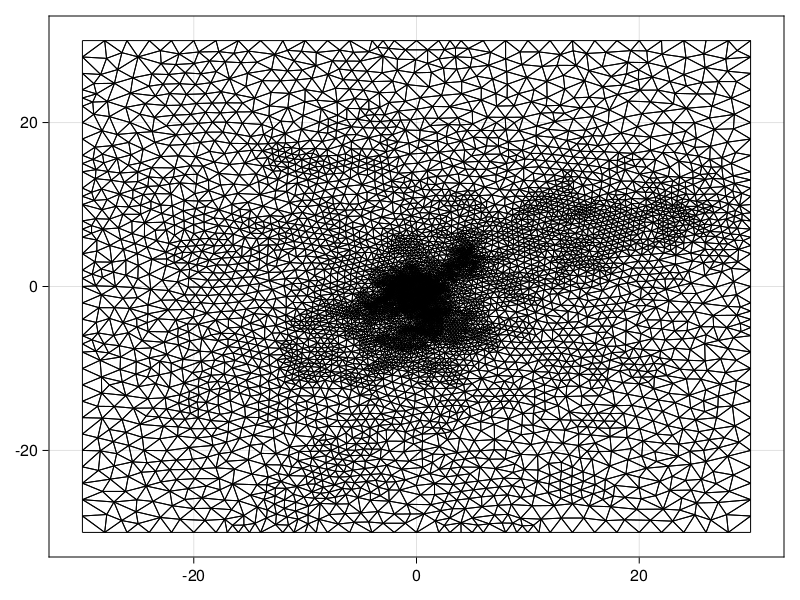
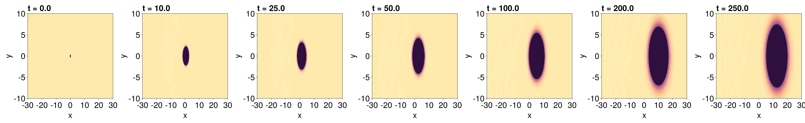
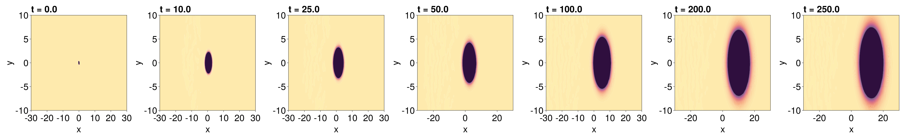
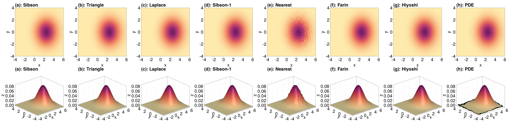

```@meta
EditURL = "https://github.com/DanielVandH/FiniteVolumeMethod.jl/tree/main/docs/src/literate_tutorials/piecewise_linear_and_natural_neighbour_interpolation_for_an_advection_diffusion_equation.jl"
```


# Piecewise Linear and Natural Neighbour Inteprolation for an Advection-Diffusion Equation
In this tutorial, we have three aims:

1. Demonstrate how to solve an advection-diffusion equation.
2. Demonstrate how piecewise linear interpolation can be applied to a PDE solution at each time.
3. Demonstrate how  [NaturalNeighbours.jl](https://github.com/DanielVandH/NaturalNeighbours.jl) can be applied to compute more accurate interpolants than piecewise linear interpolation at each time.

The equation we will be considering is
```math
\begin{equation}\label{eq:advdiffeq}
\begin{aligned}
\pdv{u}{t} &= D\pdv[2]{u}{x} + D\pdv[2]{u}{y} - \nu\pdv{u}{x},
\end{aligned}
\end{equation}
```
with $u(\vb x, 0) = \delta(\vb x)$ and homogeneous Dirichlet conditions,
where $\delta$ is the Dirac delta function. This equation is defined on
$\mathbb R^2$, but we will replace $\mathbb R^2$ with $\Omega = [-L, L]^2$
for $L = 30$.

## Solving the problem
We start by defining and solving the problem associated
with \eqref{eq:advdiffeq}. For the mesh, we could use
`triangulate_rectangle`, but we want to put most of the triangles
near the origin, so we need to use `refine!` on an initial mesh.

````julia
using DelaunayTriangulation, FiniteVolumeMethod, LinearAlgebra, CairoMakie
L = 30
tri = triangulate_rectangle(-L, L, -L, L, 2, 2, single_boundary=true)
tot_area = get_total_area(tri)
max_area_function = (A, r) -> 1e-6tot_area * r^2 / A
area_constraint = (T, p, q, r, A) -> begin
    c = (p .+ q .+ r) ./ 3
    dist_to_origin = norm(c)
    flag = A ≥ max_area_function(A, dist_to_origin)
    return flag
end
refine!(tri; min_angle=33.0, max_area=area_constraint)
triplot(tri)
````


````julia
mesh = FVMGeometry(tri)
````

````
FVMGeometry with 7517 control volumes, 14889 triangles, and 22405 edges
````

The boundary conditions are homogeneous `Dirichlet` conditions.

````julia
BCs = BoundaryConditions(mesh, (x, y, t, u, p) -> zero(u), Dirichlet)
````

````
BoundaryConditions with 1 boundary condition with type Dirichlet
````

We now need to define the actual problem. We need to write \eqref{eq:advdiffeq}
in the form
```math
\pdv{u}{t} + \div\vb q = 0.
```
To do this, write:
```math
\begin{align*}
\div \vb q &= \nu\pdv{u}{x} - D\pdv[2]{u}{x} - D\pdv[2]{u}{y} \\
&= \pdv{x}\left(\nu u - D\pdv{u}{x}\right) - \pdv{y}\left(D\pdv{u}{y}\right) \\
&= \div \begin{bmatrix} \nu u - D\pdv{u}{x} & -D\pdv{u}{y} \end{bmatrix}^{\mkern-1.5mu\mathsf{T}} \\
&= \div \left(\boldsymbol\nu u - D\grad u\right),
\end{align*}
```
where $\boldsymbol\nu = (\nu, 0)^{\mkern-1.5mu\mathsf{T}}$. Thus, we can write
```math
\vb q = \boldsymbol\nu u - D\grad u.
```
We now have our flux function. Next, let us define the initial condition.
We approximate by
```math
\delta(\vb x) \approx g(\vb x) \approx \frac{1}{\varepsilon^2\pi}\exp\left[-\frac{1}{\varepsilon^2}\left(x^2+y^2\right)\right],
```
taking $\varepsilon=1/10$. We can now define the problem. Remember that the flux function
takes argument $(\alpha, \beta, \gamma)$ rather than $u$, replacing $u$ with $u(x, y) = \alpha x + \beta y + \gamma$,
and it returns a `Tuple` representing the vector. We let $D = 0.02$ and $\nu = 0.05$.

````julia
ε = 1 / 10
f = (x, y) -> 1 / (ε^2 * π) * exp(-(x^2 + y^2) / ε^2)
initial_condition = [f(x, y) for (x, y) in each_point(tri)]
flux_function = (x, y, t, α, β, γ, p) -> begin
    ∂x = α
    ∂y = β
    u = α * x + β * y + γ
    qx = p.ν * u - p.D * ∂x
    qy = -p.D * ∂y
    return (qx, qy)
end
flux_parameters = (D=0.02, ν=0.05)
final_time = 250.0
prob = FVMProblem(mesh, BCs;
    initial_condition,
    flux_function,
    flux_parameters,
    final_time)
````

````
FVMProblem with 7517 nodes and time span (0.0, 250.0)
````

Now we can solve and visualise the solution.

````julia
using OrdinaryDiffEq, LinearSolve
times = [0, 10, 25, 50, 100, 200, 250]
sol = solve(prob, TRBDF2(linsolve=KLUFactorization()), saveat=times)
````

````
retcode: Success
Interpolation: 1st order linear
t: 7-element Vector{Float64}:
   0.0
  10.0
  25.0
  50.0
 100.0
 200.0
 250.0
u: 7-element Vector{Vector{Float64}}:
 [0.0, 0.0, 0.0, 0.0, 0.0, 0.0, 0.0, 0.0, 0.0, 0.0  …  0.0, 0.0, 0.0, 0.0, 0.0, 0.0, 0.0, 0.0, 0.0, 0.0]
 [0.0, 0.0, 0.0, 0.0, 0.0, 0.0, 0.0, 0.0, 0.0, 0.0  …  -4.820370409845838e-21, 1.781509091138934e-18, 8.668307885555532e-18, 1.0872246109283898e-19, 8.739792989435581e-38, -1.5386644558925346e-70, 0.0, -8.582427708958973e-70, 0.0, 3.1444874843320617e-71]
 [0.0, 0.0, 0.0, 0.0, 0.0, 0.0, 0.0, 0.0, 0.0, 0.0  …  -8.705575768268958e-15, 2.5320548931287523e-12, 1.8121347305786222e-11, 6.598086106204419e-13, 2.225368844349885e-27, 6.491324655482258e-52, 0.0, -1.4158529308345883e-51, 0.0, 3.2049415035354516e-54]
 [0.0, 0.0, 0.0, 0.0, 0.0, 0.0, 0.0, 0.0, 0.0, 0.0  …  -1.2856728329346321e-11, 1.2885778626468056e-9, 3.7963349888690527e-8, 3.3553263399735208e-9, 2.9817554390779693e-21, 1.850695988736534e-40, 0.0, -2.3857764776098803e-40, 0.0, -1.091516431265274e-41]
 [0.0, 0.0, 0.0, 0.0, 0.0, 0.0, 0.0, 0.0, 0.0, 0.0  …  -3.7403617794408764e-10, 1.5643100090529325e-8, 1.932323164825378e-6, 4.15627183302958e-7, -3.267490197497367e-15, 1.4791054519639965e-30, 0.0, -8.014666816327261e-31, 0.0, -3.103313174242634e-31]
 [0.0, 0.0, 0.0, 0.0, 0.0, 0.0, 0.0, 0.0, 0.0, 0.0  …  -8.039430996945249e-11, 3.6901707246303116e-9, 1.307733528890288e-6, 5.278857221610239e-7, -1.7926807786961345e-11, 2.777118539299437e-23, 0.0, 4.9952737778161765e-23, 0.0, -3.698620883146577e-23]
 [0.0, 0.0, 0.0, 0.0, 0.0, 0.0, 0.0, 0.0, 0.0, 0.0  …  -1.2829974697485974e-11, 9.155105934253671e-10, 4.147432423397547e-7, 1.8930716238425514e-7, -5.827492783419948e-11, -4.1442792238834543e-22, 0.0, 4.11810775550092e-21, 0.0, -2.528712685049022e-21]
````

````julia
using CairoMakie
fig = Figure(fontsize=38)
for i in eachindex(sol)
    ax = Axis(fig[1, i], width=400, height=400,
        xlabel="x", ylabel="y",
        title="t = $(sol.t[i])",
        titlealign=:left)
    tricontourf!(ax, tri, sol.u[i], levels=0:0.00001:0.001, extendhigh=:auto, extendlow=:auto, colormap=:matter)
    tightlimits!(ax)
    ylims!(ax, -10, 10)
end
resize_to_layout!(fig)
fig
````


## Piecewise linear interpolation
As mentioned in [mathematical details section](../math.md), a key part of the finite volume method is the assumption that
$u$ is piecewise linear between each triangular element, letting $u(x, y) = \alpha x + \beta y + \gamma$. Thus,
it may be natural to want to interpolate the solution using piecewise linear interpolation. This could be done
by making use of `jump_and_march` from DelaunayTriangulation.jl to find the triangle containing a given point
$(x, y)$ and then use `pl_interpolate` to interpolate the solution at the point; we do not provide a method
that gets this triangle for you and then interpolates without this intermediate `jump_and_march`,
as it is typically more efficient to first obtain all the triangles you need
and then interpolate. In what follows, we:

1. Define a grid to interpolate over.
2. Find the triangles containing each point in the grid.
3. Interpolate at each point for the given times.

We consider the times $t = 10, 25, 50, 100, 200, 250$. You could also of course
amend the procedure so that you evaluate the interpolant at each time for a given point first,
allowing you to avoid storing the triangle since you only consider each point a single time.

````julia
x = LinRange(-L, L, 250)
y = LinRange(-L, L, 250)
triangles = Matrix{NTuple{3,Int}}(undef, length(x), length(y))
for j in eachindex(y)
    for i in eachindex(x)
        triangles[i, j] = jump_and_march(tri, (x[i], y[j]))
    end
end
interpolated_vals = zeros(length(x), length(y), length(sol))
for k in eachindex(sol)
    for j in eachindex(y)
        for i in eachindex(x)
            interpolated_vals[i, j, k] = pl_interpolate(prob, triangles[i, j], sol.u[k], x[i], y[j])
        end
    end
end
````

Let's visualise these results to check their accuracy. We compute the triangulation of
our grid to make the `tricontourf` call faster.

````julia
_tri = triangulate([[x for x in x, _ in y] |> vec [y for _ in x, y in y] |> vec]')
fig = Figure(fontsize=38)
for i in eachindex(sol)
    ax = Axis(fig[1, i], width=400, height=400,
        xlabel="x", ylabel="y",
        title="t = $(sol.t[i])",
        titlealign=:left)
    tricontourf!(ax, _tri, interpolated_vals[:, :, i] |> vec, levels=0:0.00001:0.001, extendhigh=:auto, extendlow=:auto, colormap=:matter)
    tightlimits!(ax)
    ylims!(ax, -10, 10)
end
resize_to_layout!(fig)
fig
````


## Natural neighbour interpolation
Since the solution is defined over a triangulation, the most natural form of inteprolation to use,
other than piecewise linear interpolation, is natural neighbour interpolation. We can use
[NaturalNeighbours.jl](https://github.com/DanielVandH/NaturalNeighbours.jl) for this;
NaturalNeighbours.jl also provides the same piecewise linear interpolant above via its
`Triangle()` interpolator, which may be more efficient as it has multithreading built in.

The way to construct a natural neighbour interpolant is as follows, where we provide
the interpolant with the solution at $t = 50$.

````julia
using NaturalNeighbours
itp = interpolate(tri, sol.u[4], derivatives=true) # sol.t[4] == 50
````

````
retcode: Success
Interpolation: 1st order linear
t: 7-element Vector{Float64}:
   0.0
  10.0
  25.0
  50.0
 100.0
 200.0
 250.0
u: 7-element Vector{Vector{Float64}}:
 [0.0, 0.0, 0.0, 0.0, 0.0, 0.0, 0.0, 0.0, 0.0, 0.0  …  0.0, 0.0, 0.0, 0.0, 0.0, 0.0, 0.0, 0.0, 0.0, 0.0]
 [0.0, 0.0, 0.0, 0.0, 0.0, 0.0, 0.0, 0.0, 0.0, 0.0  …  -4.820370409845838e-21, 1.781509091138934e-18, 8.668307885555532e-18, 1.0872246109283898e-19, 8.739792989435581e-38, -1.5386644558925346e-70, 0.0, -8.582427708958973e-70, 0.0, 3.1444874843320617e-71]
 [0.0, 0.0, 0.0, 0.0, 0.0, 0.0, 0.0, 0.0, 0.0, 0.0  …  -8.705575768268958e-15, 2.5320548931287523e-12, 1.8121347305786222e-11, 6.598086106204419e-13, 2.225368844349885e-27, 6.491324655482258e-52, 0.0, -1.4158529308345883e-51, 0.0, 3.2049415035354516e-54]
 [0.0, 0.0, 0.0, 0.0, 0.0, 0.0, 0.0, 0.0, 0.0, 0.0  …  -1.2856728329346321e-11, 1.2885778626468056e-9, 3.7963349888690527e-8, 3.3553263399735208e-9, 2.9817554390779693e-21, 1.850695988736534e-40, 0.0, -2.3857764776098803e-40, 0.0, -1.091516431265274e-41]
 [0.0, 0.0, 0.0, 0.0, 0.0, 0.0, 0.0, 0.0, 0.0, 0.0  …  -3.7403617794408764e-10, 1.5643100090529325e-8, 1.932323164825378e-6, 4.15627183302958e-7, -3.267490197497367e-15, 1.4791054519639965e-30, 0.0, -8.014666816327261e-31, 0.0, -3.103313174242634e-31]
 [0.0, 0.0, 0.0, 0.0, 0.0, 0.0, 0.0, 0.0, 0.0, 0.0  …  -8.039430996945249e-11, 3.6901707246303116e-9, 1.307733528890288e-6, 5.278857221610239e-7, -1.7926807786961345e-11, 2.777118539299437e-23, 0.0, 4.9952737778161765e-23, 0.0, -3.698620883146577e-23]
 [0.0, 0.0, 0.0, 0.0, 0.0, 0.0, 0.0, 0.0, 0.0, 0.0  …  -1.2829974697485974e-11, 9.155105934253671e-10, 4.147432423397547e-7, 1.8930716238425514e-7, -5.827492783419948e-11, -4.1442792238834543e-22, 0.0, 4.11810775550092e-21, 0.0, -2.528712685049022e-21]
````

We need `derivatives = true` so that we can use the higher order interpolants `Sibson(1)`, `Hiyoshi(2)`,
and `Farin()` below - if you don't use those, then you shouldn't need this option (unless you
want to later differentiate the interpolant using `differentiate`, then yes you do need it).

We can then evaluate this interpolant by simply calling it. The most efficient
way to call it is by providing it with a vector of points, rather than broadcasting
over points, since multithreading can be used in this case. Let us
interpolate at the grid from before, which requires us to collect it into a vector:

````julia
_x = [x for x in x, _ in y] |> vec
_y = [y for _ in x, y in y] |> vec;
````

We will look at all the interpolants provided by NaturalNeighbours.jl.[^1]

[^1]: This list is available from `?NaturalNeighbours.AbstractInterpolator`. Look at the help page (`?`) for the respective interpolators or NaturalNeighbours.jl's documentation for more information.

````julia
sibson_vals = itp(_x, _y; method=Sibson())
triangle_vals = itp(_x, _y; method=Triangle()) # this is the same as pl_interpolate
laplace_vals = itp(_x, _y; method=Laplace())
sibson_1_vals = itp(_x, _y; method=Sibson(1))
nearest_vals = itp(_x, _y; method=Nearest())
farin_vals = itp(_x, _y; method=Farin())
hiyoshi_vals = itp(_x, _y; method=Hiyoshi(2))
pde_vals = sol.u[4];
````

We visualise these results as follows.

````julia
fig = Figure(fontsize=38)
all_vals = (sibson_vals, triangle_vals, laplace_vals, sibson_1_vals, nearest_vals, farin_vals, hiyoshi_vals, pde_vals)
titles = ("(a): Sibson", "(b): Triangle", "(c): Laplace", "(d): Sibson-1", "(e): Nearest", "(f): Farin", "(g): Hiyoshi", "(h): PDE")
fig = Figure(fontsize=55, resolution=(6350, 1550)) # resolution from resize_to_layout!(fig) - had to manually adjust to fix missing ticks
for (i, (vals, title)) in enumerate(zip(all_vals, titles))
    ax2d = Axis(fig[1, i], xlabel="x", ylabel="y", width=600, height=600, title=title, titlealign=:left)
    ax3d = Axis3(fig[2, i], xlabel="x", ylabel="y", width=600, height=600, title=title, titlealign=:left)
    ax3d.zlabeloffset[] = 125
    xlims!(ax2d, -4, 6)
    ylims!(ax2d, -4, 4)
    xlims!(ax3d, -4, 6)
    ylims!(ax3d, -4, 4)
    if vals ≠ pde_vals
        contourf!(ax2d, _x, _y, vals, color=vals, colormap=:matter, levels=0:0.001:0.1, extendlow=:auto, extendhigh=:auto)
        vals = copy(vals)
        vals[(_x.<-4).|(_x.>6)] .= NaN
        vals[(_y.<-4).|(_y.>4)] .= NaN # This is the only way to fix the weird issues with Axis3 when changing the (x/y/z)lims...
        surface!(ax3d, _x, _y, vals, color=vals, colormap=:matter, colorrange=(0, 0.1), extendlow=:auto, extendhigh=:auto)
    else
        tricontourf!(ax2d, tri, vals, color=vals, colormap=:matter, levels=0:0.001:0.1, extendlow=:auto, extendhigh=:auto)
        triangles = [T[j] for T in each_solid_triangle(tri), j in 1:3]
        x = getx.(get_points(tri))
        y = gety.(get_points(tri))
        vals = copy(vals)
        vals[(x.<-4).|(x.>6)] .= NaN
        vals[(y.<-4).|(y.>4)] .= NaN # This is the only way to fix the weird issues with Axis3 when changing the (x/y/z)lims...
        mesh!(ax3d, hcat(x, y, vals), triangles, color=vals, colormap=:matter, colorrange=(0, 0.1))
    end
end
fig
````


We note that natural neighbour interpolation is not technically well defined
for constrained triangulations. In this case it is fine, but for regions
with, say, holes or non-convex boundaries, you may run into issues. For such
cases, you should usually call the interpolant with `project=false` to at least
help the procedure a bit. You may also be interested in `identify_exterior_points`.
We consider interpolating data over a region with holes in [this annulus example](diffusion_equation_on_an_annulus.md).
## Just the code
An uncommented version of this example is given below.
You can view the source code for this file [here](https://github.com/DanielVandH/FiniteVolumeMethod.jl/tree/main/docs/src/literate_tutorials/piecewise_linear_and_natural_neighbour_interpolation_for_an_advection_diffusion_equation.jl).

```julia
using DelaunayTriangulation, FiniteVolumeMethod, LinearAlgebra, CairoMakie
L = 30
tri = triangulate_rectangle(-L, L, -L, L, 2, 2, single_boundary=true)
tot_area = get_total_area(tri)
max_area_function = (A, r) -> 1e-6tot_area * r^2 / A
area_constraint = (T, p, q, r, A) -> begin
    c = (p .+ q .+ r) ./ 3
    dist_to_origin = norm(c)
    flag = A ≥ max_area_function(A, dist_to_origin)
    return flag
end
refine!(tri; min_angle=33.0, max_area=area_constraint)
triplot(tri)

mesh = FVMGeometry(tri)

BCs = BoundaryConditions(mesh, (x, y, t, u, p) -> zero(u), Dirichlet)

ε = 1 / 10
f = (x, y) -> 1 / (ε^2 * π) * exp(-(x^2 + y^2) / ε^2)
initial_condition = [f(x, y) for (x, y) in each_point(tri)]
flux_function = (x, y, t, α, β, γ, p) -> begin
    ∂x = α
    ∂y = β
    u = α * x + β * y + γ
    qx = p.ν * u - p.D * ∂x
    qy = -p.D * ∂y
    return (qx, qy)
end
flux_parameters = (D=0.02, ν=0.05)
final_time = 250.0
prob = FVMProblem(mesh, BCs;
    initial_condition,
    flux_function,
    flux_parameters,
    final_time)

using OrdinaryDiffEq, LinearSolve
times = [0, 10, 25, 50, 100, 200, 250]
sol = solve(prob, TRBDF2(linsolve=KLUFactorization()), saveat=times)

using CairoMakie
fig = Figure(fontsize=38)
for i in eachindex(sol)
    ax = Axis(fig[1, i], width=400, height=400,
        xlabel="x", ylabel="y",
        title="t = $(sol.t[i])",
        titlealign=:left)
    tricontourf!(ax, tri, sol.u[i], levels=0:0.00001:0.001, extendhigh=:auto, extendlow=:auto, colormap=:matter)
    tightlimits!(ax)
    ylims!(ax, -10, 10)
end
resize_to_layout!(fig)
fig

x = LinRange(-L, L, 250)
y = LinRange(-L, L, 250)
triangles = Matrix{NTuple{3,Int}}(undef, length(x), length(y))
for j in eachindex(y)
    for i in eachindex(x)
        triangles[i, j] = jump_and_march(tri, (x[i], y[j]))
    end
end
interpolated_vals = zeros(length(x), length(y), length(sol))
for k in eachindex(sol)
    for j in eachindex(y)
        for i in eachindex(x)
            interpolated_vals[i, j, k] = pl_interpolate(prob, triangles[i, j], sol.u[k], x[i], y[j])
        end
    end
end

_tri = triangulate([[x for x in x, _ in y] |> vec [y for _ in x, y in y] |> vec]')
fig = Figure(fontsize=38)
for i in eachindex(sol)
    ax = Axis(fig[1, i], width=400, height=400,
        xlabel="x", ylabel="y",
        title="t = $(sol.t[i])",
        titlealign=:left)
    tricontourf!(ax, _tri, interpolated_vals[:, :, i] |> vec, levels=0:0.00001:0.001, extendhigh=:auto, extendlow=:auto, colormap=:matter)
    tightlimits!(ax)
    ylims!(ax, -10, 10)
end
resize_to_layout!(fig)
fig

using NaturalNeighbours
itp = interpolate(tri, sol.u[4], derivatives=true) # sol.t[4] == 50

_x = [x for x in x, _ in y] |> vec
_y = [y for _ in x, y in y] |> vec;

sibson_vals = itp(_x, _y; method=Sibson())
triangle_vals = itp(_x, _y; method=Triangle()) # this is the same as pl_interpolate
laplace_vals = itp(_x, _y; method=Laplace())
sibson_1_vals = itp(_x, _y; method=Sibson(1))
nearest_vals = itp(_x, _y; method=Nearest())
farin_vals = itp(_x, _y; method=Farin())
hiyoshi_vals = itp(_x, _y; method=Hiyoshi(2))
pde_vals = sol.u[4];

fig = Figure(fontsize=38)
all_vals = (sibson_vals, triangle_vals, laplace_vals, sibson_1_vals, nearest_vals, farin_vals, hiyoshi_vals, pde_vals)
titles = ("(a): Sibson", "(b): Triangle", "(c): Laplace", "(d): Sibson-1", "(e): Nearest", "(f): Farin", "(g): Hiyoshi", "(h): PDE")
fig = Figure(fontsize=55, resolution=(6350, 1550)) # resolution from resize_to_layout!(fig) - had to manually adjust to fix missing ticks
for (i, (vals, title)) in enumerate(zip(all_vals, titles))
    ax2d = Axis(fig[1, i], xlabel="x", ylabel="y", width=600, height=600, title=title, titlealign=:left)
    ax3d = Axis3(fig[2, i], xlabel="x", ylabel="y", width=600, height=600, title=title, titlealign=:left)
    ax3d.zlabeloffset[] = 125
    xlims!(ax2d, -4, 6)
    ylims!(ax2d, -4, 4)
    xlims!(ax3d, -4, 6)
    ylims!(ax3d, -4, 4)
    if vals ≠ pde_vals
        contourf!(ax2d, _x, _y, vals, color=vals, colormap=:matter, levels=0:0.001:0.1, extendlow=:auto, extendhigh=:auto)
        vals = copy(vals)
        vals[(_x.<-4).|(_x.>6)] .= NaN
        vals[(_y.<-4).|(_y.>4)] .= NaN # This is the only way to fix the weird issues with Axis3 when changing the (x/y/z)lims...
        surface!(ax3d, _x, _y, vals, color=vals, colormap=:matter, colorrange=(0, 0.1), extendlow=:auto, extendhigh=:auto)
    else
        tricontourf!(ax2d, tri, vals, color=vals, colormap=:matter, levels=0:0.001:0.1, extendlow=:auto, extendhigh=:auto)
        triangles = [T[j] for T in each_solid_triangle(tri), j in 1:3]
        x = getx.(get_points(tri))
        y = gety.(get_points(tri))
        vals = copy(vals)
        vals[(x.<-4).|(x.>6)] .= NaN
        vals[(y.<-4).|(y.>4)] .= NaN # This is the only way to fix the weird issues with Axis3 when changing the (x/y/z)lims...
        mesh!(ax3d, hcat(x, y, vals), triangles, color=vals, colormap=:matter, colorrange=(0, 0.1))
    end
end
fig
```

---

*This page was generated using [Literate.jl](https://github.com/fredrikekre/Literate.jl).*

