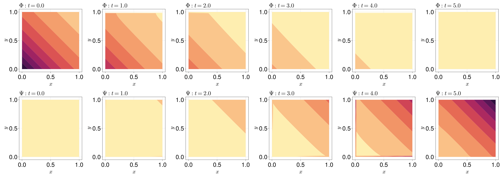

```@meta
EditURL = "https://github.com/SciML/FiniteVolumeMethod.jl/tree/main/docs/src/literate_tutorials/reaction_diffusion_brusselator_system_of_pdes.jl"
```


# A Reaction-Diffusion Brusselator System of PDEs
In this tutorial, we show how we can solve systems of PDEs.
We consider the reaction-diffusion Brusselator system:
```math
\begin{equation}\label{eq:brusleeq}
\begin{aligned}
\pdv{\Phi}{t} &= \frac14\grad^2 \Phi + \Phi^2\Psi - 2\Phi & \vb x \in [0, 1]^2, \\
\pdv{\Psi}{t} &= \frac14\grad^2 \Psi - \Phi^2\Psi + \Phi & \vb x \in [0, 1]^2,
\end{aligned}
\end{equation}
```
Since this is a somewhat contrived example, we will be using the exact
solution to define sensible initial and boundary conditions:[^1]
```math
\begin{equation}\label{eq:brusleexct}
\begin{aligned}
\Phi(x, y, t) &=\exp(-x-y-t/2), \\
\Psi(x, y, t) &= \exp(x+y+t/2).
\end{aligned}
\end{equation}
```
[^1]: See [Islam, Ali, and Haq (2010)](https://doi.org/10.1016/j.apm.2010.03.028).
We can use these exact solutions \eqref{eq:brusleexct} to also show how we can mix boundary conditions.
We use:
```math
\begin{equation*}
\begin{aligned}
\Phi(x, y, 0) &= \exp(-x-y), \\
\Psi(x, y, 0) &= \exp(x + y), \\
\pdv{\Phi}{y} &= -\exp(-x-t/2) & y = 0, \\[6pt]
\Psi &= \exp(x + t/2) & y = 0, \\
\pdv{\Phi}{x} &= -\exp(-1-y-t/2) & x=1, \\[6pt]
\pdv{\Psi}{x} &= \exp(1 + y+ t/2) & x=1, \\[6pt]
\Phi &= \exp(-1-x-t/2) & y=1, \\
\pdv{\Psi}{y} &= \exp(1 + x + t/2) & y=1, \\[6pt]
\pdv{\Phi}{x} &= -\exp(-y-t/2) & x=0, \\[6pt]
\Psi &= \exp(y + t/2) & x=0.
\end{aligned}
\end{equation*}
```
For implementing these equations, we need to write the Neumann boundary conditions
in the forms
$\vb q_1 \vdot \vu n = f(\vb x, t)$ and $\vb q_2 \vdot \vu n = f(\vb x, t)$,
where $\vb q_1$ and $\vb q_2$ are the fluxes for $\Phi$ and $\Psi$, respectively.
So, we need to rewrite \eqref{eq:brusleeq} in the conservation form;
previously, we've also allowed for reaction-diffusion formulations, but unfortunately
we do not allow this specification for systems due to some technical limitations.
We can write \eqref{eq:brusleeq} in the conservation form as follows:
```math
\begin{equation}
\begin{aligned}
\pdv{\Phi}{t} + \div\vb q_1 &= S_1, \\
\pdv{\Psi}{t} + \div\vb q_2 &= S_2,
\end{aligned}
\end{equation}
```
where $\vb q_1 = -\grad\Phi/4$, $S_1 = \Phi^2\Psi - 2\Phi$,
$\vb q_2 = -\grad\Psi/4$, and $S_2 = -\Phi^2\Psi + \Phi$.
Now that we have these flux functions, let us rewrite our boundary conditions. Remember that
$\vu n$ is the outward unit normal, so for example on the bottom boundary we have
```math
\vb q_1 \vdot \vu n = -\frac14\grad\Phi \vdot -\vu j = \frac{1}{4}\pdv{\Phi}{y}.
```
The normal vectors are $-\vu j$, $\vu i$, $\vu j$, and $-\vu i$ for the
bottom, right, top, and left sides of the square, respectively. So,
our boundary become:
```math
\begin{equation*}
\begin{aligned}
\Phi(x, y, 0) &= \exp(-x-y), \\
\Psi(x, y, 0) &= \exp(x + y), \\
\vb q_1 \vdot \vu n &= -\frac{1}{4}\exp(-x-t/2) & y = 0, \\[6pt]
\Psi &= \exp(x + t/2) & y = 0, \\
\vb q_1 \vdot \vu n &= \frac{1}{4}\exp(-1-y-t/2)  & x=1, \\[6pt]
\vb q_2 \vdot \vu n &= -\frac{1}{4}\exp(1 + y+ t/2) & x=1, \\[6pt]
\Phi &= \exp(-1-x-t/2) & y=1, \\
\vb q_2 \vdot \vu n &= -\frac14\exp(1 + x + t/2) & y=1, \\[6pt]
\vb q_1 \vdot \vu n &= -\frac14\exp(-y-t/2) & x=0, \\[6pt]
\Psi &= \exp(y + t/2) & x=0.
\end{aligned}
\end{equation*}
```

````julia
using FiniteVolumeMethod, DelaunayTriangulation
tri = triangulate_rectangle(0, 1, 0, 1, 100, 100, single_boundary=false)
mesh = FVMGeometry(tri)
````

````
FVMGeometry with 10000 control volumes, 19602 triangles, and 29601 edges
````

Now we define the boundary conditions. When considering a system of PDEs,
you need to define the boundary conditions for each variable separately.
The signatures are the same, namely `(x, y, t, u, p) -> Number`, except now
`u` is a vector (or `Tuple`) of the solution values for each variable instead
of just a scalar. This last point is not relevant here, but you do need to know
about it for other problems more generally. So, let us now define the
boundary conditions. First, for $\Phi$:

````julia
Φ_bot = (x, y, t, u, p) -> -1 / 4 * exp(-x - t / 2)
Φ_right = (x, y, t, u, p) -> 1 / 4 * exp(-1 - y - t / 2)
Φ_top = (x, y, t, u, p) -> exp(-1 - x - t / 2)
Φ_left = (x, y, t, u, p) -> -1 / 4 * exp(-y - t / 2)
Φ_bc_fncs = (Φ_bot, Φ_right, Φ_top, Φ_left)
Φ_bc_types = (Neumann, Neumann, Dirichlet, Neumann)
Φ_BCs = BoundaryConditions(mesh, Φ_bc_fncs, Φ_bc_types)
````

````
BoundaryConditions with 4 boundary conditions with types (Neumann, Neumann, Dirichlet, Neumann)
````

Now, for $\Psi$:

````julia
Ψ_bot = (x, y, t, u, p) -> exp(x + t / 2)
Ψ_right = (x, y, t, u, p) -> -1 / 4 * exp(1 + y + t / 2)
Ψ_top = (x, y, t, u, p) -> -1 / 4 * exp(1 + x + t / 2)
Ψ_left = (x, y, t, u, p) -> exp(y + t / 2)
Ψ_bc_fncs = (Ψ_bot, Ψ_right, Ψ_top, Ψ_left)
Ψ_bc_types = (Dirichlet, Neumann, Neumann, Dirichlet)
Ψ_BCs = BoundaryConditions(mesh, Ψ_bc_fncs, Ψ_bc_types)
````

````
BoundaryConditions with 4 boundary conditions with types (Dirichlet, Neumann, Neumann, Dirichlet)
````

Now we need to define the actual problems. Let us first define the flux
and source functions, remembering that the variables get replaced with
linear approximants. The flux functions also now take `Tuple`s for $\alpha$,
$\beta$, and $\gamma$, where the $i$th element of the `Tuple` refers to the
$i$th variable. Similarly, the source function takes a `Tuple` of the variables
in the `u` argument.

````julia
Φ_q = (x, y, t, α, β, γ, p) -> (-α[1] / 4, -β[1] / 4)
Ψ_q = (x, y, t, α, β, γ, p) -> (-α[2] / 4, -β[2] / 4)
Φ_S = (x, y, t, (Φ, Ψ), p) -> Φ^2 * Ψ - 2Φ
Ψ_S = (x, y, t, (Φ, Ψ), p) -> -Φ^2 * Ψ + Φ
````

````
#23 (generic function with 1 method)
````

Now we define the initial conditions.

````julia
Φ_exact = (x, y, t) -> exp(-x - y - t / 2)
Ψ_exact = (x, y, t) -> exp(x + y + t / 2)
Φ₀ = [Φ_exact(x, y, 0) for (x, y) in each_point(tri)]
Ψ₀ = [Ψ_exact(x, y, 0) for (x, y) in each_point(tri)];
````

Next, we can define the `FVMProblem`s for each variable.

````julia
Φ_prob = FVMProblem(mesh, Φ_BCs; flux_function=Φ_q, source_function=Φ_S,
    initial_condition=Φ₀, final_time=5.0)
````

````
FVMProblem with 10000 nodes and time span (0.0, 5.0)
````

````julia
Ψ_prob = FVMProblem(mesh, Ψ_BCs; flux_function=Ψ_q, source_function=Ψ_S,
    initial_condition=Ψ₀, final_time=5.0)
````

````
FVMProblem with 10000 nodes and time span (0.0, 5.0)
````

Finally, the `FVMSystem` is constructed by these two problems:

````julia
system = FVMSystem(Φ_prob, Ψ_prob)
````

````
FVMSystem with 2 equations and time span (0.0, 5.0)
````

We can now solve the problem just as we've done previously.

````julia
using OrdinaryDiffEq, LinearSolve
sol = solve(system, TRBDF2(linsolve=KLUFactorization()), saveat=1.0)
````

````
retcode: Success
Interpolation: 1st order linear
t: 6-element Vector{Float64}:
 0.0
 1.0
 2.0
 3.0
 4.0
 5.0
u: 6-element Vector{Matrix{Float64}}:
 [1.0 0.9899498337660453 … 0.13670923376163366 0.1353352832366127; 1.0 1.0101521975065353 … 7.314794856824381 7.38905609893065]
 [0.6022790543205313 0.5961843226390967 … 0.0845971605921441 0.08374694506527251; 1.6160026270944226 1.6324086049357651 … 12.033406783540796 12.155740342652036]
 [0.3629229326539094 0.359228363991126 … 0.05278240341668085 0.05225193148811555; 2.5900532168345594 2.616347948644301 … 19.801530402316683 20.003224326522847]
 [0.21894049053879297 0.21669975491945984 … 0.030583471878907444 0.03027610290251295; 4.470036440039307 4.515417132839996 … 32.63018228276749 32.962717682056564]
 [0.13231178296861926 0.13095170953894736 … 0.018819873249713567 0.01863073039505199; 7.264088973804027 7.337835439771132 … 53.79169952043943 54.33995669712674]
 [0.0799187442947166 0.07909453439684679 … 0.011446825720980928 0.011331783219633958; 11.942982019116341 12.064229531391408 … 88.68282927631773 89.58675540921887]
````

For this solution, note that the `u` values are matrices. For example:

````julia
sol.u[3]
````

````
2×10000 Matrix{Float64}:
 0.362923  0.359228  0.355571  …   0.0533183   0.0527824   0.0522519
 2.59005   2.61635   2.64291      19.6018     19.8015     20.0032
````

The `i`th row is the `i`th variable, so

````julia
sol.u[3][1, :]
````

````
10000-element Vector{Float64}:
 0.3629229326539094
 0.359228363991126
 0.3555709542537458
 0.35195131700834903
 0.34836934196000113
 ⋮
 0.05440635118902634
 0.05385955831539371
 0.05331826080103663
 0.05278240341668085
 0.05225193148811555
````

are the value of $\Phi$ at the third time, and similarly `sol.u[3][2, :]`
are the values of $\Psi$ at the third time. We can visualise the solutions as follows:

````julia
using CairoMakie
fig = Figure(fontsize=38)
for i in eachindex(sol)
    ax1 = Axis(fig[1, i], xlabel=L"x", ylabel=L"y",
        width=400, height=400,
        title=L"\Phi: t = %$(sol.t[i])", titlealign=:left)
    ax2 = Axis(fig[2, i], xlabel=L"x", ylabel=L"y",
        width=400, height=400,
        title=L"\Psi: t = %$(sol.t[i])", titlealign=:left)
    tricontourf!(ax1, tri, sol[i][1, :], levels=0:0.1:1, colormap=:matter)
    tricontourf!(ax2, tri, sol[i][2, :], levels=1:10:100, colormap=:matter)
end
resize_to_layout!(fig)
fig
````


## Just the code
An uncommented version of this example is given below.
You can view the source code for this file [here](https://github.com/SciML/FiniteVolumeMethod.jl/tree/main/docs/src/literate_tutorials/reaction_diffusion_brusselator_system_of_pdes.jl).

```julia
using FiniteVolumeMethod, DelaunayTriangulation
tri = triangulate_rectangle(0, 1, 0, 1, 100, 100, single_boundary=false)
mesh = FVMGeometry(tri)

Φ_bot = (x, y, t, u, p) -> -1 / 4 * exp(-x - t / 2)
Φ_right = (x, y, t, u, p) -> 1 / 4 * exp(-1 - y - t / 2)
Φ_top = (x, y, t, u, p) -> exp(-1 - x - t / 2)
Φ_left = (x, y, t, u, p) -> -1 / 4 * exp(-y - t / 2)
Φ_bc_fncs = (Φ_bot, Φ_right, Φ_top, Φ_left)
Φ_bc_types = (Neumann, Neumann, Dirichlet, Neumann)
Φ_BCs = BoundaryConditions(mesh, Φ_bc_fncs, Φ_bc_types)

Ψ_bot = (x, y, t, u, p) -> exp(x + t / 2)
Ψ_right = (x, y, t, u, p) -> -1 / 4 * exp(1 + y + t / 2)
Ψ_top = (x, y, t, u, p) -> -1 / 4 * exp(1 + x + t / 2)
Ψ_left = (x, y, t, u, p) -> exp(y + t / 2)
Ψ_bc_fncs = (Ψ_bot, Ψ_right, Ψ_top, Ψ_left)
Ψ_bc_types = (Dirichlet, Neumann, Neumann, Dirichlet)
Ψ_BCs = BoundaryConditions(mesh, Ψ_bc_fncs, Ψ_bc_types)

Φ_q = (x, y, t, α, β, γ, p) -> (-α[1] / 4, -β[1] / 4)
Ψ_q = (x, y, t, α, β, γ, p) -> (-α[2] / 4, -β[2] / 4)
Φ_S = (x, y, t, (Φ, Ψ), p) -> Φ^2 * Ψ - 2Φ
Ψ_S = (x, y, t, (Φ, Ψ), p) -> -Φ^2 * Ψ + Φ

Φ_exact = (x, y, t) -> exp(-x - y - t / 2)
Ψ_exact = (x, y, t) -> exp(x + y + t / 2)
Φ₀ = [Φ_exact(x, y, 0) for (x, y) in each_point(tri)]
Ψ₀ = [Ψ_exact(x, y, 0) for (x, y) in each_point(tri)];

Φ_prob = FVMProblem(mesh, Φ_BCs; flux_function=Φ_q, source_function=Φ_S,
    initial_condition=Φ₀, final_time=5.0)

Ψ_prob = FVMProblem(mesh, Ψ_BCs; flux_function=Ψ_q, source_function=Ψ_S,
    initial_condition=Ψ₀, final_time=5.0)

system = FVMSystem(Φ_prob, Ψ_prob)

using OrdinaryDiffEq, LinearSolve
sol = solve(system, TRBDF2(linsolve=KLUFactorization()), saveat=1.0)

sol.u[3]

sol.u[3][1, :]

using CairoMakie
fig = Figure(fontsize=38)
for i in eachindex(sol)
    ax1 = Axis(fig[1, i], xlabel=L"x", ylabel=L"y",
        width=400, height=400,
        title=L"\Phi: t = %$(sol.t[i])", titlealign=:left)
    ax2 = Axis(fig[2, i], xlabel=L"x", ylabel=L"y",
        width=400, height=400,
        title=L"\Psi: t = %$(sol.t[i])", titlealign=:left)
    tricontourf!(ax1, tri, sol[i][1, :], levels=0:0.1:1, colormap=:matter)
    tricontourf!(ax2, tri, sol[i][2, :], levels=1:10:100, colormap=:matter)
end
resize_to_layout!(fig)
fig
```

---

*This page was generated using [Literate.jl](https://github.com/fredrikekre/Literate.jl).*

