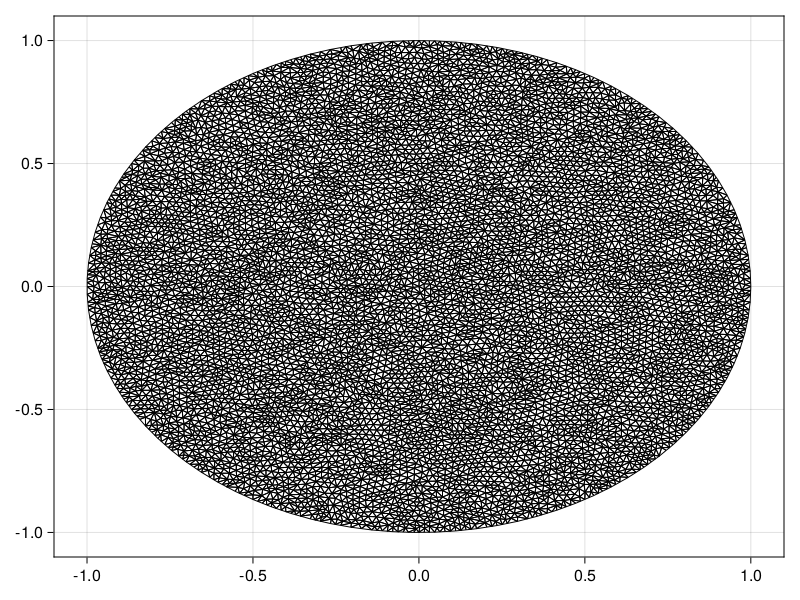
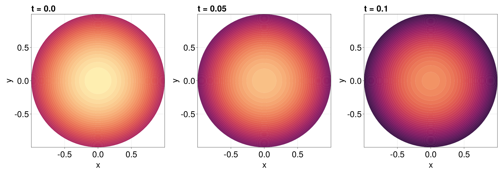

```@meta
EditURL = "https://github.com/DanielVandH/FiniteVolumeMethod.jl/tree/main/docs/src/literate_tutorials/reaction_diffusion_equation_with_a_time_dependent_dirichlet_boundary_condition_on_a_disk.jl"
```


# Reaction-Diffusion Equation with a Time-dependent Dirichlet Boundary Condition on a Disk
In this tutorial, we consider a reaction-diffusion equation
on a disk with a boundary condition of the form $\mathrm du/\mathrm dt = u$:
```math
\begin{equation*}
\begin{aligned}
\pdv{u(r, \theta, t)}{t} &= \div[u\grad u] + u(1-u) & 0<r<1,\,0<\theta<2\pi,\\[6pt]
\dv{u(1, \theta, t)}{t} &= u(1,\theta,t) & 0<\theta<2\pi,\,t>0,\\[6pt]
u(r,\theta,0) &= \sqrt{I_0(\sqrt{2}r)} & 0<r<1,\,0<\theta<2\pi,
\end{aligned}
\end{equation*}
```
where $I_0$ is the modified Bessel function of the first kind of order zero.
For this problem the diffusion function is $D(\vb x, t, u) = u$ and the source function
is $R(\vb x, t, u) = u(1-u)$, or equivalently the force function is
```math
\vb q(\vb x, t, \alpha,\beta,\gamma) = \left(-\alpha(\alpha x + \beta y + \gamma), -\beta(\alpha x + \beta y + \gamma)\right)^{\mkern-1.5mu\mathsf{T}}.
```
As usual, we start by generating the mesh.

````julia
using FiniteVolumeMethod, DelaunayTriangulation, ElasticArrays
r = fill(1, 100)
θ = LinRange(0, 2π, 100)
x = @. r * cos(θ)
y = @. r * sin(θ)
x[end] = x[begin]
y[end] = y[begin] # make sure the curve connects at the endpoints
boundary_nodes, points = convert_boundary_points_to_indices(x, y; existing_points=ElasticMatrix{Float64}(undef, 2, 0))
tri = triangulate(points; boundary_nodes)
A = get_total_area(tri)
refine!(tri; max_area=1e-4A)
mesh = FVMGeometry(tri)
````

````
FVMGeometry with 8137 control volumes, 15948 triangles, and 24084 edges
````

````julia
using CairoMakie
triplot(tri)
````


Now we define the boundary conditions and the PDE.

````julia
using Bessels
BCs = BoundaryConditions(mesh, (x, y, t, u, p) -> u, Dudt)
````

````
BoundaryConditions with 1 boundary condition with type Dudt
````

````julia
f = (x, y) -> sqrt(besseli(0.0, sqrt(2) * sqrt(x^2 + y^2)))
D = (x, y, t, u, p) -> u
R = (x, y, t, u, p) -> u * (1 - u)
initial_condition = [f(x, y) for (x, y) in each_point(tri)]
final_time = 0.10
prob = FVMProblem(mesh, BCs;
    diffusion_function=D,
    source_function=R,
    final_time,
    initial_condition)
````

````
FVMProblem with 8137 nodes and time span (0.0, 0.1)
````

We can now solve.

````julia
using OrdinaryDiffEq, LinearSolve
alg = FBDF(linsolve=UMFPACKFactorization(), autodiff=false)
sol = solve(prob, alg, saveat=0.01)
````

````
retcode: Success
Interpolation: 1st order linear
t: 11-element Vector{Float64}:
 0.0
 0.01
 0.02
 0.03
 0.04
 0.05
 0.06
 0.07
 0.08
 0.09
 0.1
u: 11-element Vector{Vector{Float64}}:
 [1.2514323512504983, 1.2514323512504983, 1.2514323512504983, 1.2514323512504983, 1.2514323512504983, 1.2514323512504983, 1.2514323512504983, 1.2514323512504983, 1.2514323512504983, 1.2514323512504983  …  1.251242484475135, 1.244356557889924, 1.2512386321295206, 1.2442390203930993, 1.2444271675535232, 1.0743400825634455, 1.0625743489130095, 1.0452854817993789, 1.1162262116968829, 1.2426862931166835]
 [1.2640100054184764, 1.2640100054184764, 1.2640100054184764, 1.2640100054184764, 1.2640100054184764, 1.2640100054184764, 1.2640100054184764, 1.2640100054184764, 1.2640100054184764, 1.2640100054184764  …  1.263818230366859, 1.2568355529208532, 1.263814339302843, 1.2567440307978952, 1.2569063978404347, 1.0851310668441547, 1.0732473329101706, 1.055793111528529, 1.1274754756360563, 1.255162997185407]
 [1.2767134865947154, 1.2767134865947154, 1.2767134865947154, 1.2767134865947154, 1.2767134865947154, 1.2767134865947154, 1.2767134865947154, 1.2767134865947154, 1.2767134865947154, 1.2767134865947154  …  1.2765197841764238, 1.2694972826454523, 1.2765158540066726, 1.269378524317533, 1.2695762113388318, 1.096043358522281, 1.0840372753141074, 1.066403048621152, 1.1387799241443823, 1.2677908809166396]
 [1.289547414339194, 1.289547414339194, 1.289547414339194, 1.289547414339194, 1.289547414339194, 1.289547414339194, 1.289547414339194, 1.289547414339194, 1.289547414339194, 1.289547414339194  …  1.289351764762933, 1.2822592932150239, 1.2893477950858714, 1.2821488604680116, 1.2823552087917056, 1.107064079897268, 1.0949236281712813, 1.0771189511244732, 1.1502334379426955, 1.2805343024660534]
 [1.3025106138417133, 1.3025106138417133, 1.3025106138417133, 1.3025106138417133, 1.3025106138417133, 1.3025106138417133, 1.3025106138417133, 1.3025106138417133, 1.3025106138417133, 1.3025106138417133  …  1.302312997494428, 1.2951642306910212, 1.3023089879121124, 1.2950207005016285, 1.2952365494213913, 1.1181908812358303, 1.1059478800455345, 1.0879542132529108, 1.161779237101385, 1.2934109078536]
 [1.3156008808296924, 1.3156008808296924, 1.3156008808296924, 1.3156008808296924, 1.3156008808296924, 1.3156008808296924, 1.3156008808296924, 1.3156008808296924, 1.3156008808296924, 1.3156008808296924  …  1.3154012784327567, 1.3081085672932244, 1.315397228554039, 1.30802022361038, 1.3081435295593322, 1.1294247193869889, 1.1171000690390325, 1.0989032315065321, 1.1734857291509242, 1.3063995080110962]
 [1.3288201418582852, 1.3288201418582852, 1.3288201418582852, 1.3288201418582852, 1.3288201418582852, 1.3288201418582852, 1.3288201418582852, 1.3288201418582852, 1.3288201418582852, 1.3288201418582852  …  1.328618533840772, 1.3210207082714367, 1.3286144432686005, 1.3211206018191204, 1.3209482243713744, 1.140754804075645, 1.128426931433759, 1.1099880589227349, 1.185384870020239, 1.3194895082430613]
 [1.3421713881964679, 1.3421713881964679, 1.3421713881964679, 1.3421713881964679, 1.3421713881964679, 1.3421713881964679, 1.3421713881964679, 1.3421713881964679, 1.3421713881964679, 1.3421713881964679  …  1.3419677545336197, 1.3341133613763738, 1.3419636228617127, 1.3343604259963353, 1.3339556575957066, 1.1522013021790816, 1.1398435096538022, 1.121174343796673, 1.1973799793281785, 1.3327176712676891]
 [1.355657518530062, 1.355657518530062, 1.355657518530062, 1.3556575185300623, 1.355657518530062, 1.355657518530062, 1.355657518530062, 1.355657518530062, 1.355657518530062, 1.355657518530062  …  1.3554518387573402, 1.3476212768393803, 1.3554476655704666, 1.3477859941766168, 1.3475087797478236, 1.163787445434912, 1.1512515143755209, 1.132421877160505, 1.2093653639548112, 1.3461242011924144]
 [1.3692806633741632, 1.3692806633741632, 1.3692806633741632, 1.3692806633741637, 1.3692806633741632, 1.3692806633741632, 1.3692806633741632, 1.3692806633741632, 1.3692806633741632, 1.3692806633741632  …  1.3690729167037907, 1.3616748728742825, 1.3690687015801437, 1.3614238147856228, 1.3617982361587433, 1.1755268038987583, 1.1625972071744521, 1.1437087847947531, 1.2212826678758475, 1.359732147070021]
 [1.3830372775365398, 1.3830372775365398, 1.3830372775365398, 1.3830372775365398, 1.3830372775365398, 1.3830372775365398, 1.3830372775365398, 1.3830372775365398, 1.3830372775365398, 1.3830372775365398  …  1.382827443718603, 1.3752310681925188, 1.382823186247348, 1.3750800689113418, 1.3752996434507498, 1.187326693664449, 1.174333226712268, 1.1552228305985754, 1.2336087907375857, 1.373374820148924]
````

````julia
fig = Figure(fontsize=38)
for (i, j) in zip(1:3, (1, 6, 11))
    ax = Axis(fig[1, i], width=600, height=600,
        xlabel="x", ylabel="y",
        title="t = $(sol.t[j])",
        titlealign=:left)
    tricontourf!(ax, tri, sol.u[j], levels=1:0.01:1.4, colormap=:matter)
    tightlimits!(ax)
end
resize_to_layout!(fig)
fig
````


## Just the code
An uncommented version of this example is given below.
You can view the source code for this file [here](https://github.com/DanielVandH/FiniteVolumeMethod.jl/tree/main/docs/src/literate_tutorials/reaction_diffusion_equation_with_a_time_dependent_dirichlet_boundary_condition_on_a_disk.jl).

```julia
using FiniteVolumeMethod, DelaunayTriangulation, ElasticArrays
r = fill(1, 100)
θ = LinRange(0, 2π, 100)
x = @. r * cos(θ)
y = @. r * sin(θ)
x[end] = x[begin]
y[end] = y[begin] # make sure the curve connects at the endpoints
boundary_nodes, points = convert_boundary_points_to_indices(x, y; existing_points=ElasticMatrix{Float64}(undef, 2, 0))
tri = triangulate(points; boundary_nodes)
A = get_total_area(tri)
refine!(tri; max_area=1e-4A)
mesh = FVMGeometry(tri)

using CairoMakie
triplot(tri)

using Bessels
BCs = BoundaryConditions(mesh, (x, y, t, u, p) -> u, Dudt)

f = (x, y) -> sqrt(besseli(0.0, sqrt(2) * sqrt(x^2 + y^2)))
D = (x, y, t, u, p) -> u
R = (x, y, t, u, p) -> u * (1 - u)
initial_condition = [f(x, y) for (x, y) in each_point(tri)]
final_time = 0.10
prob = FVMProblem(mesh, BCs;
    diffusion_function=D,
    source_function=R,
    final_time,
    initial_condition)

using OrdinaryDiffEq, LinearSolve
alg = FBDF(linsolve=UMFPACKFactorization(), autodiff=false)
sol = solve(prob, alg, saveat=0.01)

fig = Figure(fontsize=38)
for (i, j) in zip(1:3, (1, 6, 11))
    ax = Axis(fig[1, i], width=600, height=600,
        xlabel="x", ylabel="y",
        title="t = $(sol.t[j])",
        titlealign=:left)
    tricontourf!(ax, tri, sol.u[j], levels=1:0.01:1.4, colormap=:matter)
    tightlimits!(ax)
end
resize_to_layout!(fig)
fig
```

---

*This page was generated using [Literate.jl](https://github.com/fredrikekre/Literate.jl).*

