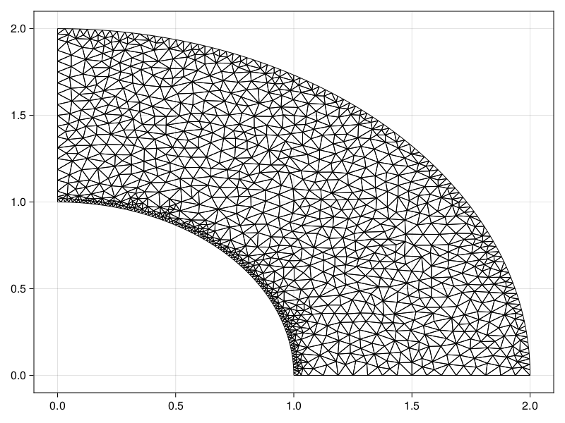
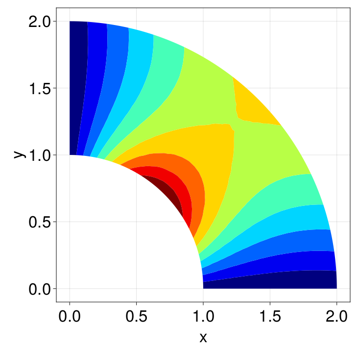
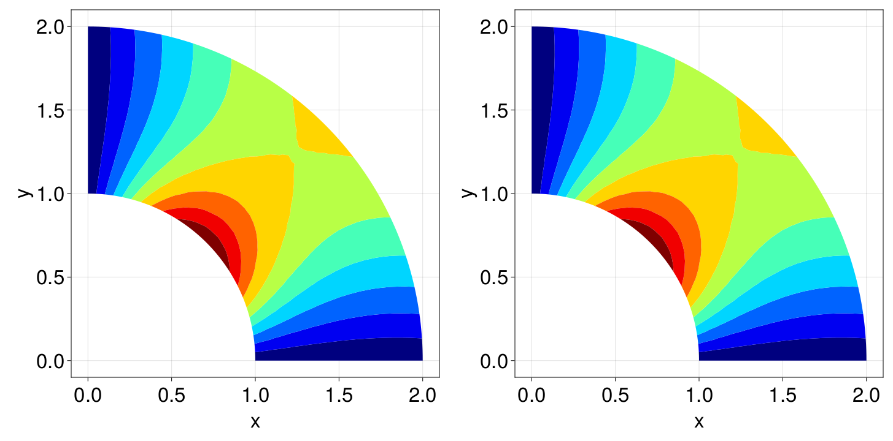
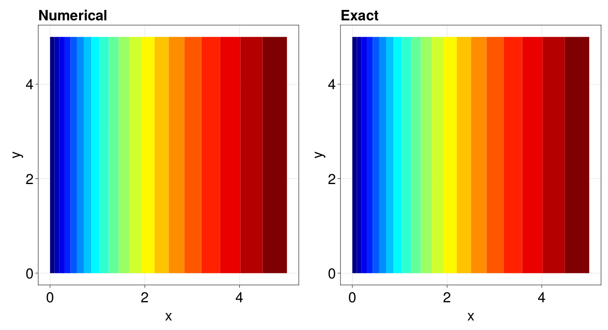

```@meta
EditURL = "https://github.com/SciML/FiniteVolumeMethod.jl/tree/main/docs/src/literate_wyos/laplaces_equation.jl"
```


# Laplace's Equation
```@contents
Pages = ["laplaces_equation.md"]
```
Now we consider Laplace's equation. What we produce in this
section can also be accessed in `FiniteVolumeMethod.LaplacesEquation`.

## Mathematical Details
The mathematical details for this solver are the same as for
our [Poisson equation example](poissons_equation.md), except with
$f = 0$. The problems being solved are of the form
```math
\div\left[D(\vb x)\grad u\right] = 0,
```
known as the generalised Laplace equation.[^1]

[^1]: See, for example, [this paper](https://doi.org/10.1016/0307-904X(87)90036-9) by Rangogni and Occhi (1987).

## Implementation
For the implementation, we can reuse a lot of what
we had for Poisson's equation, except that
we don't need `create_rhs_b`.

````julia
using FiniteVolumeMethod, SparseArrays, DelaunayTriangulation, LinearSolve
const FVM = FiniteVolumeMethod
function laplaces_equation(mesh::FVMGeometry,
    BCs::BoundaryConditions,
    ICs::InternalConditions=InternalConditions();
    diffusion_function=(x, y, p) -> 1.0,
    diffusion_parameters=nothing)
    conditions = Conditions(mesh, BCs, ICs)
    n = DelaunayTriangulation.num_solid_vertices(mesh.triangulation)
    A = zeros(n, n)
    b = zeros(num_points(mesh.triangulation))
    FVM.triangle_contributions!(A, mesh, conditions, diffusion_function, diffusion_parameters)
    FVM.boundary_edge_contributions!(A, b, mesh, conditions, diffusion_function, diffusion_parameters)
    FVM.apply_steady_dirichlet_conditions!(A, b, mesh, conditions)
    Asp = sparse(A)
    prob = LinearProblem(Asp, b)
    return prob
end
````

````
laplaces_equation (generic function with 2 methods)
````

Now let's test this problem. We consider Laplace's equation on a sector of an annulus,
so that[^2]
```math
\begin{equation*}
\begin{aligned}
\grad^2 u &= 1 < r  > 2,\,0 < \theta < \pi/2, \\
u(x, 0) &= 0 & 1 < x < 2, \\
u(0, y) &= 0 & 1 < y < 2, \\
u(x, y) &= 2xy & r = 1, \\
u(x, y) &= \left(\frac{\pi}{2} - \arctan\frac{y}{x}\right)\arctan\frac{y}{x} & r = 2.
\end{aligned}
\end{equation*}
```

[^2]: This problem comes from [here](https://sites.millersville.edu/rbuchanan/math467/LaplaceDisk.pdf#Navigation23).

To start, we define our mesh. We need to define each part of the annulus separately, which
takes some care.

````julia
using CairoMakie
lower_x = [1.0, 2.0]
lower_y = [0.0, 0.0]
θ = LinRange(0, π / 2, 100)
outer_arc_x = 2cos.(θ)
outer_arc_x[end] = 0.0 # must match with left_x
outer_arc_y = 2sin.(θ)
left_x = [0.0, 0.0]
left_y = [2.0, 1.0]
inner_arc_x = cos.(θ) |> reverse!
inner_arc_x[begin] = 0.0 # must match with left_x
inner_arc_y = sin.(θ) |> reverse!
boundary_x = [lower_x, outer_arc_x, left_x, inner_arc_x]
boundary_y = [lower_y, outer_arc_y, left_y, inner_arc_y]
boundary_nodes, points = convert_boundary_points_to_indices(boundary_x, boundary_y)
tri = triangulate(points; boundary_nodes)
refine!(tri; max_area=1e-3get_total_area(tri))
triplot(tri)
````


````julia
mesh = FVMGeometry(tri)
````

````
FVMGeometry with 1202 control volumes, 2167 triangles, and 3368 edges
````

The boundary conditions are defined as follows.

````julia
lower_f = (x, y, t, u, p) -> 0.0
outer_arc_f = (x, y, t, u, p) -> (π / 2 - atan(y, x)) * atan(y, x)
left_f = (x, y, t, u, p) -> 2x * y
inner_arc_f = (x, y, t, u, p) -> 2x * y
bc_f = (lower_f, outer_arc_f, left_f, inner_arc_f)
bc_types = (Dirichlet, Dirichlet, Dirichlet, Dirichlet)
BCs = BoundaryConditions(mesh, bc_f, bc_types)
````

````
BoundaryConditions with 4 boundary conditions with types (Dirichlet, Dirichlet, Dirichlet, Dirichlet)
````

Now we can define and solve the problem.

````julia
prob = laplaces_equation(mesh, BCs, diffusion_function=(x, y, p) -> 1.0)
````

````
LinearProblem. In-place: true
b: 1202-element Vector{Float64}:
 0.0
 0.0
 0.024671493503386318
 0.04883948713935658
 0.0725039809079108
 ⋮
 0.0
 0.0
 0.0
 0.0
 0.0
````

````julia
sol = solve(prob, KLUFactorization())
````

````
u: 1202-element Vector{Float64}:
 0.0
 0.0
 0.024671493503386318
 0.04883948713935658
 0.0725039809079108
 ⋮
 0.5030487864579902
 0.49158156832569067
 0.3844288874106583
 0.37141517809156177
 0.6114572482682799
````

````julia
fig = Figure(fontsize=33)
ax = Axis(fig[1, 1], xlabel="x", ylabel="y", width=600, height=600)
tricontourf!(ax, tri, sol.u, levels=0:0.1:1, colormap=:jet)
resize_to_layout!(fig)
fig
````


We can turn this type of problem into its corresponding `SteadyFVMProblem` as follows:

````julia
initial_condition = zeros(num_points(tri))
FVM.apply_dirichlet_conditions!(initial_condition, mesh, Conditions(mesh, BCs, InternalConditions())) # a good initial guess
fvm_prob = SteadyFVMProblem(FVMProblem(mesh, BCs;
    diffusion_function=(x, y, t, u, p) -> 1.0,
    initial_condition,
    final_time=Inf))
````

````
SteadyFVMProblem with 1202 nodes
````

````julia
using SteadyStateDiffEq, OrdinaryDiffEq
fvm_sol = solve(fvm_prob, DynamicSS(TRBDF2()))
````

````
u: 1202-element Vector{Float64}:
 0.0
 0.0
 0.024671493503386318
 0.04883948713935658
 0.0725039809079108
 ⋮
 0.5030487974363502
 0.4915815800848867
 0.384428896880054
 0.3714151861326706
 0.61145725748058
````

````julia
ax = Axis(fig[1, 2], xlabel="x", ylabel="y", width=600, height=600)
tricontourf!(ax, tri, fvm_sol.u, levels=0:0.1:1, colormap=:jet)
resize_to_layout!(fig)
fig
````


## Using the Provided Template
Let's now use the built-in `LaplacesEquation` which implements the above
inside FiniteVolumeMethod.jl. We consider the problem[^3]

[^3]: This is the first example from [this paper](https://doi.org/10.1016/0307-904X(87)90036-9) by Rangogni and Occhi (1987).

```math
\begin{equation*}
\begin{aligned}
\div\left[D(\vb x)\grad u\right] &= 0,\,0 < x < 5,\, 0 < y < 5, \\
u(0, y) &= 0 & 0 < y < 5, \\
u(5, y) &= 5 & 0 < y < 5, \\
\grad u \vdot \vu n &= 0 & 0 < x < 5,\, y \in \{0, 5\},
\end{aligned}
\end{equation*}
```

where $D(\vb x) = (x+1)(y+2)$. The exact solution
is $u(x, y) = 5\log_6(1+x)$. We define this problem as follows.

````julia
tri = triangulate_rectangle(0, 5, 0, 5, 100, 100, single_boundary=false)
mesh = FVMGeometry(tri)
zero_f = (x, y, t, u, p) -> 0.0
five_f = (x, y, t, u, p) -> 5.0
bc_f = (zero_f, five_f, zero_f, zero_f)
bc_types = (Neumann, Dirichlet, Neumann, Dirichlet) # bottom, right, top, left
BCs = BoundaryConditions(mesh, bc_f, bc_types)
diffusion_function = (x, y, p) -> (x + 1) * (y + 2)
prob = LaplacesEquation(mesh, BCs; diffusion_function)
````

````
LaplacesEquation with 10000 nodes
````

````julia
sol = solve(prob, KLUFactorization())
````

````
u: 10000-element Vector{Float64}:
 0.0
 0.13752412788341345
 0.2685706875257449
 0.39373122838568114
 0.5135147693274462
 ⋮
 4.904416090048671
 4.928620646536574
 4.952617114107139
 4.976409061067354
 5.0
````

````julia
fig = Figure(fontsize=33)
ax = Axis(fig[1, 1], xlabel="x", ylabel="y",
    width=600, height=600,
    title="Numerical", titlealign=:left)
tricontourf!(ax, tri, sol.u, levels=0:0.25:5, colormap=:jet)
ax = Axis(fig[1, 2], xlabel="x", ylabel="y",
    width=600, height=600,
    title="Exact", titlealign=:left)
u_exact = [5log(1 + x) / log(6) for (x, y) in each_point(tri)]
tricontourf!(ax, tri, u_exact, levels=0:0.25:5, colormap=:jet)
resize_to_layout!(fig)
fig
````


To finish, here is a benchmark comparing this problem to the corresponding
`SteadyFVMProblem`.

````julia
initial_condition = zeros(num_points(tri))
FVM.apply_dirichlet_conditions!(initial_condition, mesh, Conditions(mesh, BCs, InternalConditions())) # a good initial guess
fvm_prob = SteadyFVMProblem(FVMProblem(mesh, BCs;
    diffusion_function=(x, y, t, u, p) -> (x + 1) * (y + 2),
    final_time=Inf,
    initial_condition))
````

````
SteadyFVMProblem with 10000 nodes
````

````julia
using BenchmarkTools
@btime solve($prob, $KLUFactorization());
````

````
  15.368 ms (56 allocations: 17.12 MiB)
````

````julia
@btime solve($fvm_prob, $DynamicSS(TRBDF2(linsolve=KLUFactorization())));
````

````
  495.417 ms (223001 allocations: 114.30 MiB)
````

## Just the code
An uncommented version of this example is given below.
You can view the source code for this file [here](https://github.com/SciML/FiniteVolumeMethod.jl/tree/main/docs/src/literate_wyos/laplaces_equation.jl).

```julia
using FiniteVolumeMethod, SparseArrays, DelaunayTriangulation, LinearSolve
const FVM = FiniteVolumeMethod
function laplaces_equation(mesh::FVMGeometry,
    BCs::BoundaryConditions,
    ICs::InternalConditions=InternalConditions();
    diffusion_function=(x, y, p) -> 1.0,
    diffusion_parameters=nothing)
    conditions = Conditions(mesh, BCs, ICs)
    n = DelaunayTriangulation.num_solid_vertices(mesh.triangulation)
    A = zeros(n, n)
    b = zeros(num_points(mesh.triangulation))
    FVM.triangle_contributions!(A, mesh, conditions, diffusion_function, diffusion_parameters)
    FVM.boundary_edge_contributions!(A, b, mesh, conditions, diffusion_function, diffusion_parameters)
    FVM.apply_steady_dirichlet_conditions!(A, b, mesh, conditions)
    Asp = sparse(A)
    prob = LinearProblem(Asp, b)
    return prob
end

using CairoMakie
lower_x = [1.0, 2.0]
lower_y = [0.0, 0.0]
θ = LinRange(0, π / 2, 100)
outer_arc_x = 2cos.(θ)
outer_arc_x[end] = 0.0 # must match with left_x
outer_arc_y = 2sin.(θ)
left_x = [0.0, 0.0]
left_y = [2.0, 1.0]
inner_arc_x = cos.(θ) |> reverse!
inner_arc_x[begin] = 0.0 # must match with left_x
inner_arc_y = sin.(θ) |> reverse!
boundary_x = [lower_x, outer_arc_x, left_x, inner_arc_x]
boundary_y = [lower_y, outer_arc_y, left_y, inner_arc_y]
boundary_nodes, points = convert_boundary_points_to_indices(boundary_x, boundary_y)
tri = triangulate(points; boundary_nodes)
refine!(tri; max_area=1e-3get_total_area(tri))
triplot(tri)

mesh = FVMGeometry(tri)

lower_f = (x, y, t, u, p) -> 0.0
outer_arc_f = (x, y, t, u, p) -> (π / 2 - atan(y, x)) * atan(y, x)
left_f = (x, y, t, u, p) -> 2x * y
inner_arc_f = (x, y, t, u, p) -> 2x * y
bc_f = (lower_f, outer_arc_f, left_f, inner_arc_f)
bc_types = (Dirichlet, Dirichlet, Dirichlet, Dirichlet)
BCs = BoundaryConditions(mesh, bc_f, bc_types)

prob = laplaces_equation(mesh, BCs, diffusion_function=(x, y, p) -> 1.0)

sol = solve(prob, KLUFactorization())

fig = Figure(fontsize=33)
ax = Axis(fig[1, 1], xlabel="x", ylabel="y", width=600, height=600)
tricontourf!(ax, tri, sol.u, levels=0:0.1:1, colormap=:jet)
resize_to_layout!(fig)
fig

initial_condition = zeros(num_points(tri))
FVM.apply_dirichlet_conditions!(initial_condition, mesh, Conditions(mesh, BCs, InternalConditions())) # a good initial guess
fvm_prob = SteadyFVMProblem(FVMProblem(mesh, BCs;
    diffusion_function=(x, y, t, u, p) -> 1.0,
    initial_condition,
    final_time=Inf))

using SteadyStateDiffEq, OrdinaryDiffEq
fvm_sol = solve(fvm_prob, DynamicSS(TRBDF2()))

ax = Axis(fig[1, 2], xlabel="x", ylabel="y", width=600, height=600)
tricontourf!(ax, tri, fvm_sol.u, levels=0:0.1:1, colormap=:jet)
resize_to_layout!(fig)
fig

tri = triangulate_rectangle(0, 5, 0, 5, 100, 100, single_boundary=false)
mesh = FVMGeometry(tri)
zero_f = (x, y, t, u, p) -> 0.0
five_f = (x, y, t, u, p) -> 5.0
bc_f = (zero_f, five_f, zero_f, zero_f)
bc_types = (Neumann, Dirichlet, Neumann, Dirichlet) # bottom, right, top, left
BCs = BoundaryConditions(mesh, bc_f, bc_types)
diffusion_function = (x, y, p) -> (x + 1) * (y + 2)
prob = LaplacesEquation(mesh, BCs; diffusion_function)

sol = solve(prob, KLUFactorization())

fig = Figure(fontsize=33)
ax = Axis(fig[1, 1], xlabel="x", ylabel="y",
    width=600, height=600,
    title="Numerical", titlealign=:left)
tricontourf!(ax, tri, sol.u, levels=0:0.25:5, colormap=:jet)
ax = Axis(fig[1, 2], xlabel="x", ylabel="y",
    width=600, height=600,
    title="Exact", titlealign=:left)
u_exact = [5log(1 + x) / log(6) for (x, y) in each_point(tri)]
tricontourf!(ax, tri, u_exact, levels=0:0.25:5, colormap=:jet)
resize_to_layout!(fig)
fig

initial_condition = zeros(num_points(tri))
FVM.apply_dirichlet_conditions!(initial_condition, mesh, Conditions(mesh, BCs, InternalConditions())) # a good initial guess
fvm_prob = SteadyFVMProblem(FVMProblem(mesh, BCs;
    diffusion_function=(x, y, t, u, p) -> (x + 1) * (y + 2),
    final_time=Inf,
    initial_condition))
```

---

*This page was generated using [Literate.jl](https://github.com/fredrikekre/Literate.jl).*

