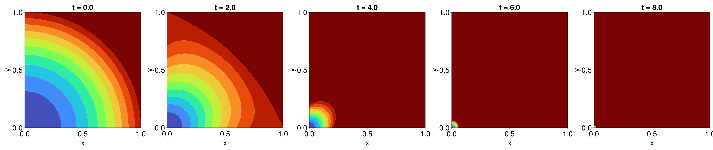

```@meta
EditURL = "https://github.com/DanielVandH/FiniteVolumeMethod.jl/tree/main/docs/src/literate_wyos/linear_reaction_diffusion_equations.jl"
```


# Linear Reaction-Diffusion Equations
```@contents
Pages = ["linear_reaction_diffusion_equations.md"]
```
Next, we write a specialised solver for solving linear reaction-diffusion equations. What
we produce in this section can also be accessed in `FiniteVolumeMethod.LinearReactionDiffusionEquation`.

## Mathematical Details
To start, let's give the mathematical details. The problems we will be solving take the form
```math
\pdv{u}{t} = \div\left[D(\vb x)\grad u\right] + f(\vb x)u.
```
We want to turn this into an equation of the form $\mathrm d\vb u/\mathrm dt = \vb A\vb u + \vb b$
as usual. This takes the same form as our [diffusion equation example](diffusion_equations.md),
except with the extra $f(\vb x)u$ term, which just adds an exta $f(\vb x)$ term
to the diagonal of $\vb A$. See the previois sections for further mathematical details.

## Implementation
Let us now implement the solver. For constructing $\vb A$, we can use `FiniteVolumeMethod.triangle_contributions!`
as in the previous sections, but we will need an extra function to add $f(\vb x)$ to the appropriate diagonals.
We can also reuse `apply_dirichlet_conditions!`, `apply_dudt_conditions`, and
`boundary_edge_contributions!` from the diffusion equation example. Here is our implementation.

````julia
using FiniteVolumeMethod, SparseArrays, OrdinaryDiffEq, LinearAlgebra
const FVM = FiniteVolumeMethod
function linear_source_contributions!(A, mesh, conditions, source_function, source_parameters)
    for i in each_solid_vertex(mesh.triangulation)
        if !FVM.has_condition(conditions, i)
            x, y = get_point(mesh, i)
            A[i, i] += source_function(x, y, source_parameters)
        end
    end
end
function linear_reaction_diffusion_equation(mesh::FVMGeometry,
    BCs::BoundaryConditions,
    ICs::InternalConditions=InternalConditions();
    diffusion_function,
    diffusion_parameters=nothing,
    source_function,
    source_parameters=nothing,
    initial_condition,
    initial_time=0.0,
    final_time)
    conditions = Conditions(mesh, BCs, ICs)
    n = DelaunayTriangulation.num_solid_vertices(mesh.triangulation)
    Afull = zeros(n + 1, n + 1)
    A = @views Afull[begin:end-1, begin:end-1]
    b = @views Afull[begin:end-1, end]
    _ic = vcat(initial_condition, 1)
    FVM.triangle_contributions!(A, mesh, conditions, diffusion_function, diffusion_parameters)
    FVM.boundary_edge_contributions!(A, b, mesh, conditions, diffusion_function, diffusion_parameters)
    linear_source_contributions!(A, mesh, conditions, source_function, source_parameters)
    FVM.apply_dudt_conditions!(b, mesh, conditions)
    FVM.apply_dirichlet_conditions!(_ic, mesh, conditions)
    Af = sparse(Afull)
    prob = ODEProblem(MatrixOperator(Af), _ic, (initial_time, final_time))
    return prob
end
````

````
linear_reaction_diffusion_equation (generic function with 2 methods)
````

If you go and look back at the `diffusion_equation` function from the
[diffusion equation example](diffusion_equations.md), you will see that
this is essentially the same function except we now have `linear_source_contributions!`
and `source_function` and `source_parameters` arguments.

Let's now test this function. We consider the problem
```math
\pdv{T}{t} = \div\left[10^{-3}x^2y\grad T\right] + (x-1)(y-1)T, \quad \vb x \in [0,1]^2,
```
with $\grad T \vdot\vu n = 1$ on the boundary.

````julia
using DelaunayTriangulation
tri = triangulate_rectangle(0, 1, 0, 1, 150, 150, single_boundary=true)
mesh = FVMGeometry(tri)
BCs = BoundaryConditions(mesh, (x, y, t, u, p) -> one(x), Neumann)
diffusion_function = (x, y, p) -> p.D * x^2 * y
diffusion_parameters = (D=1e-3,)
source_function = (x, y, p) -> (x - 1) * (y - 1)
initial_condition = [x^2 + y^2 for (x, y) in each_point(tri)]
final_time = 8.0
prob = linear_reaction_diffusion_equation(mesh, BCs;
    diffusion_function, diffusion_parameters,
    source_function, initial_condition, final_time)
````

````
ODEProblem with uType Vector{Float64} and tType Float64. In-place: true
timespan: (0.0, 8.0)
u0: 22501-element Vector{Float64}:
 0.0
 4.504301608035674e-5
 0.00018017206432142696
 0.00040538714472321063
 0.0007206882572857079
 ⋮
 1.9601369307688843
 1.9733345344804287
 1.986622224224134
 2.0
 1.0
````

````julia
using Sundials
sol = solve(prob, CVODE_BDF(linear_solver=:GMRES); saveat=2)
````

````
retcode: Success
Interpolation: 1st order linear
t: 5-element Vector{Float64}:
 0.0
 2.0
 4.0
 6.0
 8.0
u: 5-element Vector{Vector{Float64}}:
 [0.0, 4.504301608035674e-5, 0.00018017206432142696, 0.00040538714472321063, 0.0007206882572857079, 0.0011260754020089186, 0.0016215485788928425, 0.0022071077879374803, 0.0028827530291428314, 0.0036484843025088956  …  1.8955002026935723, 1.9082473762443133, 1.921084635827215, 1.9340119814422772, 1.9470294130895003, 1.9601369307688843, 1.9733345344804287, 1.986622224224134, 2.0, 1.0]
 [5.52716147191767e-10, 0.00033202071408202104, 0.001310140685137398, 0.002907992511210769, 0.005099927167281375, 0.007860998640123835, 0.011166947859617282, 0.014994186959034747, 0.019319783858113036, 0.024121447162812164  …  1.857896300391867, 1.8669544450900437, 1.8759244722984534, 1.884528730962924, 1.8927583990518235, 1.9008413452702824, 1.9084028870615026, 1.9156193227868221, 1.9221062046350286, 1.0]
 [7.870049813424153e-9, 0.00239092147887007, 0.00931146890308417, 0.02039815106135701, 0.035306625157419266, 0.053710878895533026, 0.0753024298375472, 0.09978955577827824, 0.1268965550360856, 0.15636303559215572  …  1.8504779433221192, 1.8582219226333596, 1.8660722866933632, 1.8736537551899137, 1.8806969833137446, 1.8881550315775186, 1.8950935404892248, 1.9016316807910907, 1.9088467115428092, 1.0]
 [8.333595175519436e-8, 0.016997517920280692, 0.065352787033468, 0.14133757251976914, 0.24151241806279378, 0.36270840869389104, 0.5020098139940017, 0.6567377163963104, 0.824434573299621, 1.0028496641991593  …  1.8563820911117714, 1.8631395312196728, 1.869946014570781, 1.8767665953695387, 1.8829820658335772, 1.8904507091419824, 1.896510120608713, 1.9036592580392455, 1.9105309742082484, 1.0]
 [7.871236404836896e-7, 0.12056861985382407, 0.4576775099028521, 0.9772248996008429, 1.6485909454406105, 2.444347087267379, 3.339985650693463, 4.3136697132174175, 5.346001839352283, 6.419810380000953  …  1.870086927761359, 1.876313132360229, 1.8824264689960384, 1.8887230748064165, 1.8948706021128898, 1.9014030996603855, 1.9076743375079266, 1.9146996044875533, 1.921250692046168, 1.0]
````

````julia
using CairoMakie
fig = Figure(fontsize=38)
for j in eachindex(sol)
    ax = Axis(fig[1, j], width=600, height=600,
        xlabel="x", ylabel="y",
        title="t = $(sol.t[j])")
    tricontourf!(ax, tri, sol.u[j], levels=0:0.1:1, extendlow=:auto, extendhigh=:auto, colormap=:turbo)
    tightlimits!(ax)
end
resize_to_layout!(fig)
fig
````


Here is how we could convert this into an `FVMProblem`. Note that the Neumann
boundary conditions are expressed as $\grad T\vdot\vu n = 1$ above, but for `FVMProblem`
we need them in the form $\vb q\vdot\vu n = \ldots$. For this problem, $\vb q=-D\grad T$,
which gives $\vb q\vdot\vu n = -D$.

````julia
_BCs = BoundaryConditions(mesh, (x, y, t, u, p) -> -p.D(x, y, p.Dp), Neumann;
    parameters=(D=diffusion_function, Dp=diffusion_parameters))
fvm_prob = FVMProblem(
    mesh,
    _BCs;
    diffusion_function=let D=diffusion_function
        (x, y, t, u, p) -> D(x, y, p)
    end,
    diffusion_parameters=diffusion_parameters,
    source_function=let S=source_function
        (x, y, t, u, p) -> S(x, y, p) * u
    end,
    final_time=final_time,
    initial_condition=initial_condition
)
fvm_sol = solve(fvm_prob, CVODE_BDF(linear_solver=:GMRES), saveat=2.0)
````

````
retcode: Success
Interpolation: 1st order linear
t: 5-element Vector{Float64}:
 0.0
 2.0
 4.0
 6.0
 8.0
u: 5-element Vector{Vector{Float64}}:
 [0.0, 4.504301608035674e-5, 0.00018017206432142696, 0.00040538714472321063, 0.0007206882572857079, 0.0011260754020089186, 0.0016215485788928425, 0.0022071077879374803, 0.0028827530291428314, 0.0036484843025088956  …  1.882843115174992, 1.8955002026935723, 1.9082473762443133, 1.921084635827215, 1.9340119814422772, 1.9470294130895003, 1.9601369307688843, 1.9733345344804287, 1.986622224224134, 2.0]
 [5.527159522197979e-10, 0.0003320206574741975, 0.0013101404649735286, 0.0029079920296159424, 0.00509992633502701, 0.007860997376214469, 0.011166946090891122, 0.014994184619777633, 0.01931978088968548, 0.024121443513289032  …  1.8483412443440317, 1.8578963183640196, 1.8669544935607532, 1.8759245995431442, 1.8845287440440113, 1.8927584164243538, 1.9008413111548357, 1.9084029648174201, 1.915619338162618, 1.9221064360357867]
 [7.870012488295642e-9, 0.002390915052152065, 0.009311444373113703, 0.02039809840570917, 0.035306535866865954, 0.053710745842246506, 0.07530224715199278, 0.09978931873432155, 0.12689625994386264, 0.15636267969827344  …  1.8428686543744828, 1.850477527403726, 1.858221945650777, 1.8660712887179718, 1.873655239076329, 1.8806970604061923, 1.888153953429046, 1.8950926833316954, 1.9016312526281294, 1.908845723176993]
 [8.333310694001327e-8, 0.01699715144253573, 0.06535140941133141, 0.1413346601691008, 0.24150755442629332, 0.3627012714671449, 0.5020001635378568, 0.65672538524175, 0.8244194566579149, 1.0028317113962129  …  1.8492212899245921, 1.8563779837602072, 1.8631445769620723, 1.8699385500214316, 1.8767718063415233, 1.8829770348250732, 1.890451930000836, 1.896503241379282, 1.9036641980364957, 1.9105371961803492]
 [7.871829902344283e-7, 0.12057510312661078, 0.4577016212397459, 0.9772753278311561, 1.6486742607286817, 2.444468041573926, 3.3401474447891166, 4.313874233452263, 5.346249867109934, 6.4201017765119754  …  1.863774856872435, 1.8700733364262616, 1.8763465973172142, 1.8824077185991, 1.8887503719931775, 1.8948555728557668, 1.9014118062802141, 1.9076784336366468, 1.914707648497919, 1.9212474908336243]
````

## Using the Provided Template
The above code is implemented in `LinearReactionDiffusionEquation` in FiniteVolumeMethod.jl.

````julia
prob = LinearReactionDiffusionEquation(mesh, BCs;
    diffusion_function, diffusion_parameters,
    source_function,  initial_condition, final_time)
sol = solve(prob, CVODE_BDF(linear_solver=:GMRES); saveat=2)
````

````
retcode: Success
Interpolation: 1st order linear
t: 5-element Vector{Float64}:
 0.0
 2.0
 4.0
 6.0
 8.0
u: 5-element Vector{Vector{Float64}}:
 [0.0, 4.504301608035674e-5, 0.00018017206432142696, 0.00040538714472321063, 0.0007206882572857079, 0.0011260754020089186, 0.0016215485788928425, 0.0022071077879374803, 0.0028827530291428314, 0.0036484843025088956  …  1.8955002026935723, 1.9082473762443133, 1.921084635827215, 1.9340119814422772, 1.9470294130895003, 1.9601369307688843, 1.9733345344804287, 1.986622224224134, 2.0, 1.0]
 [5.52716147191767e-10, 0.00033202071408202104, 0.001310140685137398, 0.002907992511210769, 0.005099927167281375, 0.007860998640123835, 0.011166947859617282, 0.014994186959034747, 0.019319783858113036, 0.024121447162812164  …  1.857896300391867, 1.8669544450900437, 1.8759244722984534, 1.884528730962924, 1.8927583990518235, 1.9008413452702824, 1.9084028870615026, 1.9156193227868221, 1.9221062046350286, 1.0]
 [7.870049813424153e-9, 0.00239092147887007, 0.00931146890308417, 0.02039815106135701, 0.035306625157419266, 0.053710878895533026, 0.0753024298375472, 0.09978955577827824, 0.1268965550360856, 0.15636303559215572  …  1.8504779433221192, 1.8582219226333596, 1.8660722866933632, 1.8736537551899137, 1.8806969833137446, 1.8881550315775186, 1.8950935404892248, 1.9016316807910907, 1.9088467115428092, 1.0]
 [8.333595175519436e-8, 0.016997517920280692, 0.065352787033468, 0.14133757251976914, 0.24151241806279378, 0.36270840869389104, 0.5020098139940017, 0.6567377163963104, 0.824434573299621, 1.0028496641991593  …  1.8563820911117714, 1.8631395312196728, 1.869946014570781, 1.8767665953695387, 1.8829820658335772, 1.8904507091419824, 1.896510120608713, 1.9036592580392455, 1.9105309742082484, 1.0]
 [7.871236404836896e-7, 0.12056861985382407, 0.4576775099028521, 0.9772248996008429, 1.6485909454406105, 2.444347087267379, 3.339985650693463, 4.3136697132174175, 5.346001839352283, 6.419810380000953  …  1.870086927761359, 1.876313132360229, 1.8824264689960384, 1.8887230748064165, 1.8948706021128898, 1.9014030996603855, 1.9076743375079266, 1.9146996044875533, 1.921250692046168, 1.0]
````

Here is a benchmark comparison of `LinearReactionDiffusionEquation` versus `FVMProblem`.
````julia
using BenchmarkTools
@btime solve($prob, $CVODE_BDF(linear_solver=:GMRES); saveat=$2);
````

````
  48.360 ms (1087 allocations: 1.58 MiB)
````

````julia
@btime solve($fvm_prob, $CVODE_BDF(linear_solver=:GMRES); saveat=$2);
````

````
  163.686 ms (83267 allocations: 90.84 MiB)
````
## Just the code
An uncommented version of this example is given below.
You can view the source code for this file [here](https://github.com/DanielVandH/FiniteVolumeMethod.jl/tree/main/docs/src/literate_wyos/linear_reaction_diffusion_equations.jl).

```julia
using FiniteVolumeMethod, SparseArrays, OrdinaryDiffEq, LinearAlgebra
const FVM = FiniteVolumeMethod
function linear_source_contributions!(A, mesh, conditions, source_function, source_parameters)
    for i in each_solid_vertex(mesh.triangulation)
        if !FVM.has_condition(conditions, i)
            x, y = get_point(mesh, i)
            A[i, i] += source_function(x, y, source_parameters)
        end
    end
end
function linear_reaction_diffusion_equation(mesh::FVMGeometry,
    BCs::BoundaryConditions,
    ICs::InternalConditions=InternalConditions();
    diffusion_function,
    diffusion_parameters=nothing,
    source_function,
    source_parameters=nothing,
    initial_condition,
    initial_time=0.0,
    final_time)
    conditions = Conditions(mesh, BCs, ICs)
    n = DelaunayTriangulation.num_solid_vertices(mesh.triangulation)
    Afull = zeros(n + 1, n + 1)
    A = @views Afull[begin:end-1, begin:end-1]
    b = @views Afull[begin:end-1, end]
    _ic = vcat(initial_condition, 1)
    FVM.triangle_contributions!(A, mesh, conditions, diffusion_function, diffusion_parameters)
    FVM.boundary_edge_contributions!(A, b, mesh, conditions, diffusion_function, diffusion_parameters)
    linear_source_contributions!(A, mesh, conditions, source_function, source_parameters)
    FVM.apply_dudt_conditions!(b, mesh, conditions)
    FVM.apply_dirichlet_conditions!(_ic, mesh, conditions)
    Af = sparse(Afull)
    prob = ODEProblem(MatrixOperator(Af), _ic, (initial_time, final_time))
    return prob
end

using DelaunayTriangulation
tri = triangulate_rectangle(0, 1, 0, 1, 150, 150, single_boundary=true)
mesh = FVMGeometry(tri)
BCs = BoundaryConditions(mesh, (x, y, t, u, p) -> one(x), Neumann)
diffusion_function = (x, y, p) -> p.D * x^2 * y
diffusion_parameters = (D=1e-3,)
source_function = (x, y, p) -> (x - 1) * (y - 1)
initial_condition = [x^2 + y^2 for (x, y) in each_point(tri)]
final_time = 8.0
prob = linear_reaction_diffusion_equation(mesh, BCs;
    diffusion_function, diffusion_parameters,
    source_function, initial_condition, final_time)

using Sundials
sol = solve(prob, CVODE_BDF(linear_solver=:GMRES); saveat=2)

using CairoMakie
fig = Figure(fontsize=38)
for j in eachindex(sol)
    ax = Axis(fig[1, j], width=600, height=600,
        xlabel="x", ylabel="y",
        title="t = $(sol.t[j])")
    tricontourf!(ax, tri, sol.u[j], levels=0:0.1:1, extendlow=:auto, extendhigh=:auto, colormap=:turbo)
    tightlimits!(ax)
end
resize_to_layout!(fig)
fig

_BCs = BoundaryConditions(mesh, (x, y, t, u, p) -> -p.D(x, y, p.Dp), Neumann;
    parameters=(D=diffusion_function, Dp=diffusion_parameters))
fvm_prob = FVMProblem(
    mesh,
    _BCs;
    diffusion_function=let D=diffusion_function
        (x, y, t, u, p) -> D(x, y, p)
    end,
    diffusion_parameters=diffusion_parameters,
    source_function=let S=source_function
        (x, y, t, u, p) -> S(x, y, p) * u
    end,
    final_time=final_time,
    initial_condition=initial_condition
)
fvm_sol = solve(fvm_prob, CVODE_BDF(linear_solver=:GMRES), saveat=2.0)

prob = LinearReactionDiffusionEquation(mesh, BCs;
    diffusion_function, diffusion_parameters,
    source_function,  initial_condition, final_time)
sol = solve(prob, CVODE_BDF(linear_solver=:GMRES); saveat=2)
```

---

*This page was generated using [Literate.jl](https://github.com/fredrikekre/Literate.jl).*

