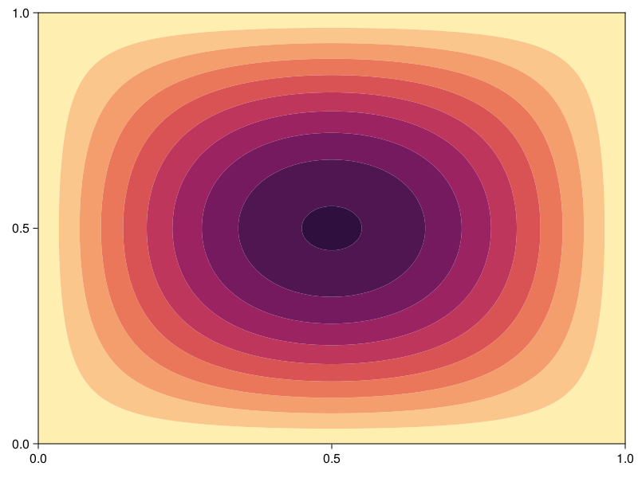
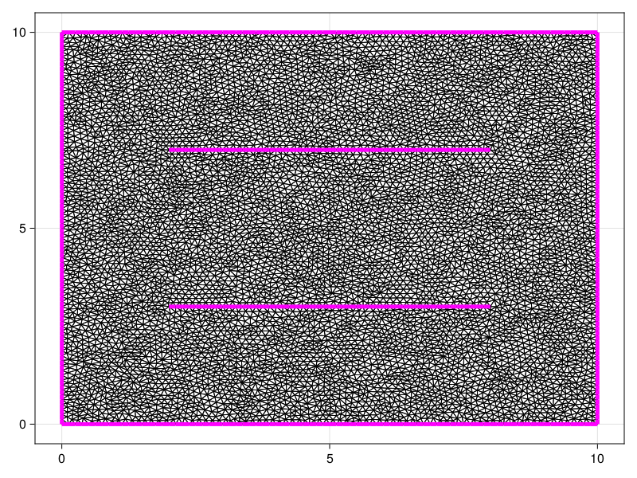
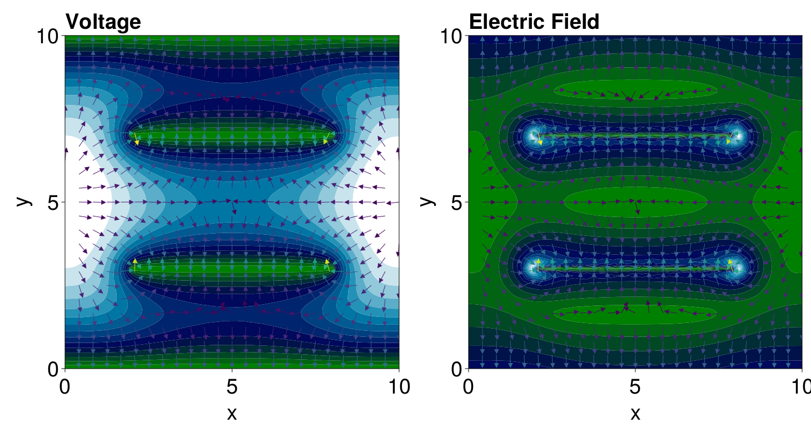

```@meta
EditURL = "https://github.com/SciML/FiniteVolumeMethod.jl/tree/main/docs/src/literate_wyos/poissons_equation.jl"
```


# Poisson's Equation
```@contents
Pages = ["poissons_equation.md"]
```
We now write a solver for Poisson's equation. What we produce
in this section can also be accessed in `FiniteVolumeMethod.PoissonsEquation`.

## Mathematical Details
We start by describing the mathematical details. The problems we will be solving
take the form
```math
\div[D(\vb x)\grad u] = f(\vb x).
```
Note that this is very similar to a mean exit time problem, except
$f(\vb x) = -1$ for mean exit time problems. Note that this is actually
a generalised Poisson equation - typically these equations look like
$\grad^2 u = f$.[^1]

[^1]: See, for example, [this paper](https://my.ece.utah.edu/~ece6340/LECTURES/Feb1/Nagel%202012%20-%20Solving%20the%20Generalized%20Poisson%20Equation%20using%20FDM.pdf).

From these similarities, we already know that
```math
\frac{1}{V_i}\sum_{\sigma\in\mathcal E_i} D(\vb x_\sigma)\left[\left(s_{k, 11}n_\sigma^x+s_{k,21}n_\sigma^y\right)u_{k1} + \left(s_{k,12}n_\sigma^x+s_{k,22}n_\sigma^y\right)u_{k2}+\left(s_{k,13}n_\sigma^x+s_{k,23}n_\sigma^y\right)u_{k3}\right]L_\sigma = f(\vb x_i),
```
and thus we can write this as $\vb a_i^{\mkern-1.5mu\mathsf T}\vb u = b_i$ as usual, with $b_i = f(\vb x_i)$.
The boundary conditions are handled in the same way as in [mean exit time problems](mean_exit_time.md).

## Implementation
Let us now implement our problem. For [mean exit time problems](mean_exit_time.md), we
had a function `create_met_b` that we used for defining $\vb b$. We should generalise
that function to now accept a source function:

````julia
function create_rhs_b(mesh, conditions, source_function, source_parameters)
    b = zeros(DelaunayTriangulation.num_solid_vertices(mesh.triangulation))
    for i in each_solid_vertex(mesh.triangulation)
        if !FVM.is_dirichlet_node(conditions, i)
            p = get_point(mesh, i)
            x, y = getxy(p)
            b[i] = source_function(x, y, source_parameters)
        end
    end
    return b
end
````

````
create_rhs_b (generic function with 1 method)
````

We also need a function that applies the Dirichlet conditions.

````julia
function apply_steady_dirichlet_conditions!(A, b, mesh, conditions)
    for (i, function_index) in FVM.get_dirichlet_nodes(conditions)
        x, y = get_point(mesh, i)
        b[i] = FVM.eval_condition_fnc(conditions, function_index, x, y, nothing, nothing)
        A[i, i] = 1.0
    end
end
````

````
apply_steady_dirichlet_conditions! (generic function with 1 method)
````

So, our problem can be defined by:

````julia
using FiniteVolumeMethod, SparseArrays, DelaunayTriangulation, LinearSolve
const FVM = FiniteVolumeMethod
function poissons_equation(mesh::FVMGeometry,
    BCs::BoundaryConditions,
    ICs::InternalConditions=InternalConditions();
    diffusion_function=(x,y,p)->1.0,
    diffusion_parameters=nothing,
    source_function,
    source_parameters=nothing)
    conditions = Conditions(mesh, BCs, ICs)
    n = DelaunayTriangulation.num_solid_vertices(mesh.triangulation)
    A = zeros(n, n)
    b = create_rhs_b(mesh, conditions, source_function, source_parameters)
    FVM.triangle_contributions!(A, mesh, conditions, diffusion_function, diffusion_parameters)
    FVM.boundary_edge_contributions!(A, b, mesh, conditions, diffusion_function, diffusion_parameters)
    apply_steady_dirichlet_conditions!(A, b, mesh, conditions)
    return LinearProblem(sparse(A), b)
end
````

````
poissons_equation (generic function with 2 methods)
````

Now let's test this problem. We consider
```math
\begin{equation*}
\begin{aligned}
\grad^2 u &= -\sin(\pi x)\sin(\pi y) & \vb x \in [0,1]^2, \\
u &= 0 & \vb x \in\partial[0,1]^2.
\end{aligned}
\end{equation*}
```

````julia
tri = triangulate_rectangle(0, 1, 0, 1, 100, 100, single_boundary=true)
mesh = FVMGeometry(tri)
BCs = BoundaryConditions(mesh, (x, y, t, u, p) -> zero(x), Dirichlet)
source_function = (x, y, p) -> -sin(π * x) * sin(π * y)
prob = poissons_equation(mesh, BCs;  source_function)
````

````
LinearProblem. In-place: true
b: 10000-element Vector{Float64}:
 0.0
 0.0
 0.0
 0.0
 0.0
 ⋮
 0.0
 0.0
 0.0
 0.0
 0.0
````

````julia
sol = solve(prob, KLUFactorization())
````

````
u: 10000-element Vector{Float64}:
 0.0
 0.0
 0.0
 0.0
 0.0
 ⋮
 0.0
 0.0
 0.0
 0.0
 0.0
````

````julia
using CairoMakie
fig, ax, sc = tricontourf(tri, sol.u, levels=LinRange(0, 0.05, 10), colormap=:matter, extendhigh=:auto)
tightlimits!(ax)
fig
````


If we wanted to turn this into a `SteadyFVMProblem`, we use a similar call to `poissons_equation`
above except with an `initial_condition` for the initial guess. Moreover, we need to
change the sign of the source function, since above we are solving $\div[D(\vb x)\grad u] = f(\vb x)$,
when `FVMProblem`s assume that we are solving $0 = \div[D(\vb x)\grad u] + f(\vb x)$.

````julia
initial_condition = zeros(num_points(tri))
fvm_prob = SteadyFVMProblem(FVMProblem(mesh, BCs;
    diffusion_function= (x, y, t, u, p) -> 1.0,
    source_function=let S = source_function
        (x, y, t, u, p) -> -S(x, y, p)
    end,
    initial_condition,
    final_time=Inf))
````

````
SteadyFVMProblem with 10000 nodes
````

````julia
using SteadyStateDiffEq, OrdinaryDiffEq
fvm_sol = solve(fvm_prob, DynamicSS(TRBDF2(linsolve=KLUFactorization())))
````

````
u: 10000-element Vector{Float64}:
 0.0
 0.0
 0.0
 0.0
 0.0
 ⋮
 0.0
 0.0
 0.0
 0.0
 0.0
````

## Using the Provided Template
Let's now use the built-in `PoissonsEquation` which implements the above template
inside FiniteVolumeMethod.jl. The above problem can be constructed as follows:

````julia
prob = PoissonsEquation(mesh, BCs; source_function=source_function)
````

````
PoissonsEquation with 10000 nodes
````

````julia
sol = solve(prob, KLUFactorization())
````

````
u: 10000-element Vector{Float64}:
 0.0
 0.0
 0.0
 0.0
 0.0
 ⋮
 0.0
 0.0
 0.0
 0.0
 0.0
````

Here is a benchmark comparison of the `PoissonsEquation` approach against the `FVMProblem` approach.
````julia
using BenchmarkTools
@btime solve($prob, $KLUFactorization());
````

````
  15.442 ms (56 allocations: 15.21 MiB)
````

````julia
@btime solve($fvm_prob, $DynamicSS(TRBDF2(linsolve=KLUFactorization())));
````

````
  189.406 ms (185761 allocations: 93.63 MiB)
````

Let's now also solve a generalised Poisson equation. Based
on Section 7 of [this paper](https://my.ece.utah.edu/~ece6340/LECTURES/Feb1/Nagel%202012%20-%20Solving%20the%20Generalized%20Poisson%20Equation%20using%20FDM.pdf)
by Nagel (2012), we consider an equation of the form
```math
\div\left[\epsilon(\vb x)\grad V(\vb x)\right] = -\frac{\rho(\vb x)}{\epsilon_0}.
```
We consider this equation on the domain $\Omega = [0, 10]^2$. We put two parallel capacitor plates
inside the domain, with the first in $2 \leq x \leq 8$ along $y = 3$, and the other at $2 \leq x \leq 8$ along $y=7$.
We use $V = 1$ on the top plate, and $V = -1$ on the bottom plate. For the domain boundaries, $\partial\Omega$, we use homogeneous
Dirichlet conditions on the top and bottom sides, and homogeneous Neumann conditions on the left and right sides.
For the space-varying electric constant $\epsilon(\vb x)$, we use[^2]
```math
\epsilon(\vb x) = 1 + \frac12(\epsilon_0 - 1)\left[1 + \erf\left(\frac{r}{\Delta}\right)\right],
```
where $r$ is the distance between $\vb x$ and the parallel plates, $\Delta  = 4$. The value of $\epsilon_0$
is approximately $\epsilon_0 = 8.8541878128 \times 10^{-12}$. For the charge density $\rho(\vb x)$, we use
a Gaussian density,
```math
\rho(\vb x) = \frac{Q}{2\pi}\mathrm{e}^{-r^2/2},
```
where, again, $r$ is the distance between $\vb x$ and the parallel plates, and $Q = 10^{-6}$.

[^2]: This form of $\epsilon(\vb x)$ is based on [this paper](https://doi.org/10.1063/1.4939125) by Fisicaro et al. (2016).

To define this problem, let us first define the mesh. We will need to manually put in the capacitor plates so that
we can enforce Dirichlet conditions on them.

````julia
a, b, c, d = 0.0, 10.0, 0.0, 10.0
e, f = (2.0, 3.0), (8.0, 3.0)
g, h = (2.0, 7.0), (8.0, 7.0)
points = [(a, c), (b, c), (b, d), (a, d), e, f, g, h]
boundary_nodes = [[1, 2], [2, 3], [3, 4], [4, 1]]
segments = Set(((5, 6), (7, 8)))
tri = triangulate(points; boundary_nodes, edges, delete_ghosts=false)
refine!(tri; max_area=1e-4get_total_area(tri))
fig, ax, sc = triplot(tri, show_constrained_edges=true, constrained_edge_linewidth=5)
fig
````


````julia
mesh = FVMGeometry(tri)
````

````
FVMGeometry with 8043 control volumes, 15764 triangles, and 23806 edges
````

The boundary conditions are given by:

````julia
zero_f = (x, y, t, u, p) -> zero(x)
bc_f = (zero_f, zero_f, zero_f, zero_f)
bc_types = (Dirichlet, Neumann, Dirichlet, Neumann) # bot, right, top, left
BCs = BoundaryConditions(mesh, bc_f, bc_types)
````

````
BoundaryConditions with 4 boundary conditions with types (Dirichlet, Neumann, Dirichlet, Neumann)
````

To define the internal conditions, we need to get the indices for the plates.

````julia
function find_vertices_on_plates(tri)
    lower_plate = Int[]
    upper_plate = Int[]
    for i in each_solid_vertex(tri)
        x, y = get_point(tri, i)
        in_range = 2 ≤ x ≤ 8
        if in_range
            y == 3 && push!(lower_plate, i)
            y == 7 && push!(upper_plate, i)
        end
    end
    return lower_plate, upper_plate
end
lower_plate, upper_plate = find_vertices_on_plates(tri)
dirichlet_nodes = Dict(
    (lower_plate .=> 1)...,
    (upper_plate .=> 2)...
)
internal_f = ((x, y, t, u, p) -> -one(x), (x, y, t, u, p) -> one(x))
ICs = InternalConditions(internal_f, dirichlet_nodes=dirichlet_nodes)
````

````
InternalConditions with 98 Dirichlet nodes and 0 Dudt nodes
````

Next, we define $\epsilon(\vb x)$ and $\rho(\vb x)$. We need a function that computes the distance
between a point and the plates. For the distance between a point and a line segment, we can use:[^3]

````julia
using LinearAlgebra
function dist_to_line(p, a, b)
    ℓ² = norm(a .- b)^2
    t = max(0.0, min(1.0, dot(p .- a, b .- a) / ℓ²))
    pv = a .+ t .* (b .- a)
    return norm(p .- pv)
end
````

````
dist_to_line (generic function with 1 method)
````

[^3]: Taken from [here](https://stackoverflow.com/a/1501725).
Thus, the distance between a point and the two plates is:

````julia
function dist_to_plates(x, y)
    p = (x, y)
    a1, b1 = (2.0, 3.0), (8.0, 3.0)
    a2, b2 = (2.0, 7.0), (8.0, 7.0)
    d1 = dist_to_line(p, a1, b1)
    d2 = dist_to_line(p, a2, b2)
    return min(d1, d2)
end
````

````
dist_to_plates (generic function with 1 method)
````

So, our function $\epsilon(\vb x)$ is defined by:

````julia
using SpecialFunctions
function dielectric_function(x, y, p)
    r = dist_to_plates(x, y)
    return 1 + (p.ϵ₀ - 1) * (1 + erf(r / p.Δ)) / 2
end
````

````
dielectric_function (generic function with 1 method)
````

The charge density is:

````julia
function charge_density(x, y, p)
    r = dist_to_plates(x, y)
    return p.Q / (2π) * exp(-r^2 / 2)
end
````

````
charge_density (generic function with 1 method)
````

Using this charge density, our source function is defined by:

````julia
function plate_source_function(x, y, p)
    ρ = charge_density(x, y, p)
    return -ρ / p.ϵ₀
end
````

````
plate_source_function (generic function with 1 method)
````

Now we can define our problem.

````julia
diffusion_parameters = (ϵ₀=8.8541878128e-12, Δ=4.0)
source_parameters = (ϵ₀=8.8541878128e-12, Q=1e-6)
prob = PoissonsEquation(mesh, BCs, ICs;
    diffusion_function=dielectric_function,
    diffusion_parameters=diffusion_parameters,
    source_function=plate_source_function,
    source_parameters=source_parameters)
````

````
PoissonsEquation with 8043 nodes
````

````julia
sol = solve(prob, KLUFactorization())
````

````
u: 8043-element Vector{Float64}:
     0.0
     0.0
     0.0
     0.0
    -1.0
     ⋮
 51056.49568160037
 38356.53738605582
 23776.172046371616
 15305.800698280922
 36991.813605841366
````

With this solution, we can also define the electric field $\vb E$, using $\vb E = -\grad V$.
To compute the gradients, we use NaturalNeighbours.jl.

````julia
using NaturalNeighbours
itp = interpolate(tri, sol.u; derivatives=true)
E = map(.-, itp.gradient) # E = -∇V
````

````
8043-element Vector{Tuple{Float64, Float64}}:
 (-92.16611391825855, -38611.08851918353)
 (-135.07123950960246, -38712.62388759961)
 (106.23769658329466, 38570.04241506763)
 (47.27146740325949, 39027.27922671291)
 (59246.37075623101, 387.2192495354995)
 ⋮
 (15303.599369740816, -12846.469299439254)
 (2226.185267168199, -10264.496829932992)
 (-2168.004405683131, 13349.848294884237)
 (1482.293757452546, -21202.372178727317)
 (1724.200560200586, -12129.215330819241)
````

For plotting the electric field, we will show the electric field intensity $\|\vb E\|$,
and we can also show the arrows. Rather than showing all arrows, we will show them at
a smaller grid of values, which requires differentiating `itp` so that we can get the
gradients at arbitrary points.

````julia
∂ = differentiate(itp, 1)
x = LinRange(0, 10, 25)
y = LinRange(0, 10, 25)
x_vec = [x for x in x, y in y] |> vec
y_vec = [y for x in x, y in y] |> vec
E_itp = map(.-, ∂(x_vec, y_vec, interpolant_method=Hiyoshi(2)))
E_intensity = norm.(E_itp)
fig = Figure(fontsize=38)
ax = Axis(fig[1, 1], width=600, height=600, titlealign=:left,
    xlabel="x", ylabel="y", title="Voltage")
tricontourf!(ax, tri, sol.u, levels=15, colormap=:ocean)
arrow_positions = [Point2f(x, y) for (x, y) in zip(x_vec, y_vec)]
arrow_directions = [Point2f(e...) for e in E_itp]
arrows!(ax, arrow_positions, arrow_directions,
    lengthscale=0.3, normalize=true, arrowcolor=E_intensity, linecolor=E_intensity)
    xlims!(ax,0,10)
    ylims!(ax,0,10)
ax = Axis(fig[1, 2], width=600, height=600, titlealign=:left,
    xlabel="x", ylabel="y", title="Electric Field")
tricontourf!(ax, tri, norm.(E), levels=15, colormap=:ocean)
arrows!(ax, arrow_positions, arrow_directions,
    lengthscale=0.3, normalize=true, arrowcolor=E_intensity, linecolor=E_intensity)
xlims!(ax,0,10)
ylims!(ax,0,10)
resize_to_layout!(fig)
fig
````


To finish, let us benchmark the `PoissonsEquation` approach against the `FVMProblem` approach.

````julia
fvm_prob = SteadyFVMProblem(FVMProblem(mesh, BCs, ICs;
    diffusion_function=let D = dielectric_function
        (x, y, t, u, p) -> D(x, y, p)
    end,
    source_function=let S = plate_source_function
        (x, y, t, u, p) -> -S(x, y, p)
    end,
    diffusion_parameters=diffusion_parameters,
    source_parameters=source_parameters,
    initial_condition=zeros(num_points(tri)),
    final_time=Inf))
````

````
SteadyFVMProblem with 8043 nodes
````

````julia
@btime solve($prob, $KLUFactorization());
````

````
  9.061 ms (56 allocations: 10.81 MiB)
````

````julia
@btime solve($fvm_prob, $DynamicSS(TRBDF2(linsolve=KLUFactorization())));
````

````
  329.327 ms (201134 allocations: 93.70 MiB)
````

## Just the code
An uncommented version of this example is given below.
You can view the source code for this file [here](https://github.com/SciML/FiniteVolumeMethod.jl/tree/main/docs/src/literate_wyos/poissons_equation.jl).

```julia
function create_rhs_b(mesh, conditions, source_function, source_parameters)
    b = zeros(DelaunayTriangulation.num_solid_vertices(mesh.triangulation))
    for i in each_solid_vertex(mesh.triangulation)
        if !FVM.is_dirichlet_node(conditions, i)
            p = get_point(mesh, i)
            x, y = getxy(p)
            b[i] = source_function(x, y, source_parameters)
        end
    end
    return b
end

function apply_steady_dirichlet_conditions!(A, b, mesh, conditions)
    for (i, function_index) in FVM.get_dirichlet_nodes(conditions)
        x, y = get_point(mesh, i)
        b[i] = FVM.eval_condition_fnc(conditions, function_index, x, y, nothing, nothing)
        A[i, i] = 1.0
    end
end

using FiniteVolumeMethod, SparseArrays, DelaunayTriangulation, LinearSolve
const FVM = FiniteVolumeMethod
function poissons_equation(mesh::FVMGeometry,
    BCs::BoundaryConditions,
    ICs::InternalConditions=InternalConditions();
    diffusion_function=(x,y,p)->1.0,
    diffusion_parameters=nothing,
    source_function,
    source_parameters=nothing)
    conditions = Conditions(mesh, BCs, ICs)
    n = DelaunayTriangulation.num_solid_vertices(mesh.triangulation)
    A = zeros(n, n)
    b = create_rhs_b(mesh, conditions, source_function, source_parameters)
    FVM.triangle_contributions!(A, mesh, conditions, diffusion_function, diffusion_parameters)
    FVM.boundary_edge_contributions!(A, b, mesh, conditions, diffusion_function, diffusion_parameters)
    apply_steady_dirichlet_conditions!(A, b, mesh, conditions)
    return LinearProblem(sparse(A), b)
end

tri = triangulate_rectangle(0, 1, 0, 1, 100, 100, single_boundary=true)
mesh = FVMGeometry(tri)
BCs = BoundaryConditions(mesh, (x, y, t, u, p) -> zero(x), Dirichlet)
source_function = (x, y, p) -> -sin(π * x) * sin(π * y)
prob = poissons_equation(mesh, BCs;  source_function)

sol = solve(prob, KLUFactorization())

using CairoMakie
fig, ax, sc = tricontourf(tri, sol.u, levels=LinRange(0, 0.05, 10), colormap=:matter, extendhigh=:auto)
tightlimits!(ax)
fig

initial_condition = zeros(num_points(tri))
fvm_prob = SteadyFVMProblem(FVMProblem(mesh, BCs;
    diffusion_function= (x, y, t, u, p) -> 1.0,
    source_function=let S = source_function
        (x, y, t, u, p) -> -S(x, y, p)
    end,
    initial_condition,
    final_time=Inf))

using SteadyStateDiffEq, OrdinaryDiffEq
fvm_sol = solve(fvm_prob, DynamicSS(TRBDF2(linsolve=KLUFactorization())))

prob = PoissonsEquation(mesh, BCs; source_function=source_function)

sol = solve(prob, KLUFactorization())

a, b, c, d = 0.0, 10.0, 0.0, 10.0
e, f = (2.0, 3.0), (8.0, 3.0)
g, h = (2.0, 7.0), (8.0, 7.0)
points = [(a, c), (b, c), (b, d), (a, d), e, f, g, h]
boundary_nodes = [[1, 2], [2, 3], [3, 4], [4, 1]]
segments = Set(((5, 6), (7, 8)))
tri = triangulate(points; boundary_nodes, edges, delete_ghosts=false)
refine!(tri; max_area=1e-4get_total_area(tri))
fig, ax, sc = triplot(tri, show_constrained_edges=true, constrained_edge_linewidth=5)
fig

mesh = FVMGeometry(tri)

zero_f = (x, y, t, u, p) -> zero(x)
bc_f = (zero_f, zero_f, zero_f, zero_f)
bc_types = (Dirichlet, Neumann, Dirichlet, Neumann) # bot, right, top, left
BCs = BoundaryConditions(mesh, bc_f, bc_types)

function find_vertices_on_plates(tri)
    lower_plate = Int[]
    upper_plate = Int[]
    for i in each_solid_vertex(tri)
        x, y = get_point(tri, i)
        in_range = 2 ≤ x ≤ 8
        if in_range
            y == 3 && push!(lower_plate, i)
            y == 7 && push!(upper_plate, i)
        end
    end
    return lower_plate, upper_plate
end
lower_plate, upper_plate = find_vertices_on_plates(tri)
dirichlet_nodes = Dict(
    (lower_plate .=> 1)...,
    (upper_plate .=> 2)...
)
internal_f = ((x, y, t, u, p) -> -one(x), (x, y, t, u, p) -> one(x))
ICs = InternalConditions(internal_f, dirichlet_nodes=dirichlet_nodes)

using LinearAlgebra
function dist_to_line(p, a, b)
    ℓ² = norm(a .- b)^2
    t = max(0.0, min(1.0, dot(p .- a, b .- a) / ℓ²))
    pv = a .+ t .* (b .- a)
    return norm(p .- pv)
end

function dist_to_plates(x, y)
    p = (x, y)
    a1, b1 = (2.0, 3.0), (8.0, 3.0)
    a2, b2 = (2.0, 7.0), (8.0, 7.0)
    d1 = dist_to_line(p, a1, b1)
    d2 = dist_to_line(p, a2, b2)
    return min(d1, d2)
end

using SpecialFunctions
function dielectric_function(x, y, p)
    r = dist_to_plates(x, y)
    return 1 + (p.ϵ₀ - 1) * (1 + erf(r / p.Δ)) / 2
end

function charge_density(x, y, p)
    r = dist_to_plates(x, y)
    return p.Q / (2π) * exp(-r^2 / 2)
end

function plate_source_function(x, y, p)
    ρ = charge_density(x, y, p)
    return -ρ / p.ϵ₀
end

diffusion_parameters = (ϵ₀=8.8541878128e-12, Δ=4.0)
source_parameters = (ϵ₀=8.8541878128e-12, Q=1e-6)
prob = PoissonsEquation(mesh, BCs, ICs;
    diffusion_function=dielectric_function,
    diffusion_parameters=diffusion_parameters,
    source_function=plate_source_function,
    source_parameters=source_parameters)

sol = solve(prob, KLUFactorization())

using NaturalNeighbours
itp = interpolate(tri, sol.u; derivatives=true)
E = map(.-, itp.gradient) # E = -∇V

∂ = differentiate(itp, 1)
x = LinRange(0, 10, 25)
y = LinRange(0, 10, 25)
x_vec = [x for x in x, y in y] |> vec
y_vec = [y for x in x, y in y] |> vec
E_itp = map(.-, ∂(x_vec, y_vec, interpolant_method=Hiyoshi(2)))
E_intensity = norm.(E_itp)
fig = Figure(fontsize=38)
ax = Axis(fig[1, 1], width=600, height=600, titlealign=:left,
    xlabel="x", ylabel="y", title="Voltage")
tricontourf!(ax, tri, sol.u, levels=15, colormap=:ocean)
arrow_positions = [Point2f(x, y) for (x, y) in zip(x_vec, y_vec)]
arrow_directions = [Point2f(e...) for e in E_itp]
arrows!(ax, arrow_positions, arrow_directions,
    lengthscale=0.3, normalize=true, arrowcolor=E_intensity, linecolor=E_intensity)
    xlims!(ax,0,10)
    ylims!(ax,0,10)
ax = Axis(fig[1, 2], width=600, height=600, titlealign=:left,
    xlabel="x", ylabel="y", title="Electric Field")
tricontourf!(ax, tri, norm.(E), levels=15, colormap=:ocean)
arrows!(ax, arrow_positions, arrow_directions,
    lengthscale=0.3, normalize=true, arrowcolor=E_intensity, linecolor=E_intensity)
xlims!(ax,0,10)
ylims!(ax,0,10)
resize_to_layout!(fig)
fig

fvm_prob = SteadyFVMProblem(FVMProblem(mesh, BCs, ICs;
    diffusion_function=let D = dielectric_function
        (x, y, t, u, p) -> D(x, y, p)
    end,
    source_function=let S = plate_source_function
        (x, y, t, u, p) -> -S(x, y, p)
    end,
    diffusion_parameters=diffusion_parameters,
    source_parameters=source_parameters,
    initial_condition=zeros(num_points(tri)),
    final_time=Inf))
```

---

*This page was generated using [Literate.jl](https://github.com/fredrikekre/Literate.jl).*

